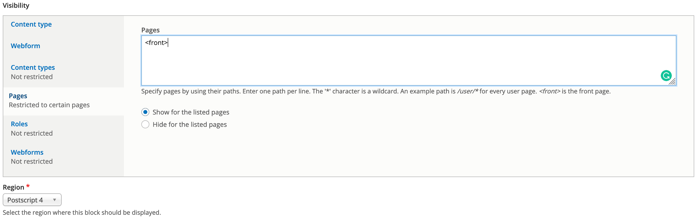

# 1.5 Blocks in GovCMS

_Blocks_ are individual pieces of your site’s web page layout. They are placed inside the regions of your theme, and can be created, removed, and rearranged in the _Block layout_ \(_admin/structure/block_\) administration page. Examples of blocks include the _Who’s online_ listing, the main navigation menu, and the breadcrumb trail. The main page content is also a block.

Some modules make new blocks available for placement on your site. For example, when the core Search module is installed and configured, it provides a block that contains a search form. You may also create and place your own custom blocks.

Each block has its own configuration settings, which allow you to select which pages of your site will display the block. It’s even possible to place multiple copies of a block, each with its own separate configuration and visibility rules.

#### Block administration review

Go to Structure &gt; Block layout at /admin/structure/block

The block admin page shows you the blocks on your site and where they’re displayed. In the default theme, GovCMS 8 UI-Kit Starter, the search form, main navigation, and site branding blocks are spread across various regions.

You can change the order of the blocks displaying by using the four-way arrow icon and dragging and dropping the blocks up or down. Once you’re happy with the position, scroll to the bottom of the page and click **Save blocks**.

* Disabled blocks

Depending on what modules you have installed, various new blocks become available for activation in any of the site regions. You may explore available blocks by clicking the “Place block” button in the desired region:

#### **Exercise 1.5:** Place the welcome message block

Many websites contain a welcome message on the homepage. In this exercise you’ll learn how to place a block of content into a page and manage block visibility settings. You will also learn how blocks are placed into page regions.

This is a sample “Welcome to our site” block you’ll build during this exercise.

1. Navigate to Structure → Block layout → Add custom block \(/block/add\)
2. Fill out the form: **Block description**: “Welcome to Government Jobs Portal”. If you don’t want your block to have a title, enter &lt;none&gt; in the block title field, or leave this field empty. **Body**: “Government Jobs Portal is the official site to search and apply for jobs in the federal or state government. Be part of the bigger picture.”
3. Click the **Save** button. It should redirect you to the block configuration page: 

Note: If you weren’t redirected, navigate to Structure → Block layout and locate the Postscript 4 region. Click the Place block button next to the Postscript 4 region name.

Locate the block you created, by searching for its name “Welcome to Government Jobs Portal”.

1. Next, you’ll need to assign the block to an area on the site. Scroll down to the **Region** select element. Select **Postscript 4**.
2. Finally, configure the block’s **Visibility settings** so the Welcome Message block only appears on the homepage.
3. Under the **Pages** section of the visibility settings.
   1. Select the Show for the listed pages radio button
   2. Like the screenshot below, enter the text _&lt;front&gt;_ in the Pages field. This will make sure the block is only displayed on the front \(home\) page of your site. Leave the other settings as-is.
4. **Save** the block **** 
****After the page is saved, you’ll be redirected to the _Block Layout_ page. If you have multiple blocks assigned to the same region \(such as Postscript 4\), these can be rearranged on that page. Press the _Save blocks_ button.
5. Now go to the homepage of your site and view your new welcome message/block in the second sidebar.

Tip: Blocks aren’t content so they won’t be displayed in the content listing. To view all custom blocks go to _Structure_  _Block layout_  _Custom block library_.

