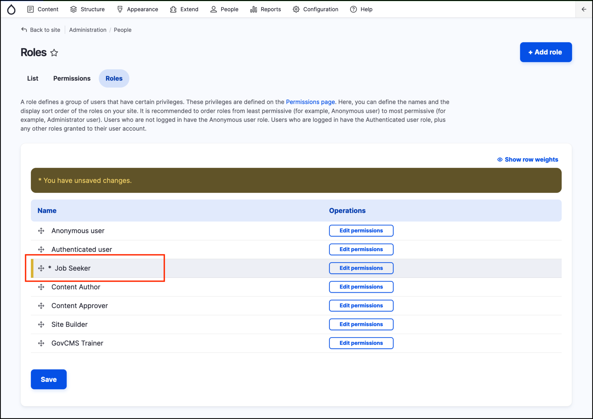

# Exercise 1.1: Add new roles and users

In this exercise we’ll add our required Job Seeker role, then we’ll add users and assign roles to them.

## Create a new role

1. Navigate to _People_ → **Roles** from the _Admin menu_.
2. Add the **Job Seeker** role (the Content Author and Content Approver roles exist in GovCMS out-of-the-box).
3. Reorder the roles with the role with least permissions at the top, and the most permissions at the bottom.
4.  Click **Save**.

## Add users

1. Navigate to _People_ on the _Admin menu_.
2. Add two test users:
   -  **testeditor** - assign the _Content Author_ role.
   - **testjobseeker** - assign the _Job Seeker_ role.

## Test user roles

Lastly, test the new roles by logging in as the test accounts.

* **Option 1**: Logout of the superuser user/1 account and log back in again as **testeditor** or **testjobseeker**.
* **Option 2**: Open another browser and login as one of the test users.
