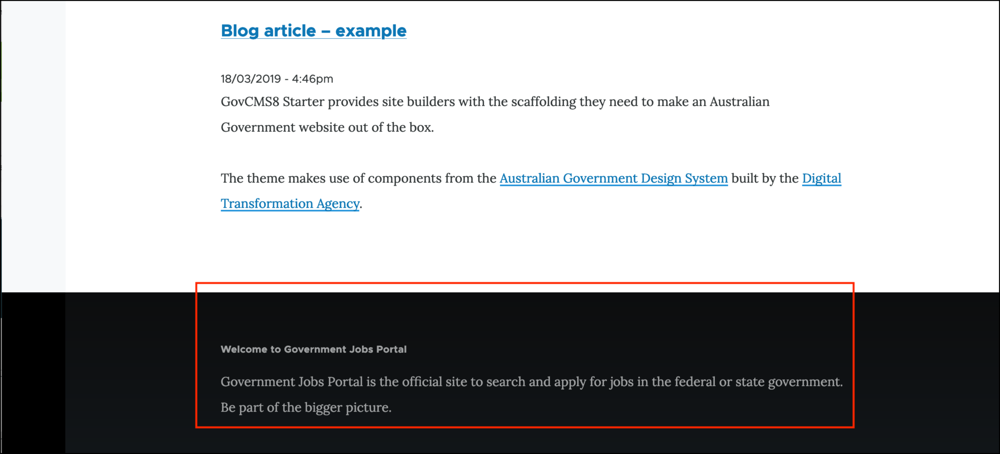
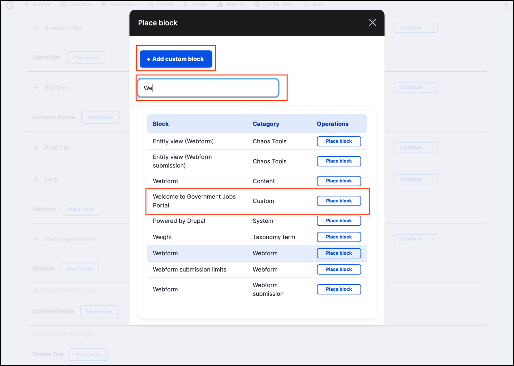
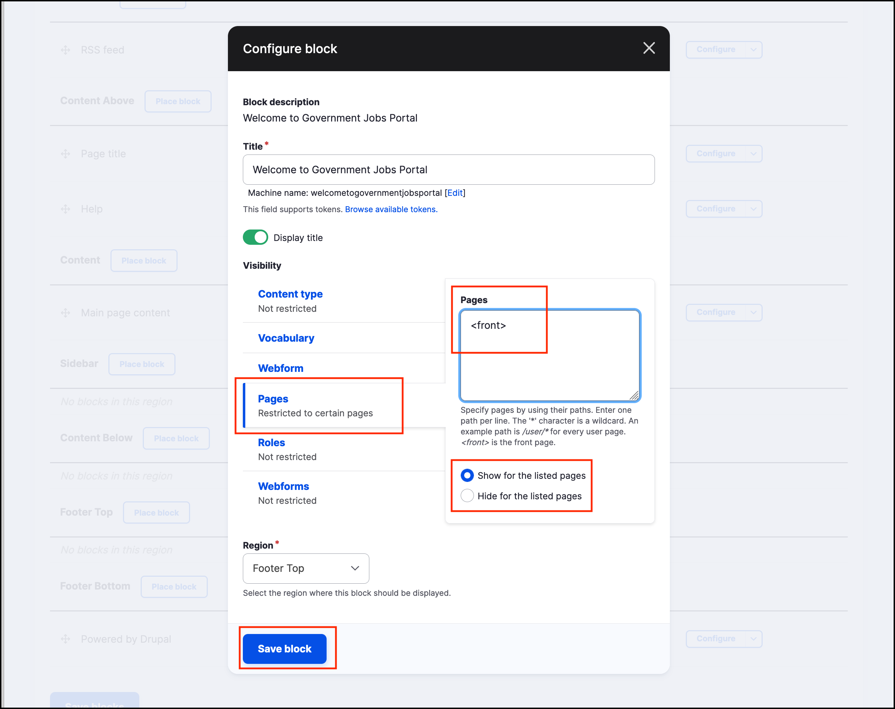

# Exercise 1.3: Place Welcome message block

Many websites contain a welcome message on the homepage. In this exercise you’ll learn how to place a block of content into a page and manage block visibility settings. You will also learn how blocks are placed into page regions.

The screenshot below displays a “Welcome to our site” block. You will build a similar block in this exercise.

## Add a custom block

1. Navigate to _Structure_ → _Block layout_ → **Add custom block** (/block/add).
2. Fill out the form:
   * **Block description**: “Welcome to Government Jobs Portal”. If you don’t want your block to have a title, enter \<none> in the block title field, or leave this field empty.
   * **Body**: “Government Jobs Portal is the official site to search and apply for jobs in the federal or state government. Be part of the bigger picture.”
3. Click the **Save** button.

## Place custom block

Navigate to _Structure_ → **Block layout** and locate the **Footer Top** region. Click the Place block button next to the **Footer Top** region name.

Locate the block you created, by searching for its name “Welcome to Government Jobs Portal”.

## Assign block to region

Next, you’ll need to assign the block to an area on the site.

1. Scroll down to the **Region** select element. Select **Footer Top**.
2. Finally, configure the block’s **Visibility settings** so the Welcome Message block only appears on the homepage.
3. Under the **Pages** section of the visibility settings.
   * Select the **Show for the listed pages** radio button.
   * Following the screenshot below, enter the text _\<front>_ in the Pages field. This will make sure the block is only displayed on the front (home) page of your site. Leave the other settings as-is.
4. **Save** the block.

After the page is saved, you’ll be redirected to the _Block Layout_ page. If you have multiple blocks assigned to the same region (such as Footer Top), these can be rearranged on that page. Press the _Save blocks_ button.

Now go to the homepage of your site and view your new welcome message/block in the footer.

> **Tip:** Blocks aren’t content so they won’t be displayed in the content listing. To view all custom blocks go to _Structure_ → _Block layout_ → _Custom block library_ .
