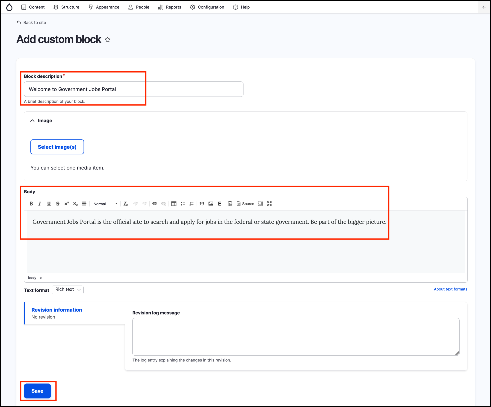

# Exercise 1.3: Place Welcome message block

Many websites contain a welcome message on the homepage. In this exercise you’ll learn how to place a block of content into a page and manage block visibility settings. You will also learn how blocks are placed into page regions.

The screenshot below displays a “Welcome to our site” block. You will build a similar block in this exercise.

1. Navigate to Structure → Block layout → Add custom block (/block/add)
2. Fill out the form:

* **Block description**: “Welcome to Government Jobs Portal”. If you don’t want your block to have a title, enter \<none> in the block title field, or leave this field empty.
* **Body**: “Government Jobs Portal is the official site to search and apply for jobs in the federal or state government. Be part of the bigger picture.”

1. Click the **Save** button.

You should be redirected to the block configuration page as shown in the screenshot below.

.png>)

> Note: If you weren’t redirected, navigate to Structure → Block layout and locate the Postscript 4 region. Click the Place block button next to the Postscript 4 region name.

Locate the block you created, by searching for its name “Welcome to Government Jobs Portal”.

1. Next, you’ll need to assign the block to an area on the site. Scroll down to the **Region** select element. Select **Postscript 4**.
2. Finally, configure the block’s **Visibility settings** so the Welcome Message block only appears on the homepage.
3. Under the **Pages** section of the visibility settings.
   1. Select the Show for the listed pages radio button
   2. Like the screenshot below, enter the text _\<front>_ in the Pages field. This will make sure the block is only displayed on the front (home) page of your site. Leave the other settings as-is.
4.  **Save** the block _\*\*_

    \_\*\*\_After the page is saved, you’ll be redirected to the _Block Layout_ page. If you have multiple blocks assigned to the same region (such as Postscript 4), these can be rearranged on that page. Press the _Save blocks_ button.
5. Now go to the homepage of your site and view your new welcome message/block in the second sidebar.

> **Tip:** Blocks aren’t content so they won’t be displayed in the content listing. To view all custom blocks go to _Structure_  _Block layout_  _Custom block library_ .
