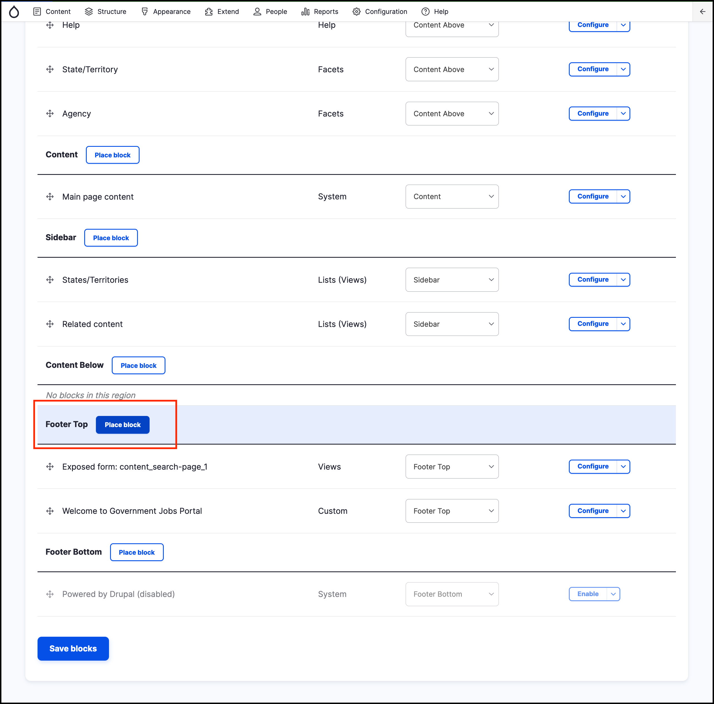
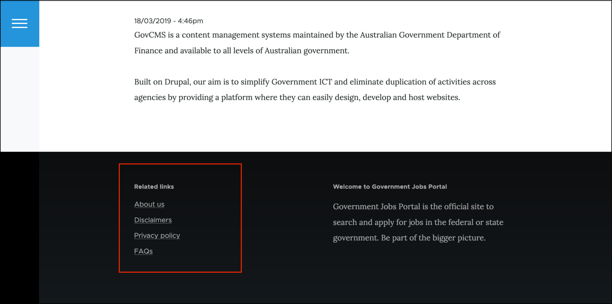

# Exercise 1.5: Assign the related links menu block to a region

When you create a new menu, GovCMS automatically creates a menu block for the menu. Now we need to assign this menu block with an area on the website.

1. Go to _Structure_ → **Block layout** \(/admin/structure/block\).
2. Scroll down and find the **Footer Top** area and click the **Place block** button.
    
    
    
3. Search the list for - _Related Links_. Select Menus block “Related Links”. 
4. Click **Place block**.

    

4. Click **Save block**.
5. Click **Save blocks** in the **Block layout** page. 
6. Check your site to make sure the **Related Links** menu block is in the **Footer**.

Next, we’ll restrict visibility so it doesn’t show throughout the site.
