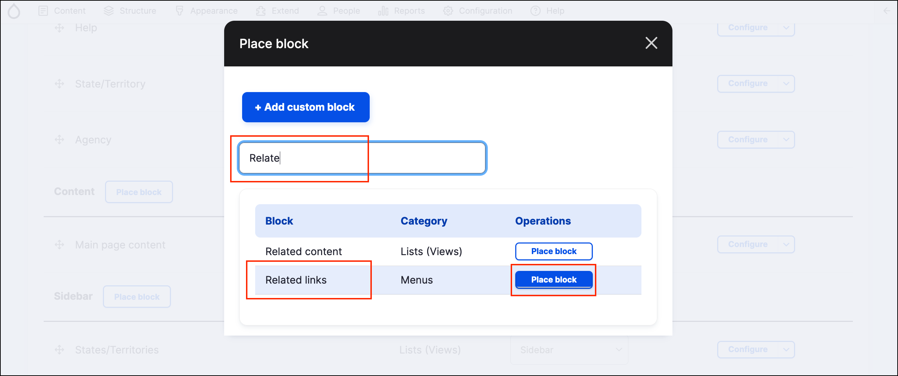

# Exercise 1.5: Assign the related links menu block to a region

When you create a new menu, GovCMS automatically creates a menu block for the menu. Now we need to assign this menu block to a region on the website.

1. Go to _Structure_ → **Block layout** (/admin/structure/block).
2.  Scroll down and find the **Footer middle 2** area and click the **Place block** button.

    <figure><figcaption>
Place block in the Footer middle 2 region
</figcaption></figure>
3. Search the list for - _Related Links_. Select Menus block “Related Links”.
4.  Click **Place block**.

    <figure><figcaption></figcaption></figure>
5. Uncheck the option to "Display title".
6. Click **Save block**.
7. Click **Save blocks** in the **Block layout** page.
8.  Check your site to make sure the **Related Links** menu block is in the **Footer**.\

    <figure><figcaption>
Related Links block in the Footer
</figcaption></figure>

Next, we’ll restrict visibility so it doesn’t show throughout the site.
