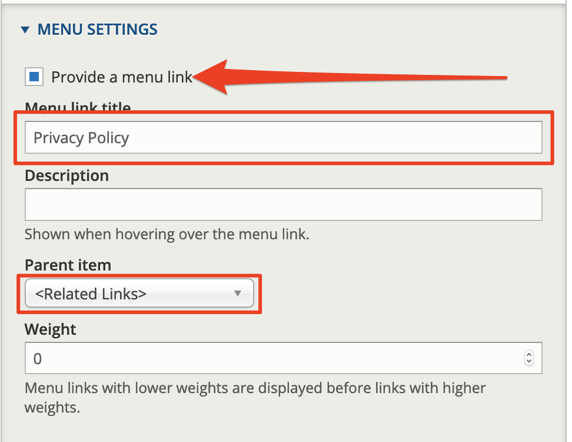

# Exercise 2: Build the related links menu

#### **Exercise 1.7:** Build the related links menu

In this exercise, we’ll add a Related Links menu item. This can be broken into two stages:

1. Adding the custom menu
2. Adding in the menu items
3. **Add the custom menu**
   1. Go to the menu administration page – /admin/structure/menu - and click on the **Add menu** link at the top of the page.
   2. Type in the name of our menu in the _Title_ field: **Related Links**
   3. Type in a menu description in the _Administrative summary_ field. While the description is optional, it helps site administrators understand the different menus, especially if the site has lots menus.
   4. Click **Save** to create the new menu. 
4. **Add menu items to the related links menu**

Now that you’ve created the custom menu, you need to add in the links to existing pages. You can do this in one of two ways:

* Adding links to the menu when you edit the specific content pages/section
* Adding the items manually via the menu interface 

1. **Add Related links menu option to Basic page content type**
2. Go to Structure → Content types → Standard page and click **Edit**
3. Scroll down to “Menu settings”. Under Available menus, enable Related links 
4. Click Save content type
5. **Add several new Basic pages to build menu links**
   1. Add content using the Standard Page content type and create the following new pages:

* About us
* FAQs
* Disclaimer
* Privacy policy
  1. Make sure you select "Provide a menu link" and select the parent item "Related links" for all pages

* 1. Go to _Structure_ → _Menus_ → _Related links_. Click the **List links** tab. The new pages you created now appear in this admin area.

You can also add the links manually by following these steps:

1. In the menu administration page, click **Add link** at the top of the Related links. At the menu link creation page type in these settings:
   * **Link:** type **About** and select **About us**
   * **Description:** Jobs Posting About Us page
   * **Title**: About us \(2\)
2. Leave the other settings at their defaults and click **Save**
3. Repeat the steps above for any remaining menu items

Finally, you can re-order the links on your menu.

1. Go to _Structure_ → _Menus_ to see a list of all your site’s menus
2. Click on **Edit menu** to the right of the Related Links menu entry. You should see a list of the menu items we just created.
3. You can drag and drop the menu items to re-order them. Then click **Save configuration**.

**Note:** Another way to change the menu order is to change the ‘weight’ of the menu item when you’re editing the content.

