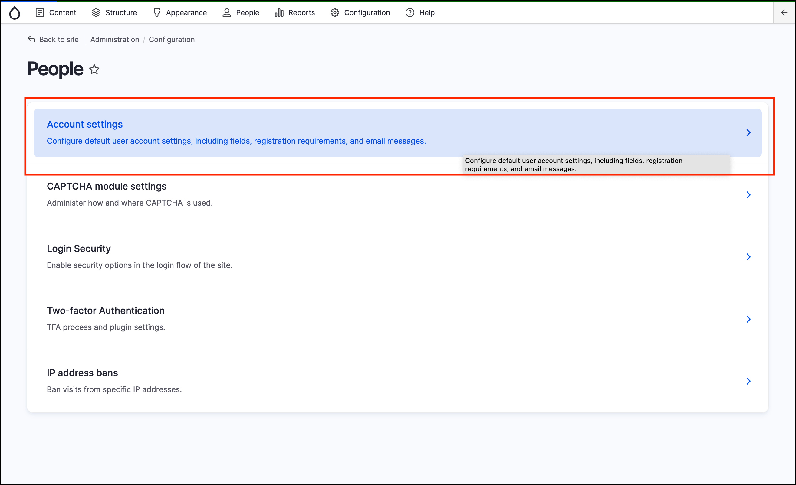

# Exercise 1.2: Configure account settings

In this exercise, you’ll learn how to access various account settings and change them in GovCMS.

1. On the _Admin menu_ hover on _Configuration_ then click **People**. Click on **Account settings**

    

2. Look at the “Who can register accounts” page and make sure you’re happy with the settings.
3. Here you can edit the automatic emails used for welcoming new users, account activation, password recovery, etc. Use tokens for setting email content. This is often overlooked, but it's a great way to provide a good first impression with new site members.

> (i) Tokens are specially formatted chunks of text that serve as placeholders for a dynamically generated value. For example, a token of \[title\] will automatically place the content’s title in the field.

This area allows users to login with a username or password and allows you to update the account creation process.

**Screenshot required**
