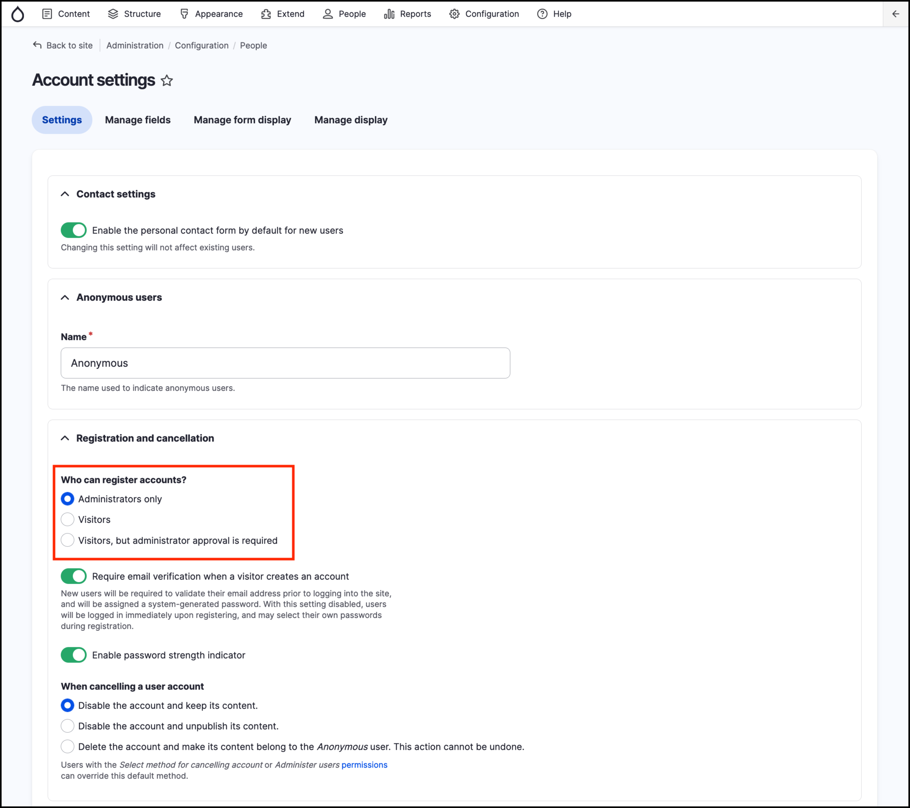
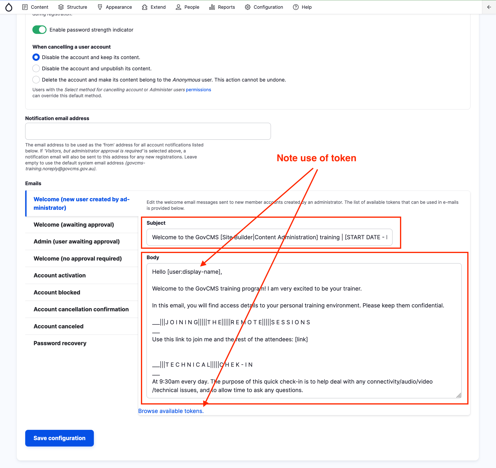

# Exercise 1.2: Configure account settings

In this exercise, you’ll learn how to access various account settings and change them in GovCMS.

1. Navigate to _Configuration_ → _People_ → **Account settings**

This area allows users to login with a username or password and allows you to update the account creation process. Look at the “Who can register accounts” page and make sure you’re happy with the settings. To allow Job Seekers to register an account, change the setting to "Visitors".

On this page you can edit the automatic emails used for welcoming new users, account activation, password recovery, etc. Use tokens for setting email content. This is often overlooked, but it's a great way to provide a good first impression with new site members.

The screenshot below shows the email sent to trainees as part of the setup for a course. Change it to reflect an email you would wish to send to a newly registed Job Seeker.


Tokens are specially formatted chunks of text that serve as placeholders for a dynamically generated value. For example, a token of \[title] will automatically place the content’s title in the field.

