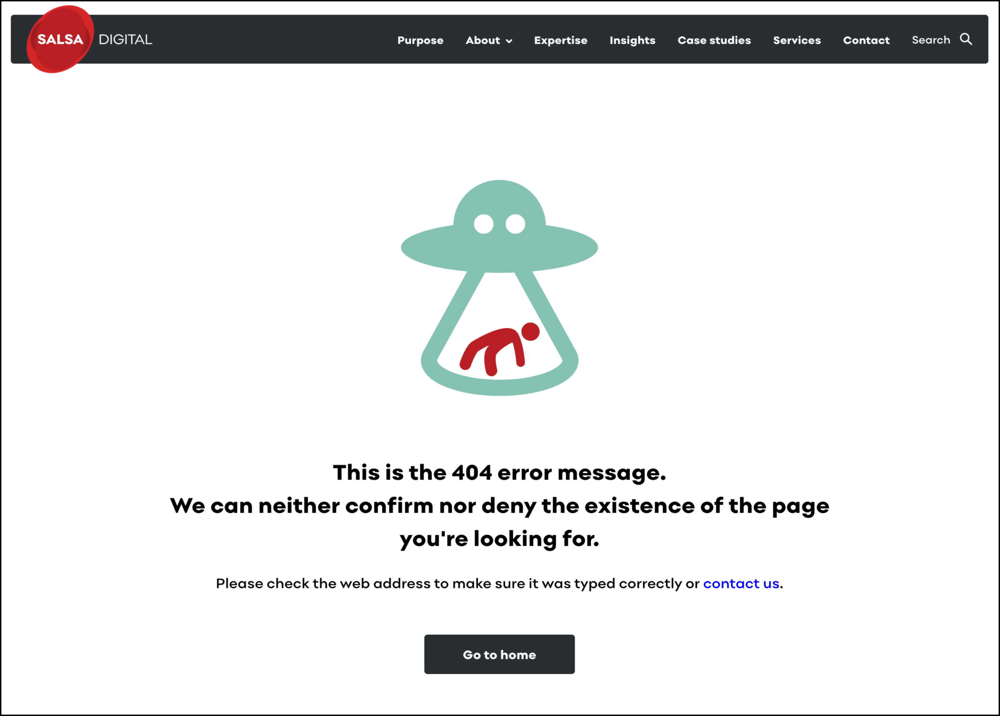

# Exercise 1.9: Create a friendly error page

Customising error messages is often overlooked, but it’s easy to tailor this experience for your website. See: [https://salsadigital.com.au/somepage](https://salsadigital.com.au/somepage) as an example.

In this exercise you’ll create a custom error message/page. The page could be a graphic, or a useful message.

1. Create basic _Standard pages_ with an appropriate message for each situation \(e.g. [http://example.com/notfound](http://example.com/notfound) and [http://example.com/accessdenied](http://example.com/accessdenied)\)
2. Go to _Configuration_ → _System_ → **Basic site settings**.
3. Type in the paths in the bottom section on **Error pages**.
4. Save configuration.

