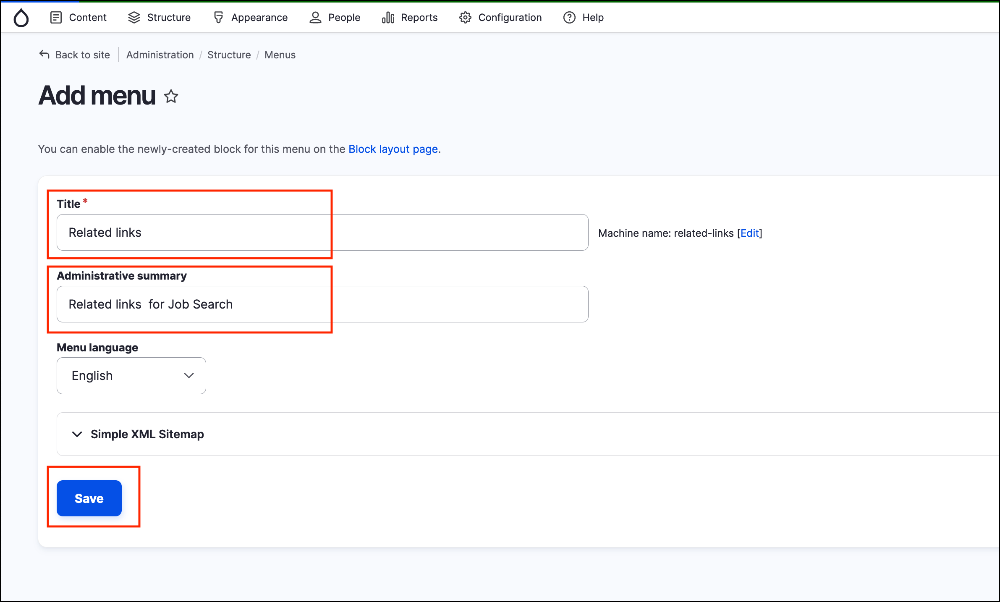
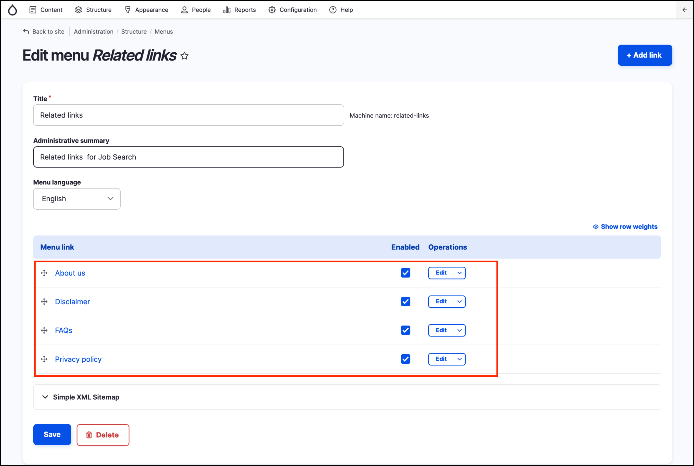

# Exercise 1.4: Build the related links menu

In this exercise, we’ll add a Related Links menu item. This can be broken into two stages:

## Adding the custom menu

1. Go to the menu administration page – /admin/structure/menu - hover over _Structure_ on the _Admin menu_ then click _Menus_. Click on the **Add menu** button at the top right of the page.
2. Type in the name of our menu in the _Title_ field: **Related Links**.
3. Type in a menu description in the _Administrative summary_ field. While the description is optional, it helps site administrators understand the different menus, especially if the site has lots menus.
4. Click **Save** to create the new menu.

## Add menu items to the related links menu

Now that you’ve created the custom menu, you need to add in the **links** to existing pages. You can do this in one of two ways:

* Adding links to the menu when you edit the specific content pages/section.
* Adding the items manually via the menu interface.

### Add Related links menu option to Basic page content type

1. On the _Admin menu_ hover over _Structure_ → _Content types_, then click on **Standard page**.
2. Scroll down and click on the “Menu settings” item. Under Available menus, enable Related links.
3. Click **Save content type**.

### Add several new Basic pages to build menu links

Add content using the Standard Page content type and create the following new pages:

* About us
* FAQs
* Disclaimer
* Privacy policy

Make sure you select "Provide a menu link" and select the parent item "Related links" for all pages. See the screenshot below for an example.

## View Related Links menu

On the _Admin menu_ hover over _Structure_ → _Menus_ then click on **Related links**. The new pages you created now appear in this admin area.

You can also add the links manually by following these steps:

1. In the menu administration page, click **Add link** at the top of the Related links. At the menu link creation page type in these settings:
   * **Link:** type **About** and select **About us**.
   * **Description:** Jobs Posting About Us page.
   * **Title**: About us (2)
2. Leave the other settings at their defaults and click **Save**.
3. Repeat the steps above for any remaining menu items.

Finally, you can re-order the links on your menu.

1. Go to _Structure_ → _Menus_ to see a list of all your site’s menus.
2. Click on **Edit menu** to the right of the **Related links** menu entry. You should see a list of the menu items we just created as in the previous screenshot.
3. You can drag and drop the menu items to re-order them. Then click **Save configuration**.


**Note:** Another way to change the menu order is to change the ‘weight’ of the menu item when you’re editing the content.


> ****
