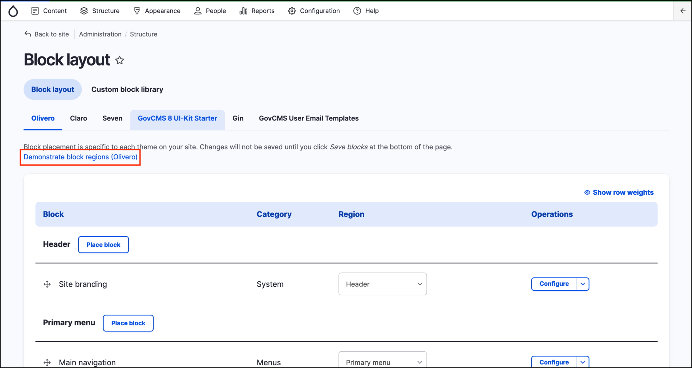
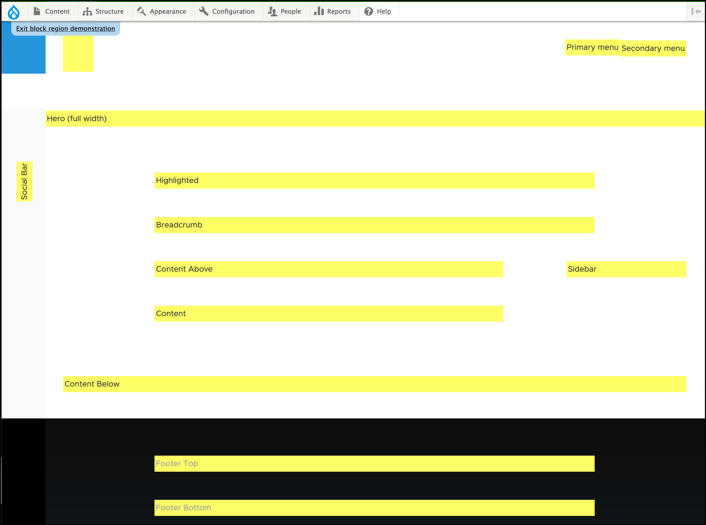

# Regions in GovCMS

Besides its primary content, a web page contains other content such as site branding \(site name, slogan, and logo\), navigation aids \(menus, links, and icons\), formatted text and images. Each theme provides a set of named regions, such as _Header_, _Content_, and _Sidebar_, where site builders may choose to place their content.

The available regions depend on the theme design. Only the Content region, which contains the primary content, is required; others are optional.

Regions can be displayed by hovering over _Structure_ on the _Admin Menu_ then clicking **Block layout**. 

Once at this page, click on the **Demonstrate block regions \(Olivero\)** button.

