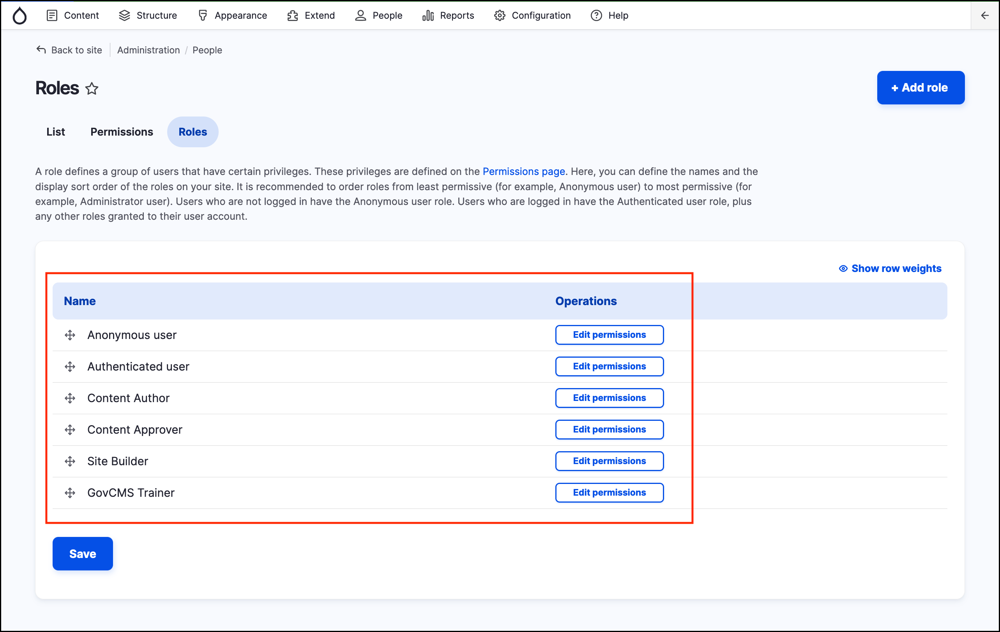

# Roles and Permissions

Rather than assigning individual permissions directly to each user, permissions are grouped into **roles**. You can define one or more roles on your site, and then grant permissions to each role.

Each (backend) user account on your site is automatically given the Authenticated user role, and may optionally be assigned one or more additional roles. When you assign a role to a user account, the user will have all the permissions of the role when logged in.

It’s a good practice to create several roles on your site.

GovCMS comes with a number of default roles:

1. Content Author
2. Content Approver
3. Site Administrator

To explore available roles, navigate to _People_ → _Roles_.


When assigning permissions to a role, always give the least permissions necessary and test permissions before assigning the role to a user.


## User roles analysis

In the case of our new Government Jobs Portal, our site needs three user roles:

* **Job Seeker:** Job seekers can’t create any content in the site but **can** save job applications (webforms) and update their profile.
* **Content Author:** These are the agency staff members who will be creating content for the website.
* **Content Approver:** These are the agency staff members who will be approving content for publishing.

The Content Author role is available by default in GovCMS sites and in your training environment. We will cover creating the Job Seeker role in the following exercises.
