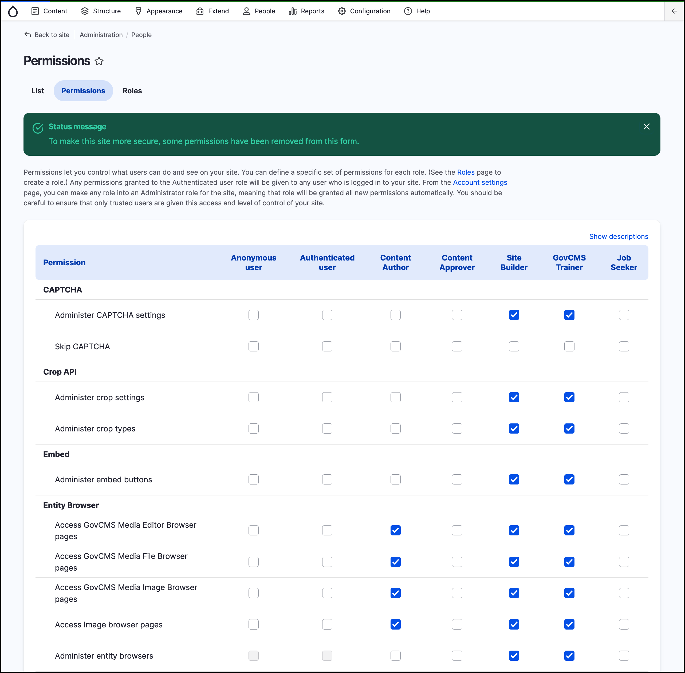

# Test permissions

It’s important you use GovCMS’s _User Role_ and _Permissions_ features to help keep your site secure. User roles and permissions help to ensure users can’t take advantage of security vulnerabilities on your site. To test permission settings, follow these steps:

Go to _People_ → _Permissions_. The permissions should be as follows:
 
   - **Site Builder**: Most permissions selected
   - **Content Author**: Permissions selected for adding and editing any content
   - **Content Approver** and **Job Seeker**: Cannot have any permissions to add, edit, edit or delete content.
   - **Annonymous user**: No permissions
   - **Authenticated user:** No permissions

> Note: You will be creating the Job Seeker role as part of the exercises in this course.

