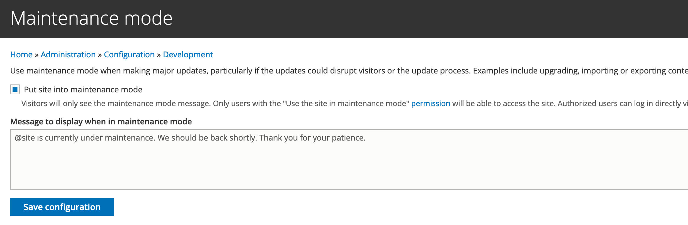

# Appendices

### Appendix 1: Local development tips

The GovCMS site building manual and course doesn’t focus on local development. However, at some point you may want to set up your local environment to isolate your work from a shared cloud environment.

#### Use bundled Docker set up

Local Docker-based setup is bundled into GovCMS8. To start using it, you have to have Docker installed on your local computer. Docker is available for Windows, MacOS and Linux.

To get started with GovCMS on your local computer, close your project and follow the instructions found in the README.md file.

To get a vanilla GovCMS 8 running on your local, clone the GovCMS8-Scaffold repository and follow the installation instructions in the README.md file: [https://github.com/govcms/govcms8-scaffold](https://github.com/govcms/govcms8-scaffold) and [https://github.com/govCMS/govcms8-scaffold/blob/master/README.md](https://github.com/govCMS/govcms8-scaffold/blob/master/README.md)

### Appendix 2: Taking a site offline

GovCMS websites can be put into offline _maintenance mode,_ so you can perform site maintenance. During any maintenance period, you can post a maintenance message for visitors.

#### **Exercise** – Put your site into Maintenance mode

In this exercise you’ll learn how to put your site into maintenance mode and how to put it back online.

1. Set maintenance mode permissions
   1. Navigate to **People** → **Permissions** 
   2. Find permission “Use the site in maintenance mode” and select roles you wish to allow to log in during this time.
   3. Save the configuration.

**Tip:** Whenever your site is in maintenance mode, add /user URL to the full address of your site to access it.

Put site into maintenance mode

*
  1. Login to your site as user 1 (the account you created when you installed GovCMS). If you run your site locally, execute “ahoy login” command in terminal, to get the one-time login URL. If you are provided with a hosted training environment, use username **admin**) and click on the _Configuration_ tab in the admin menu. Under the _development_ section, select _Maintenance mode_ – this will take you to the _Maintenance mode_ admin page.
  2.  Check the _put site into maintenance mode_ checkbox and enter a message site visitors will see while the site is offline. Click the **Save configuration** button to put the site in maintenance mode and take it offline.

      
  3. To test the maintenance mode, logout of the site (or use an incognito mode or different browser). You should now see a _Site under maintenance_ page displaying the message you entered.

Take site out of maintenance mode

*
  1. Go to the user login page at [http://example.com/user](http://mysite.com/user). Login as user 1 to perform any required maintenance tasks. GovCMS now displays an admin message on every page (see screenshot below): 
  2. You can click **Go online** when you’re ready to put the site back online. From the Maintenance admin page, deselect the _put site into maintenance mode_ checkbox and click **Save configuration**. Your site will then be back online.
