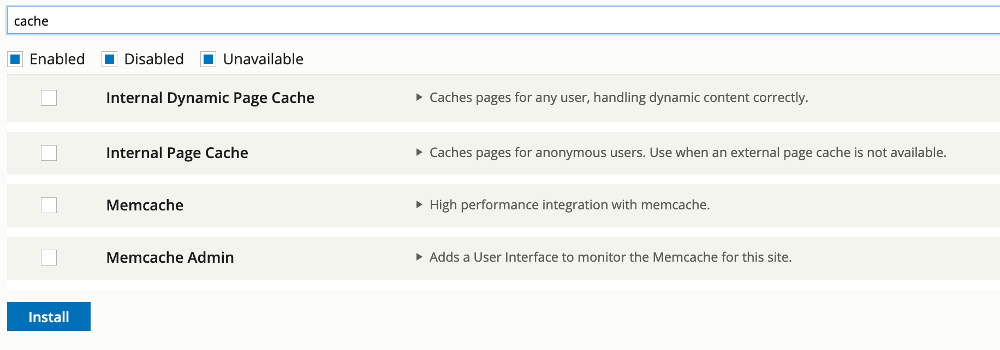

# Review current issues and bottlenecks

An external speed optimisation tool like [http://webpagetest.org](http://webpagetest.org/) will highlight the problems and provide some guidance to mitigate or minimise the impact. Here we’ll cover some general and common issues and how to tackle them in GovCMS.

#### First Byte time

The First Byte time indicates that your website takes too much time to render the page. This may be a result of a less than optimal website configuration, low-performant code or lack of caching. Managing website cache may be a relatively easy way to speed up the site.

Before proceeding with website caching, let’s review which caching modules are available in GovCMS. Navigate to the **Extend** page and enter “cache” in the filter field.

**Note:** GovCMS SaaS does not provide Memcached container and so the Memcache and Memcache Admin modules have to stay disables.

We can safely activate the **Internal Dynamic Page Cache.** The **Internal Page Cache** modules may be left disabled, as the GovCMS hosting platform provides an efficient reverse-proxy cache – a better replacement to this module.

#### Enable GovCMS internal cache

Note! Before changing configuration of the internal cache in production, an UAT testing has to be conducted to avoid unforeseen rendering problems for dynamic website content.

Enable caching of the site by going to **Configuration** → **Development** → **Performance**. Activate CSS and JS aggregation.

This step improves site loading speeds by reducing the number of connections between the client browser and webserver. You can find CSS and JS aggregation settings in the **Bandwidth optimisation** section.

Reassess your site’s performance to estimate the improvements.
