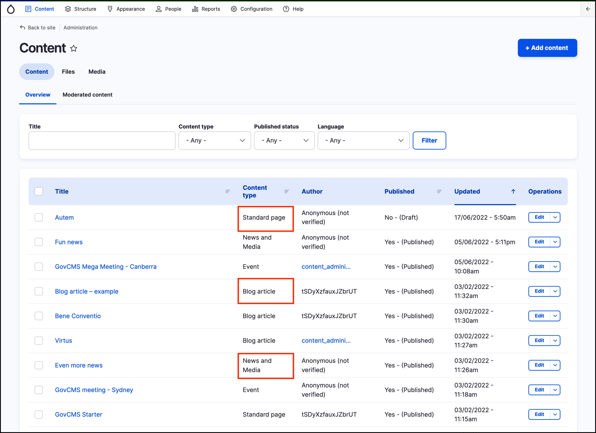

# Exercise 2.1: Compare content types

In this exercise we’ll compare content form and display using the default content types in GovCMS. We explore some fields and form widgets and how these can change between content types.

## Create content

1. Click Content → **Add content**.
2. Create a **Standard page** titled “About us” _Use a Lorem Ipsum generator to add placeholder text_. Do not add the page to the menu and keep all other defaults. Publish the page.
3. Create a **News and Media** article titled “Salary rates in 2019 for Government employees” Again, _Use a Lorem Ipsum generator to add placeholder text_. Do not add the page to the menu and keep all other defaults. Publish the page.

## Compare content types

Go to Admin → **Content**. Compare the editing forms and content display. **News and Media** and **Standard Pages** have different default settings.

