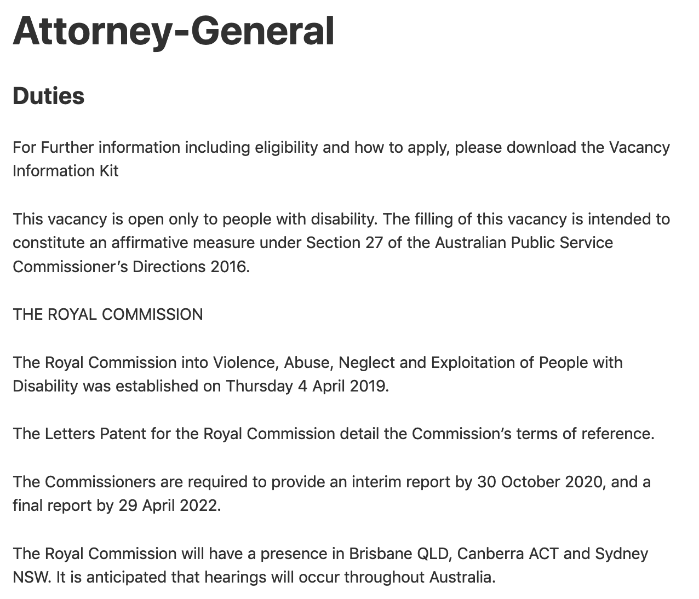
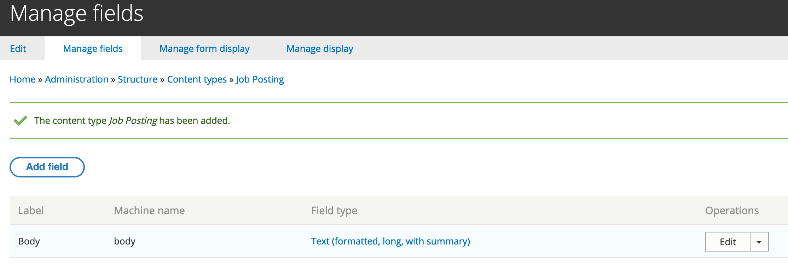

# Exercise 2.3: Create a content type

Different content types meet different content requirements while ensuring consistency across a type of content. Content types are set up with text boxes and structured through pull-down menus and check boxes.

https://www.drupal.org/docs/user\_guide/en/structure-content-type.html

In this exercise you’ll create a Job Posting content type. The screenshot below shows the form and what the posting will look like on the website.

| Create job posting form | Individual job posting |
| :--- | :--- |
|  |  |

As the name suggests, the _Job Posting_ content type will be used to post jobs on the website. There are three stages involved:

1. Create content type
2. Review your content type
3. Adjust the permissions for your new content type

## Create a content type

1. Go to Structure → Content types. Click **Add content type**
2. Next, type in the content name and description:
 - **Name**: Job Posting
 - **Description**: Post a job to the jobs section of the site. \(The description needs to explain the content type.\)

3. Next, scroll down to the configuration tabs. Under **Submission form settings** follow these:
 - **Title field label:** _Job title_
 - **Preview before submitting:** Disabled
 - **Explanation or submission guidelines**: Leave this empty. This field lets you put in any specific instructions for the content type.

    

4. We want jobs to be published by default, but not automatically promoted to the front page, so under **Publishing options** use these settings:
 - **Published**: Leave selected
 - **Promoted to front page:** Deselect

    > **Note:** Some Content Authors \(depending on their permissions\) will be able to override these defaults when creating content.

5. We don’t want the author’s name or the content publish date displayed, so under **Display settings** deselect the _Display author and date information option_.
6. We also don’t want job listings being added to the menu navigation, so under the default **Menu settings**, deselect Main menu.
7. Click _**Save and manage fields**_. This brings you to the Manage Fields admin page - admin/structure/types/manage/job\_posting/fields. Review the default fields that were created for your new content type.  

## Review your content type

Go to **Content** → **Add content** and select Job posting. Review the form for your new content type.

## Adjust permissions for your new content type

Go to **People** → **Permissions** and change the permissions to match the other content types.

## Challenge exercise 2.4: Plan a new content type

Looking back on what you’ve learnt so far during this unit, think about how you’d add a new content type, such as ‘Media conference’. What fields would you need to include? Plan out the process you’d follow to create the new content type.
