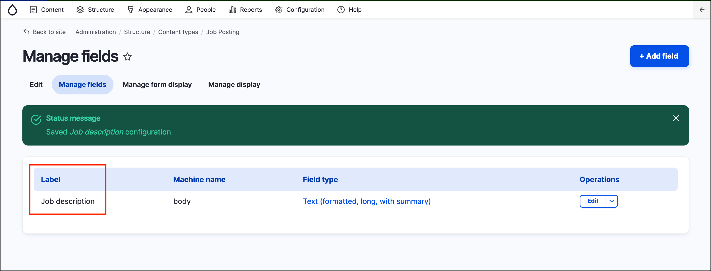

# Exercise 2.5: Modify an existing field

1. Go to _Structure_ → _Content types_ → _Job posting_ → **Manage fields**.
2. Click **Edit** on the body field (this will only change the way the field appears in the Job posting content type, and not others):
 - Change the **Label** to “Job description”
 - Deselect **Summary** input

3. Click **Save settings**. Your field listing should show the new label.

