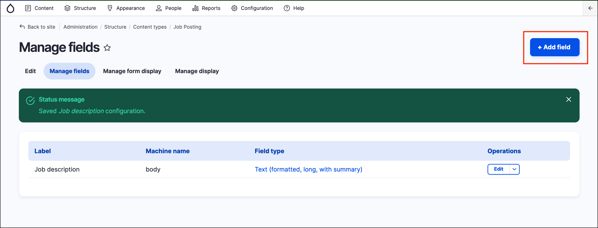
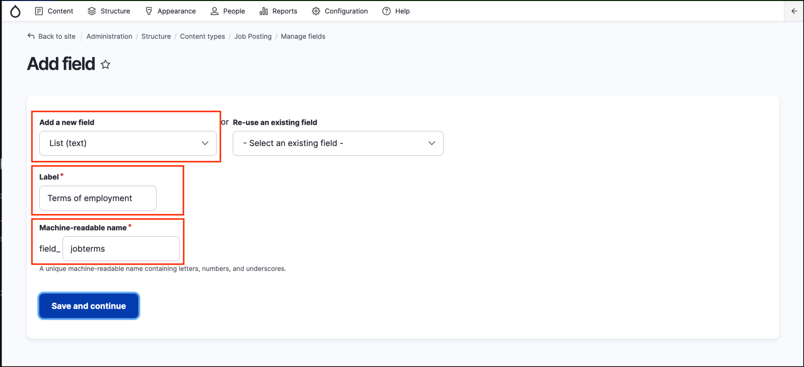
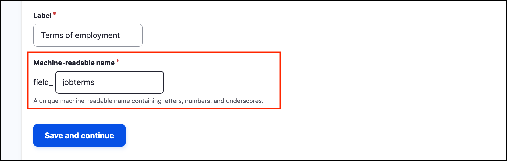
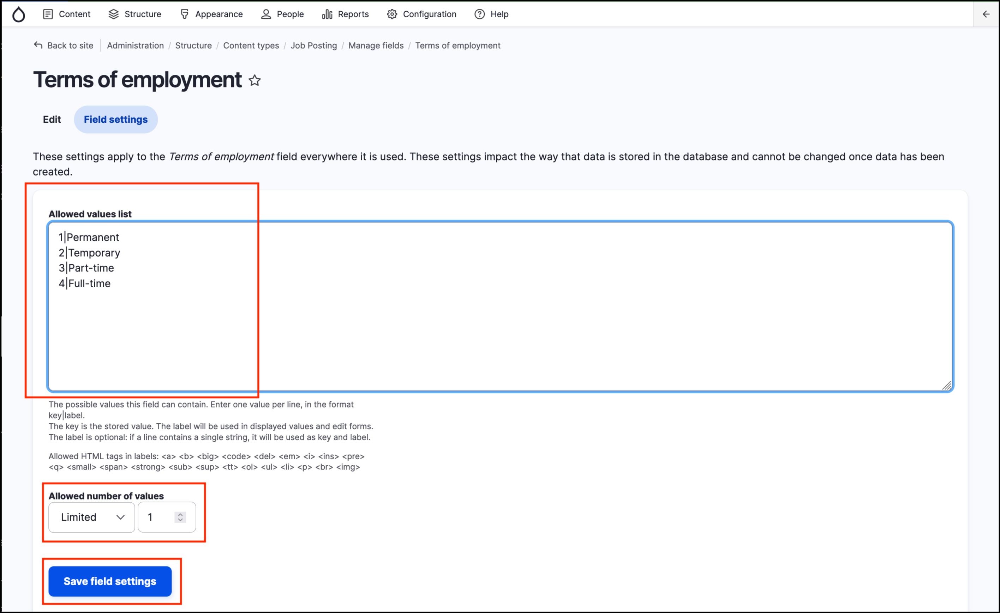
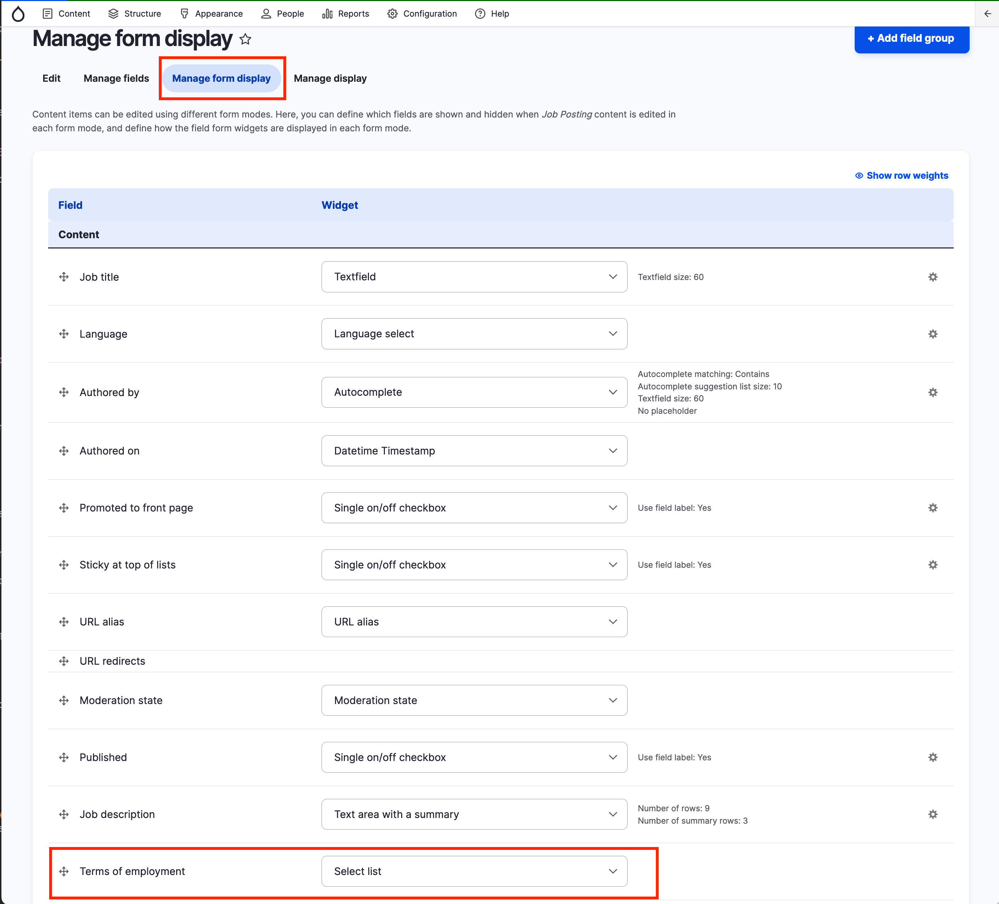
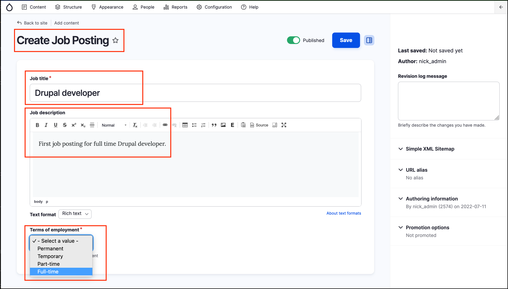

# Exercise 2.6: Add a custom text field

For our Government Jobs Portal website, we want to let site visitors filter job offers by full time/part time. In this exercise, we’ll add this value in.

## Add a field

Let’s start by adding our first field – _Terms of employment_

1. Go to _Structure_ → _Content types_ → _Job posting_ → **Manage fields** (if you have moved away from this page).
2.  Click **+ Add field**.

    
3.  Under **Text**, select _List (text)_.

    * Enter “Terms of employment” for **Label**.
    * For the Machine name, click edit and enter the machine name: _jobterms_.
    * Click **Save and continue**.

    
4. Click **Save and continue** and you’ll go back to the _Field settings_ page for the _Terms of employment_ field.

Review the _Field naming conventions_ section below, before moving to the _Field settings_.

### Field naming conventions

When adding a new field, GovCMS automatically suggests a field name. You can edit the field name when you’re adding it but cannot change it later on. When naming the field you should think carefully about a logical name, especially if you’ll be using the field in other content types.

The field name can only contain lowercase letters, numbers 0-9, and the underscore character. It’s a good idea to set up a naming convention early on.

## Configure field settings

Next we’ll set up the values (items) for our dropdown list.

1.  Add the following options to the **Allowed Values list** text area:

    * 1|Permanent
    * 2|Temporary
    * 3|Part-time
    * 4|Full-time

    

    > **Note** You must include the numbers before each entry because they provide a numerical key for each option, which means you can change the names of the items without losing content.
2. Select “Limited” and “1” in the **Allowed number of values** dropdown and scrollwheel.
3. Click **Save field settings**.

## Configure default settings

Now you’ll see the Edit tab, with the field’s default settings. Follow these settings:

* Select **Required Field**.
* **Help text**: _“Please select terms of employment”_ (to be displayed when creating or editing Job Posting content).
* **Default value** for Terms of employment: leave this as **- None -**.
* Click **Save settings**. You’ll then be returned to the _Manage fields_ page.

### Manage Form display

The Manage Form display tab allows you to control fields that will be available in the content creation form, along with widgets. This page is used to make adjustments to the widgets used in content types.

Navigate to the **Manage Form display** page and review the available fields. Locate the “Terms of employment” field you created and review what widget selection is available.

## Review your content type

Once you’ve saved your last field, you’ll be taken back to the Job Posting Manage fields page. All the fields you add to your content type will be visible here.

Finally, you should test the content type by adding content to it.

Go to _Content_ → _Add content_ and choose the **Job posting** option. Check the form and create a test job posting for a full-time job as a Drupal developer. Save the new job posting and note the URL path for the new content.


To view the field you’ve created, go to _Reports_ → **Field list**.

