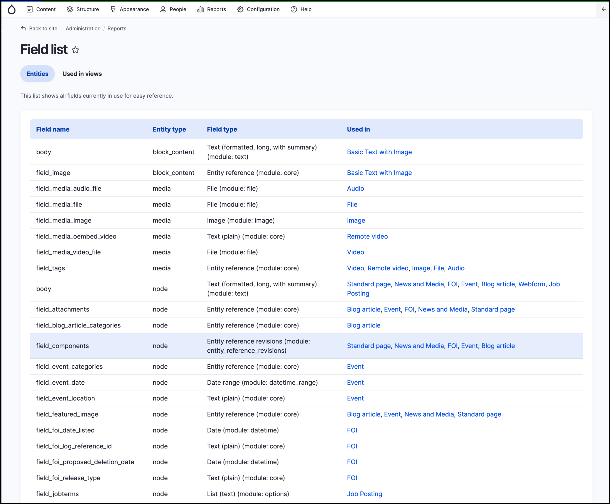

# Exercise 2.7: Review the Field list report

1. Go to _Reports_ → **Field list** to see a list of fields added to your site.
2. **Delete** any unused fields on your site.

> Remember, using common fields across multiple content types allows you to edit some global settings and values in one place.
