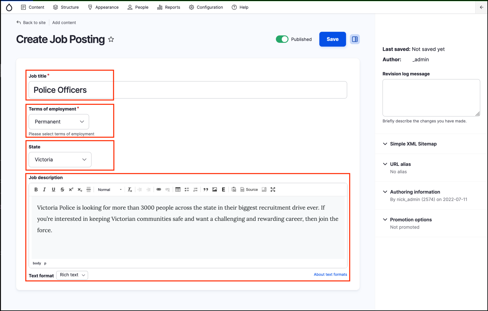
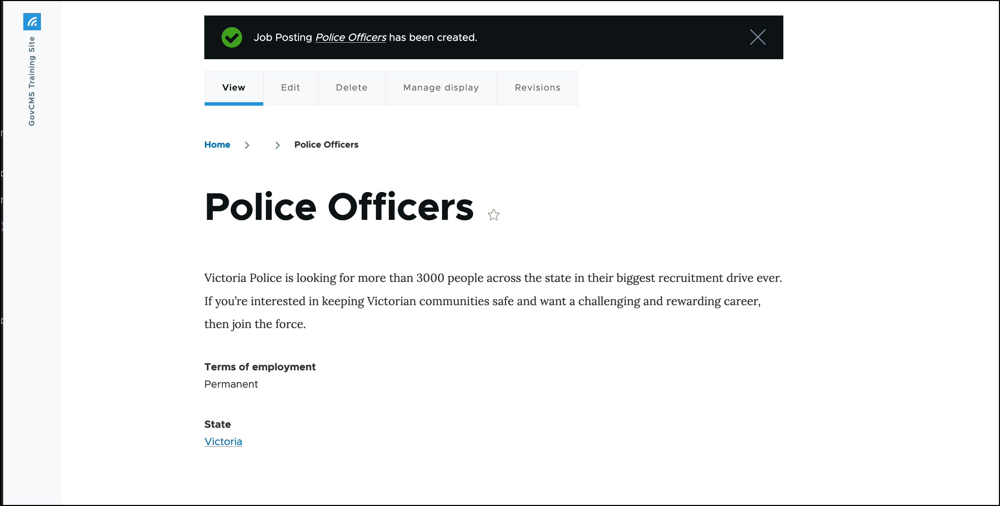
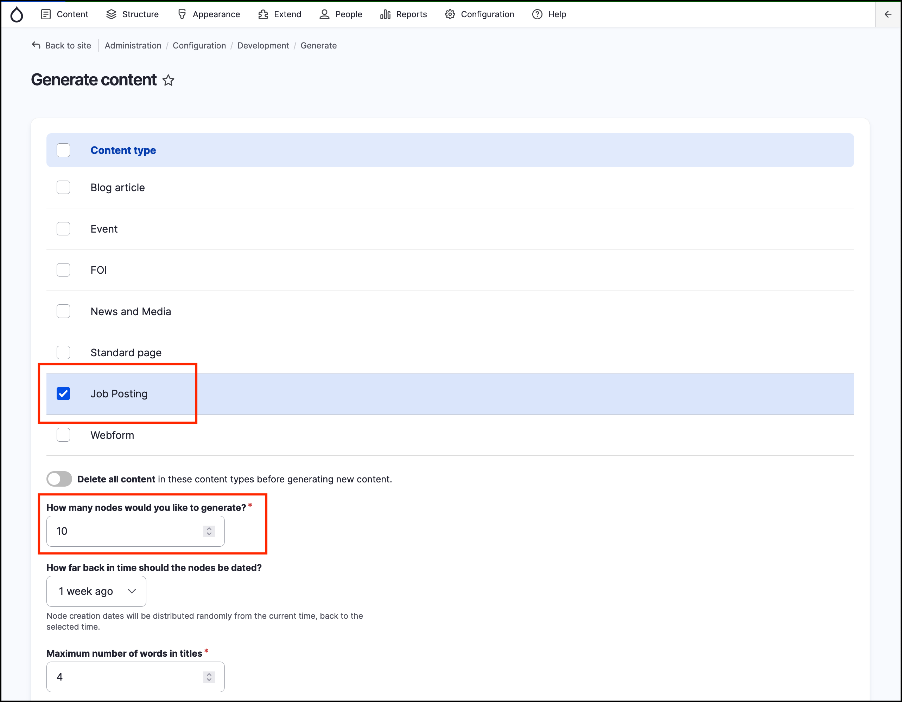

# Exercise 2.8: Testing content types

## Content test - manual

Create a Job listing manually.

1. Go to _Content ->_ _Add content_ → **Job posting**.
2.  On the Add Job posting form, enter the following information:

    * **Job Title** – Police Officers
    * Terms of employment – Permanent
    * Geographical Region: Victoria
    * **Job Description** – Victoria Police is looking for more than 3000 people across the state in their biggest recruitment drive ever. If you’re interested in keeping Victorian communities safe and want a challenging and rewarding career, then join the force.

    
3. Leave all remaining default settings.
4. Click **Save**.

You should now see your newly created Job Posting.

## Content test – generated content

Often we need content to help test new content types. However, creating content manually can be very time consuming. Instead, we can use the Devel Generate – a module, bundled in GovCMS.

**Note:** The Devel Generate module should not be enabled or used in a production website.

This module is already enabled on your training environment.

1. Go to _Configuration_ → _Generate_ → **Generate content**.
2. Select the Job Posting checkbox.
3. Enter 10 in the **How many nodes would you like to generate?** field.
4. Click **Generate** button.


**Note**: Content generated by the Devel Generate module is not published by default – this is due to active content moderation workflow. Make sure you publish content if necessary.

