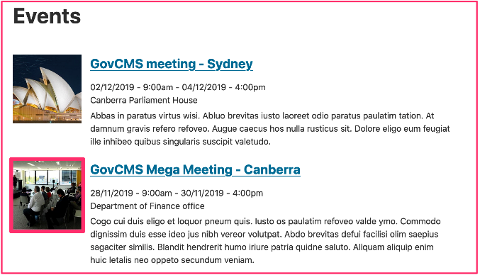
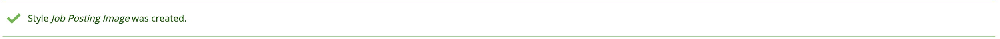
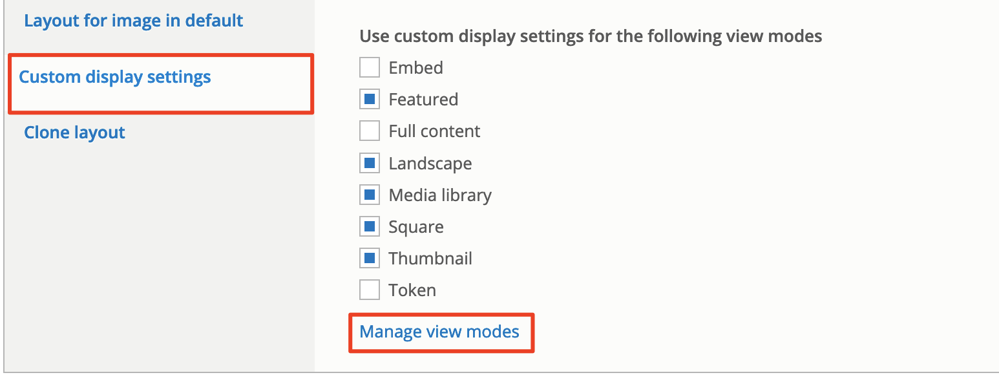
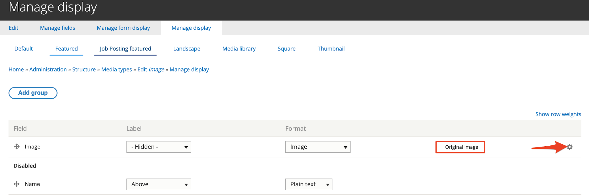
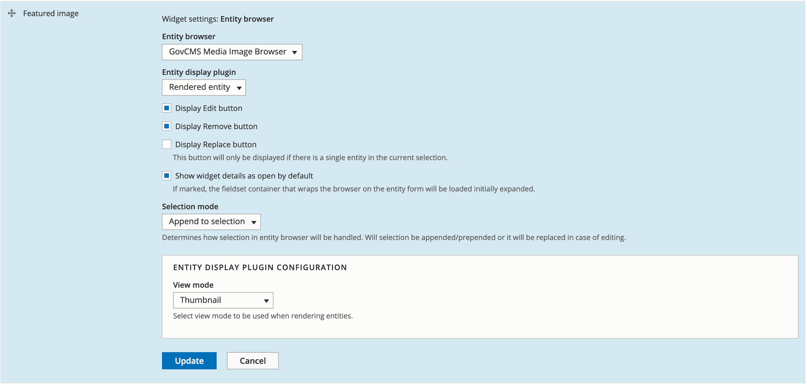

# Review configuration of image media display

#### **Exercise 3.1:** Review configuration of Image Media display

When embedding media assets from other content types and entity types, we have the option to display them rendered, in which case we have to select the required view mode. In this exercise we’ll explore how Display modes in the Media type **Image** link to the _Image styles_.

1. Navigate to Structure → Media types → Image
2. Explore the primary tabs of “Manage fields” and “Manage form display”. The user interface is almost identical to the content types.
3. Go to the Manage display tab.
4. Explore the available display modes, paying attention to the advanced configuration of the Image field.
   1. Default
   2. Featured
   3. Landscape
   4. Media Library
   5. Square
   6. Thumbnail
5.  The Advanced configuration of the Image field uses “Image styles” in most cases

    

### 3.4 Example use of image styles

In the Event content type, we have an image field. The same image may display as a Thumbnail (left in the screenshot below) or Full content image (right in the screenshot below). The image is scaled down, resized and cropped. Each image has a copy stored in the filesystem.

| Example: thumbnail             | Example: Full content image          |
| ------------------------------ | ------------------------------------ |
|  | .png>) |

You may explore how the Event content type displays these images based on the Display Mode.

1. Navigate to the Structure → Content types → Event → Manage display → Teaser Small
2.  Locate the Image field. Explore how it’s rendered by using the **Square** _Display mode_ from the **Image** _Media entity_ (see previous exercise) !\[A screenshot of a cell phone

    Description automatically generated]\(../.gitbook/assets/59%20%281%29.png)

### 3.5 Naming image styles

Image styles allow you to scale, crop and resize images without changing the original image. By default, in GovCMS seven sizes are defined:

1. Featured
2. Landscape
3. Large (480×480)
4. Linkit result thumbnail
5. Medium (220×220)
6. Square
7. Thumbnail (100×100)

The **Thumbnail (100×100)** style, for example, is shown with the teaser for image posts and **Square** is used when listing Events.

When you change an image style configuration, the image module automatically refreshes all created images.

Every image style must have a name, which will be used in the URL of the generated images. Image styles are generally named in one of three ways:

1. Using a generic style label/name, such as “Featured” or “Thumbnail”. This is the most flexible and can be reused in different locations.
2. Using its ‘location’ within the image style name, e.g. “Events Banner”.
3. Using the image size to name it, such as “Large (480×480)”.

You can name your image styles differently, but we recommend setting up a naming convention.

#### **Exercise 3.2:** Add and configure a media field

In this exercise you will add an Image media field to a content type and learn how to configure it. There are four steps involved:

1. Create an image style
2. Configure an Image Media entity view mode to use an Image style
3. Check permissions
4. Add image field to content type

Image styles are set and configured in the _Image styles admin page_.

1. **Create an image style**
   1. Go to Configuration → Media → Image styles
   2. To create our new image style, click on the **Add image style** button at the top of the page. .png>)
   3. Name it **Job Posting Image** given the image style will be applied to the “Job posting” Featured Image field.
   4. Click the **Create new style** button to save the new image style. You’ll then be taken to the “Edit style Job Posting Image” page. 
   5. The next step is to add the Scale effect. Under **Effects** select **Scale** from the dropdown menu. Click **Add**. You’ll then be taken to the “Add scale effect” page.
   6. Enter the following settings:
      * **Width**: 1200
      * **Height**: leave empty This allows you to have a flexible image height and keep the original proportions of the image.
      * Leave the **Allow Upscaling** checkbox unselected Image upscaling usually leads to poor image quality.
      * Click Add effect. .png>)
   7. Your _image style_ has been saved. You can make additional changes and then click the **Save** button to save those changes.

.png>)

1. **Configure an Image Media entity view mode to use an Image style**
   1. Navigate to the _Structure_ → _Media types_ → I\_mage\_ → _Manage display_ (/admin/structure/media/manage/image/display). You should see some out-of-the-box available view modes. .png>)
   2.  Scroll to the bottom of the page and expand the **Custom display settings** pane. You can see a few _View modes_ preselected by default. Each selected checkbox here represents an enabled _View mode_ at the top of the page.

       Since we need to apply our custom _Image style_, we have to create a new _View mode_ so that we don’t affect the display of existing images that are configured to display with other _View modes_.\
       
   3. Open the **Manage view modes** link (see the previous screenshot) in a new tab/browser window. .png>)
   4. Locate the Media and click **Add new Media view mode** link.
   5. Give it a name “Job Posting featured” and click the **Save** button.
   6. Return to the previous browser tab/window - go back to step 2b above and refresh the page to get the updated list of _View modes_.
   7. Repeat step 2b above by scrolling down and expanding the _Custom display settings_ pane. You should now see the Job Posting featured _view mode_ as a checkbox option. Select it and save the page.
   8. Note, that the **Job Posting featured** tab is now available at the top:  Click it to navigate to the view mode configuration page.
   9. At the moment, the Image field is the only one available for display and it is set to show as the originally uploaded image, without any _image style_. We need to change it to apply our custom _Image style_. 
   10. Click the gear link on the right to change from the Original image to the _image_\
       _style_ **Job Posting Image.**\
       \_\_.png>)

       Press the **Update** button to save the changes.
   11. Confirm the image style option has changed: .png>)
   12. Press the **Save** button to save the changes.
2. **Check permissions**
3. Go to **People** → **Permissions** and double check the permissions for the content type: _Job posting_.
4. Make sure the _Content Author_ role has permissions to _Create_, _Edit_ any and _Delete_ any _Job posting_. 
5. Click Save permissions
6. **Add image field to content type** Go to Administration → Structure → Content types → Job Posting → Manage fields page. Add a field following these steps:
   1. Click the **Add field** button.
   2.  In the “Reuse an existing field” selector, choose **Entity reference: field\_featured\_image**.

       
   3. Ensure the label reads “Featured Image”.
   4. Click the **Save and continue** button.
   5. In the next page, select the “Create referenced entities if they don't already exist” checkbox in the Reference type fieldset.

.png>)

*
  1. Select Image as **Media type**.
  2. Leave the remaining values to their defaults and **Save settings**. This will take you back to the **Manage fields** page.
  3. Navigate to the **Manage form display** (secondary tabs).
  4. Locate the **Featured image** field, set the _Widget_ to **Entity Browser**
  5. Change the Widget for the field as displayed below:

#### **Challenge Exercise 3.3:** Change image size

Remove the _Scale width 1200_ effect in the _Job Posting Image_ style and replace it with Scale and Crop, applying 1200px wide and 400px height dimensions.

Review how GovCMS updates the _Job posting_ images for the existing content.

What if you want to change the image size? The original image is saved as a backup and can be changed. If you decide to change the _Job Posting Image_ style later (for example change the image’s dimensions to 200 x 200) GovCMS will automatically resize all _Job posting_ images. You can also completely change the image style used in a content type by editing the content type display settings. This also flushes the cached versions and creates new, resized versions
