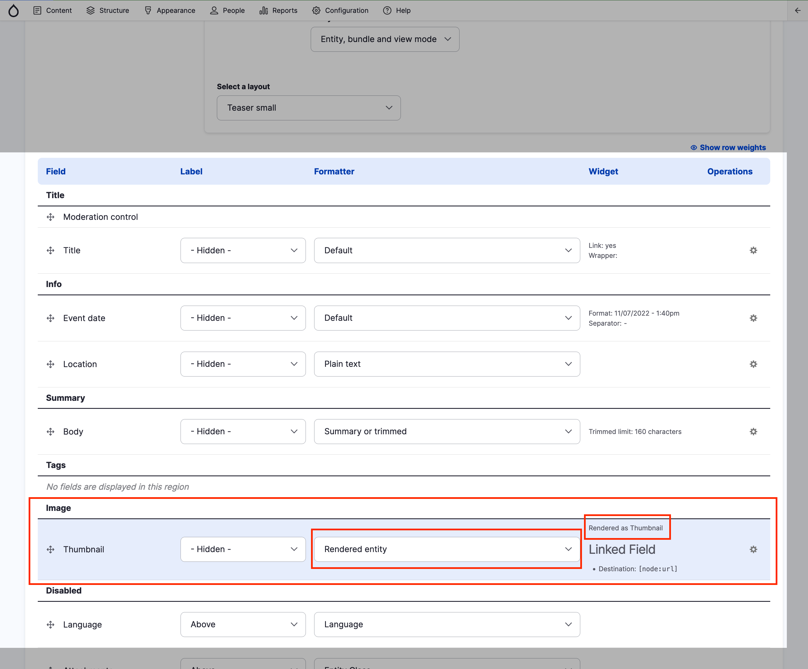

# Exercise 3.1: Example use of image styles

In the Event content type, we have an image field. The same image may display as a Thumbnail (left in the screenshot below) or Full content image (right in the screenshot below). The image is scaled down, resized and cropped. Each image has a copy stored in the filesystem.

| Example: thumbnail                                             | Example: Full content image                                       |
| -------------------------------------------------------------- | ----------------------------------------------------------------- |
| .png>) | .png>) |

You may explore how the Event content type displays these images based on the Display Mode.

1. Navigate to _Structure_ → _Content types_ → **Event** → **Manage display** → **Teaser Small**.
2. Locate the Image field.

Explore how it’s rendered by using the **Thumbnail** _Display mode_ from the **Image** _Media entity_ (see previous exercise).

## Naming image styles

Image styles allow you to scale, crop and resize images without changing the original image. By default, in GovCMS seven sizes are defined:

1. Featured
2. Landscape
3. Large (480×480)
4. Linkit result thumbnail
5. Medium (220×220)
6. Square
7. Thumbnail (100×100)

The **Thumbnail (100×100)** style, for example, is shown with the teaser for image posts and **Square** is used when listing Events.

When you change an image style configuration, the image module automatically refreshes all created images.

Every image style must have a name, which will be used in the URL of the generated images. Image styles are generally named in one of three ways:

1. Using a generic style label/name, such as “Featured” or “Thumbnail”. This is the most flexible and can be reused in different locations.
2. Using its ‘location’ within the image style name, e.g. “Events Banner”.
3. Using the image size to name it, such as “Large (480×480)”.

You can name your image styles differently, but we recommend setting up a naming convention.
