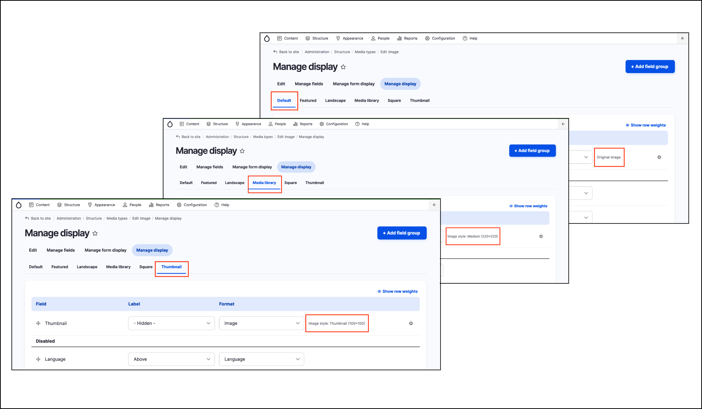

# Review configuration of image media display

When embedding media assets from other content types and entity types, we have the option to display them rendered, in which case we have to select the required view mode. In this exercise we’ll explore how **Display modes** in the Media type **Image** link to the _Image styles_.

1. Navigate to _Structure_ → _Media types_ → **Image**.
2. Explore the primary tabs of **Manage fields** and **Manage form display**. The user interface is almost identical to the content types.
3. Go to the Manage display tab.
4. Explore the available display modes, paying attention to the advanced configuration of the Image field.
   1. Default
   2. Featured
   3. Landscape
   4. Media Library
   5. Square
   6. Thumbnail
5. The Advanced configuration of the Image field uses “Image styles” in most cases

   
