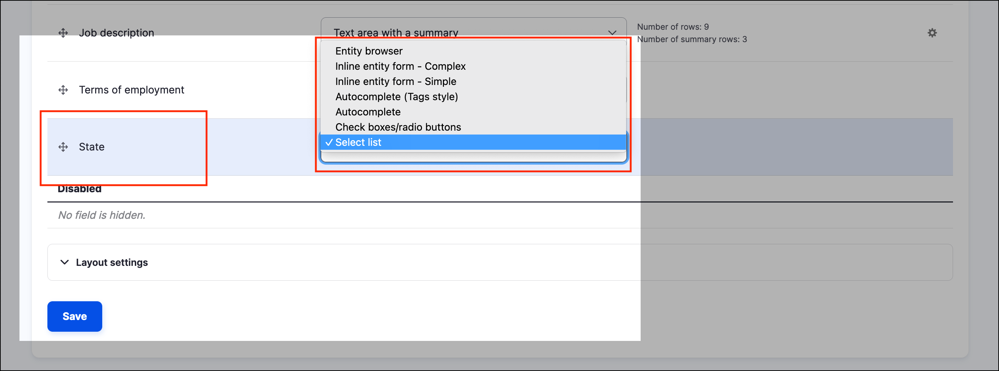

# About input options

There are a variety of input options that control how you use terms on your website. Below you can see the options available for the _Manage form display_ page:  

There are a couple of options to manage the taxonomy terms:

* **Controlled vocabularies** allow you to set the terms and restrict the options available to content authors. You can limit inputs by setting up a specific widget, such as select list, checkboxes or radio buttons.
* **Tagging** allows users with the corresponding permissions to add new terms. You can also have an autocomplete text field.
