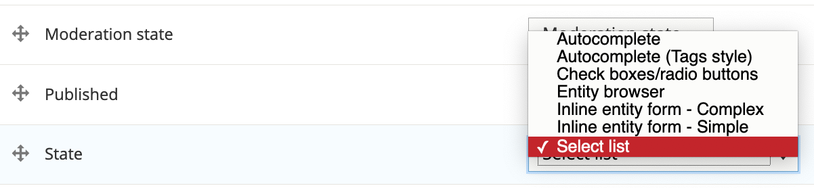

# About input options

There are a variety of input options that control how you use terms on your website. Below you can see the options available for the _Manage form display_ page:\

There are a couple of options to manage the taxonomy terms:

* **Controlled vocabularies** allow you to set the terms and restrict the options available to content authors. You can limit inputs by setting up a specific widget, such as select list, checkboxes or radio buttons.
* **Tagging** allows users with the corresponding permissions to add new terms. You can also have an autocomplete text field.

#### **Exercise 4.3:** Adding fields to content types

In this exercise we’ll add the State/Territory field to job postings and to News and Media. For this exercise we have a controlled _vocabulary_, limiting input to one State/Territory, so we’ll use a select list.

1. Add the State/Territory field to Job postings
   1. Go to **Structure** → **Content types** and click on **manage fields** to the right of the Job posting content type name.
   2. To associate the State/Territory vocabulary with a particular content type we need to add our new _Term reference_ field. Under /admin/structure/types/manage/job\_posting/fields, click **Add field**. Under **Add a new field**, select **Reference** → **Taxonomy term**, then complete the fields as follows:

**Add the existing State taxonomy field to News and Media**\
Now that job postings can be categorised by states/territories, News and media articles need to use the same State/Territory vocabulary. Follow the instructions above but add the _**existing**_ taxonomy field to the **News and Media** content type.

.png>)\
Configure the form display and page display to show the new field.

\*\*\*\*
