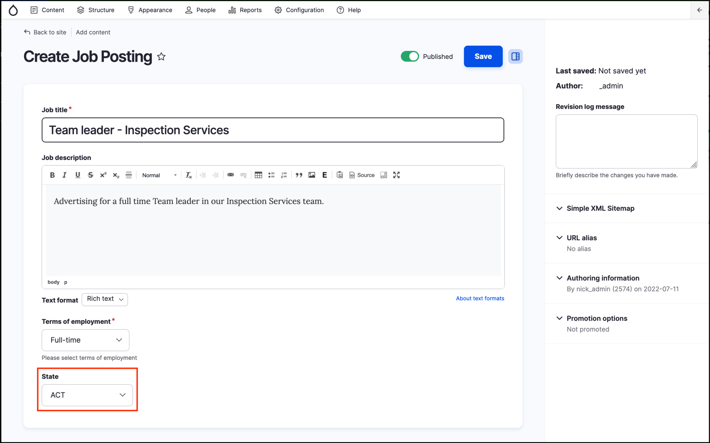
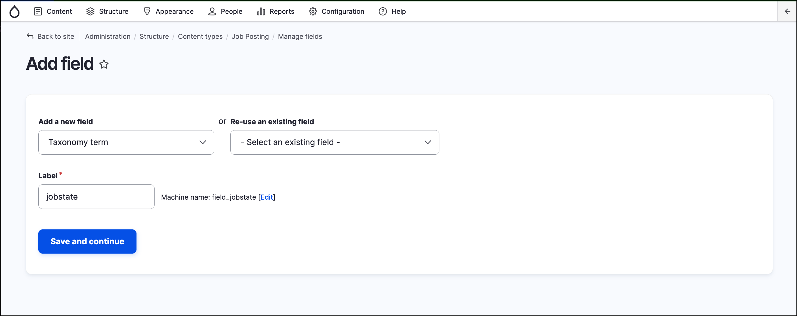
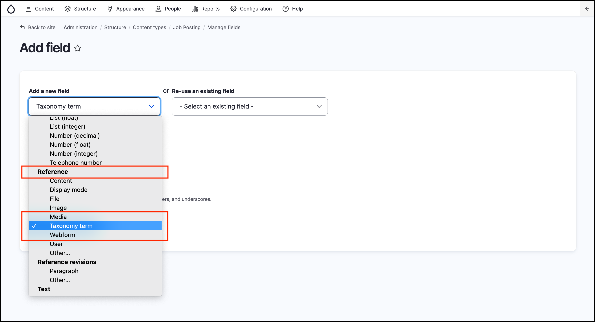
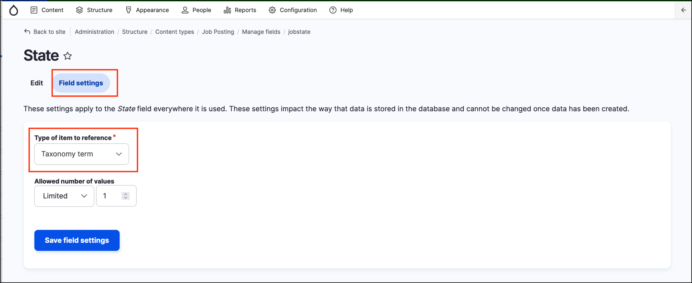

# Exercise 4.2: Add taxonomy field to content types

Use your experience from the previous exercises to add the State/Territory field to all content types.

> **Hint** - use Entity Reference for the field type. Follow the screenshots below if needed to configure the field correctly for the _Job posting_ content type.

