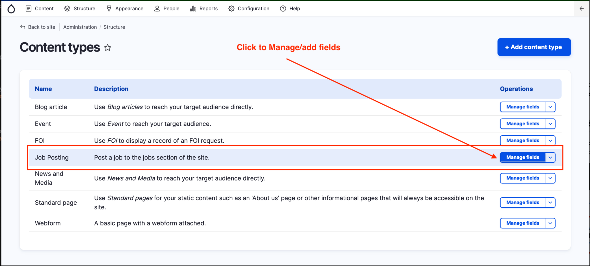
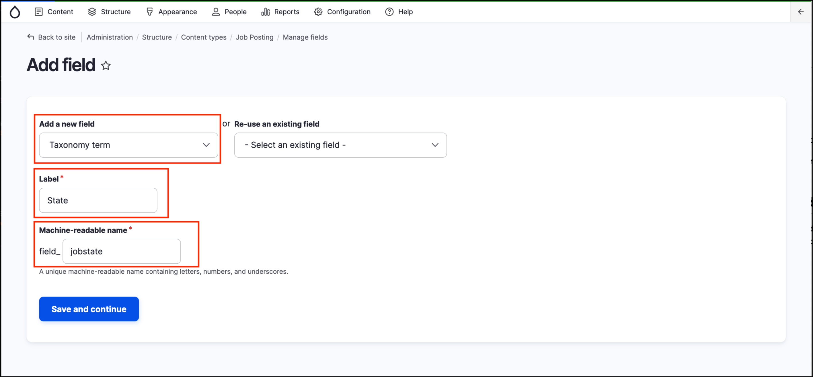
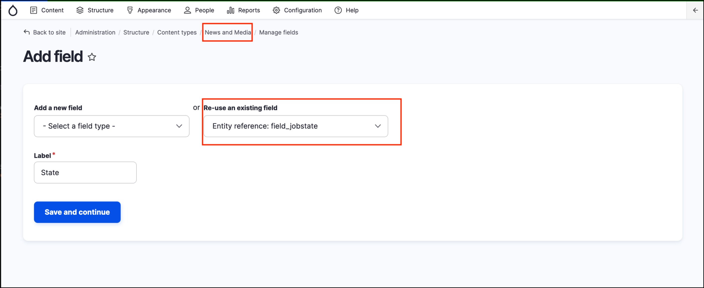

# Exercise 4.3: Add fields to content types

In this exercise we’ll add the State/Territory field to job postings and to News and Media. For this exercise we have a controlled _vocabulary_, limiting input to one State/Territory, so we’ll use a select list.

## Add the State/Territory field to Job postings

1. Go to _Structure_ → _Content types.
2. Click on **Manage fields** to the right of the _Job posting_ content type name.

    

2. To associate the State/Territory vocabulary with a particular content type we need to add our new _Term reference_ field. 
3. Under /admin/structure/types/manage/job\_posting/fields, click **Add field**. Under **Add a new field**, select **Reference** → **Taxonomy term**, then complete the fields as shown in the screenshot below:

## Add the existing State taxonomy field to News and Media

Now that job postings can be categorised by states/territories, News and media articles need to use the same State/Territory vocabulary. Follow the instructions above but add the _**existing**_ taxonomy field to the **News and Media** content type. 

Configure the form display and page display to show the new field.
