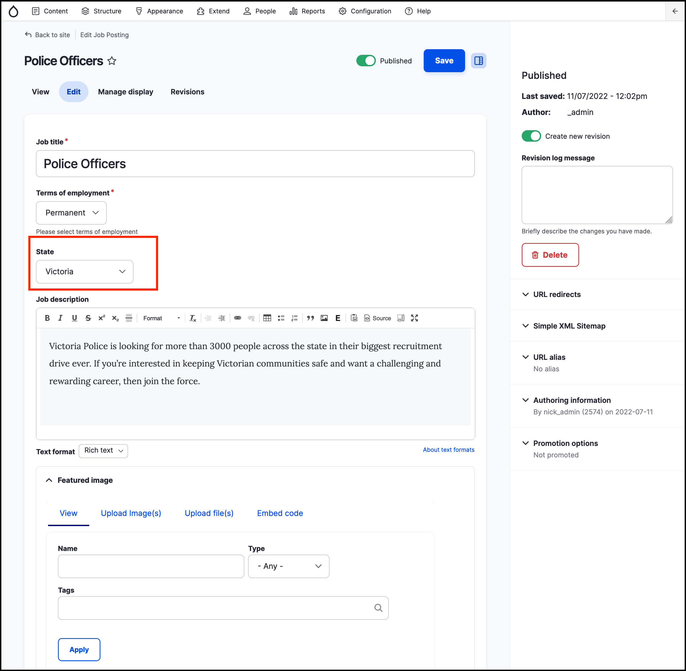
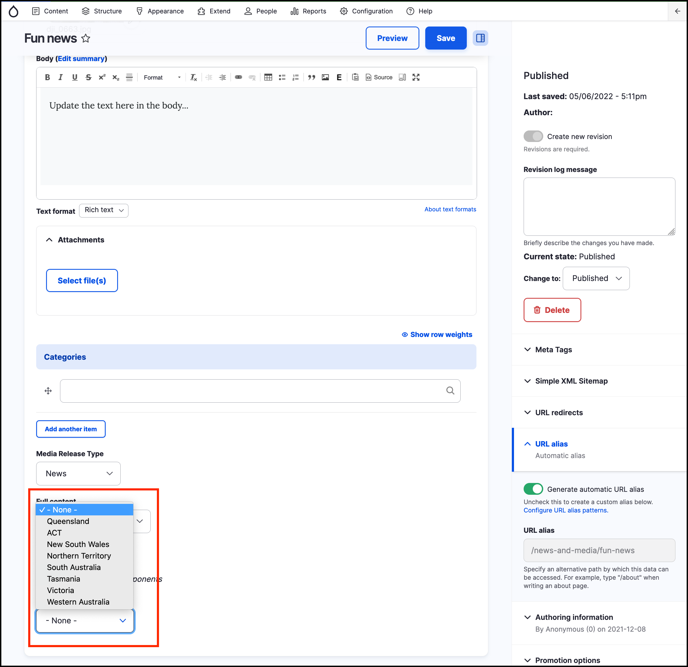

# Exercise 4.4: Test the new vocuabulary

Finally, test out the new vocabulary by going into a **Job posting** or **News and Media** post you created earlier. When you click **Edit**, you should see a new taxonomy field called “State/Territory”. Select _Victoria_. Save the content page and then confirm it appears in the frontend.

The screenshot below shows the _Job Posting_ content form, including the dropdown list for the _State/Territory_ vocabulary.

This screenshow shows the _News & Media_ content form, including the dropdown list for the _State/Territory_ vocabulary.

