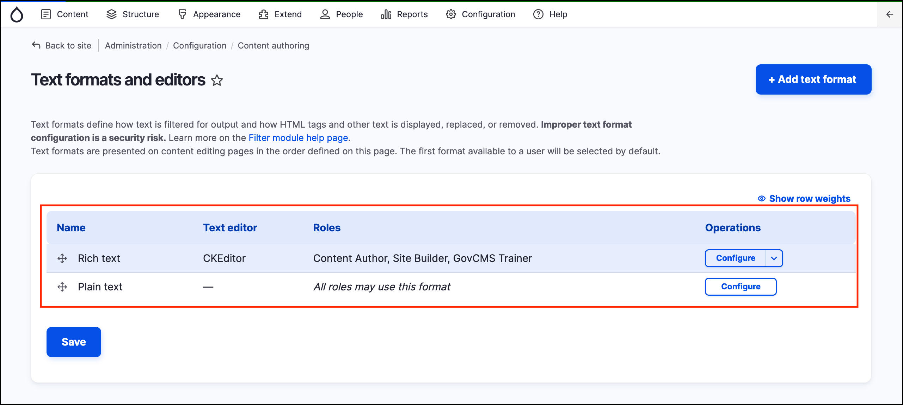
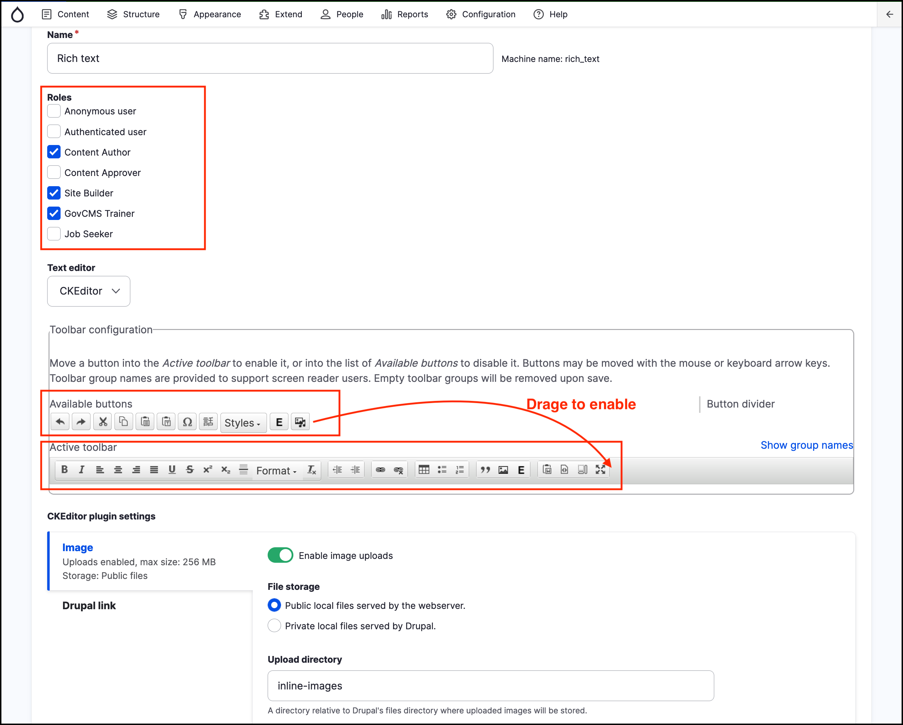
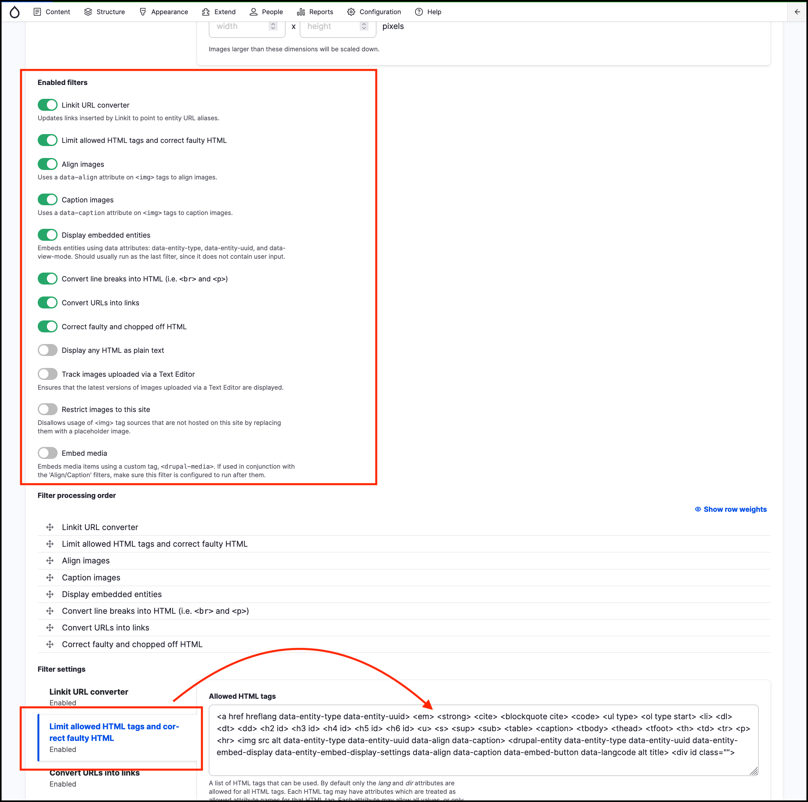
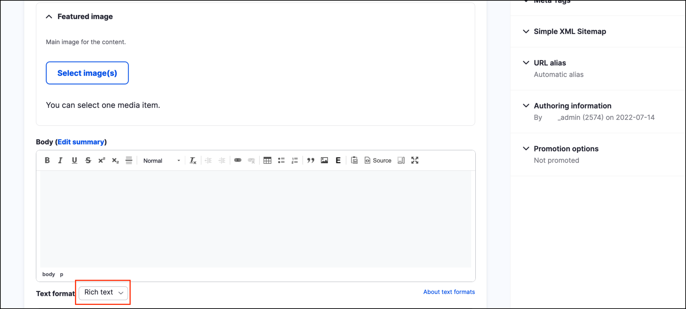
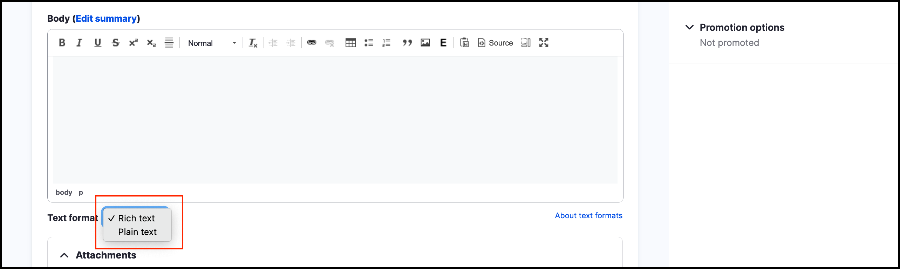

# Exercise 5.1 \(optional\): Set up the Rich Text editor

In this exercise you’ll learn how to set up the rich text editor.

## Configure the Rich Text editor

1. Make sure you’re logged in as an administrator.
2. Go to _Configuration_ → _Content authoring_ → **Text formats and editors**.

    
   
3. Click the **Configure** link in the Operations column next to _Rich text_.
4. Review the Roles section, which allows you to configure the roles allowed to access Rich text format.
5. The Toolbar configuration allows you to manage editor buttons/plugins. 

     
    
    > **As a rule,** give users as few buttons as possible, for as long as possible.
    
6. The **CKEditor plugin settings** allow you to configure some additional options, such as **Insert from Media Library** and **Image uploads**.
7. Check the **Enabled filters** section. 

     
    
    Note that the **Limit allowed HTML tags and correct faulty HTML** option is selected. It’s important to keep this options enabled for **increased security**. 
    
    If additional HTML tags are required to be supported, update the **Allowed HTML tags** field with the tags that you need. Avoid whitelisting the &lt;script&gt; tag, since it may introduce a backdoor to malicious scripts.
    
8. The **Filter processing order** section allows you to arrange the execution order of filters. Avoid modifying the default order unless necessary.

## Test the editor

Now you can test the editor out by creating a new _Standard page_, making sure the input format is set to _Rich text_. 

1. Toggle between the _Plain text_ input field and _Rich text_ by selecting Plain text in the Text format selector 

    

2. Add some text, and then make it bold. Also try adding a list, an image and a link. 
    > **Tip:** You can get some sample images at Dynamic Dummy Image Generator: [http://dummyimage.com/](http://dummyimage.com)
3. Click **Save.** 
4. See how your page looks. Is the page being displayed as you expected?

