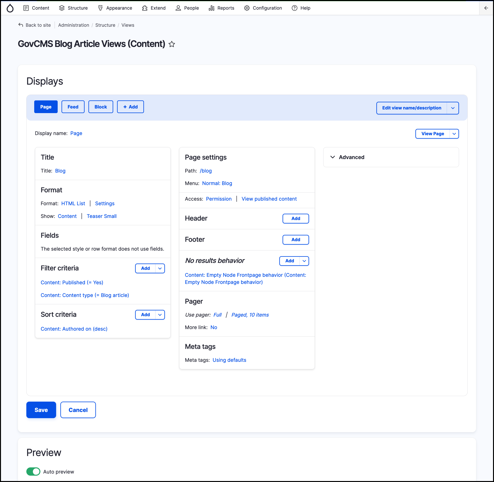
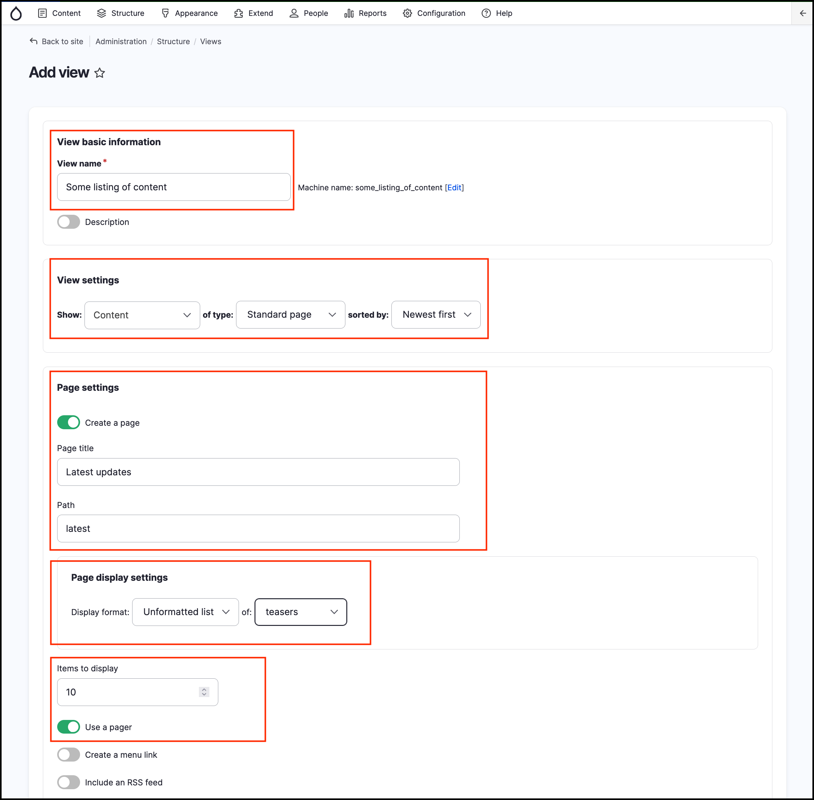

# Content listing with Views

In this unit we’ll focus on **Views**, a popular core module in GovCMS and Drupal.

Using the Views module, we can fetch content from the database of our site and present it to the user as lists, posts, galleries, tables, maps, graphs, menu items, blocks, reports, forum posts, etc. Different content types including nodes, users, and other bundles can be displayed.

**Views UI**, a submodule within _Views_, provides a graphical interface underneath which lies a powerful SQL query builder that can access virtually any information in your database and display it in any format.

Different displays can present the query results as pages with fixed URLs on your site \(or URLs accepting arguments\), blocks, feeds, or panel panes.

You can also use Views to present related content or implement contextual filters. An example of presenting related content is when you want to display a list of users along with links to the content they have created.

## Introduction to Views

As an introduction to Views, your instructor will go through some of its features. Views allows you to create filters using dynamic input and also connect content to other content pieces.

It’s important to remember that you’re _limiting_ a data set by using filters and selecting the appropriate \(and only the necessary\) fields. If you’ve got a very large website and try to display full nodes on one page, you will destroy the site. Keep this in mind to avoid any issues.

Recommended reading:

[Documentation for the Drupal 8/9 core Views module](https://www.drupal.org/docs/8/core/modules/views)

Basic interface to create a view:

1. **Choose what to query**. Select content, users, taxonomy, files or any other type of data.
2. Limit your selection by filtering by content type, taxonomy term, etc.
3. **Specify how to display,** lists, tables, grid etc.
4. **Set a display,** such as a page, block, RSS feed, etc.

The screenshot below shows the Create View form.

## Create lists of content using Views

In a previous unit we created the new content type of Job Posting for our Government Jobs website. However, we didn’t set up a way for the list content to be displayed anywhere on our site. In the next exercises we’re going to create a list of job postings on one page and a list of News and Media articles on another page. This will help you learn more about the Views module.

