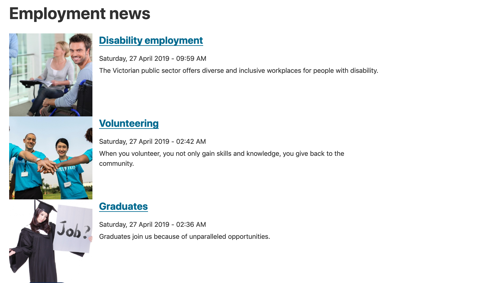
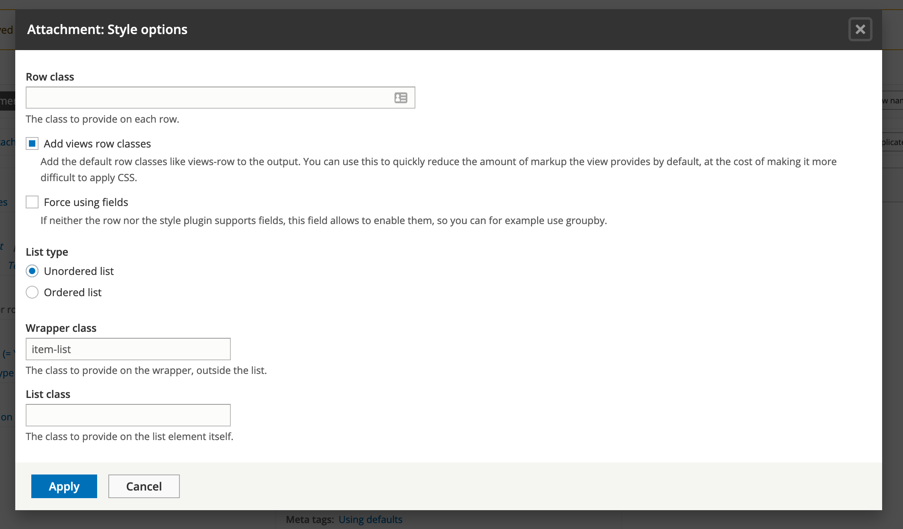
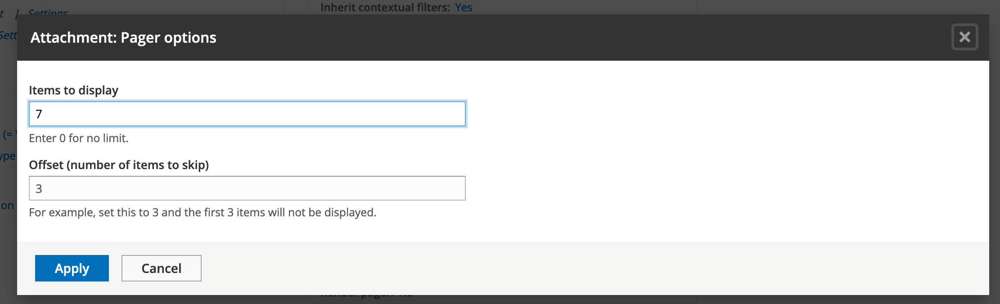

# Content listing with Views

In this unit we’ll focus on Views, a popular core module.

Using the Views module, we can fetch content from the database of our site and present it to the user as lists, posts, galleries, tables, maps, graphs, menu items, blocks, reports, forum posts, etc. Different content types including nodes, users, and other bundles can be displayed.

Views UI, a submodule within Views, provides a graphical interface underneath which lies a powerful SQL query builder that can access virtually any information in your database and display it in any format.

Different displays can present the query results as pages with fixed URLs on your site \(or URLs accepting arguments\), blocks, feeds, or panel panes.

You can also use Views to present related content or implement contextual filters. An example of presenting related content is when you want to display a list of users along with links to the content they have created.

## 6.1 Introduction to Views

As an introduction to Views, your instructor will go through some of its features. Views allows you to create filters using dynamic input and also connect content to other content pieces.

It’s important to remember that you’re _limiting_ a data set by using filters and selecting the appropriate \(and only the necessary\) fields. If you’ve got a very large website and try to display full nodes on one page, you will destroy the site. Keep this in mind to avoid any issues.

Recommended reading

[https://www.drupal.org/docs/8/core/modules/views](https://www.drupal.org/docs/8/core/modules/views)

Basic interface to create a view:

1. **Choose what to query**. Select content, users, taxonomy, files or any other type of data.
2. Limit your selection by filtering by content type, taxonomy term, etc.
3. **Specify how to display,** lists, tables, grid etc.
4. **Set a display,** such as a page, block, RSS feed, etc.

## 6.2 Create lists of content using Views

In one of the previous units we created the new content type of Job Posting for our Government Jobs website. However, we didn’t set up a way for the list content to be displayed anywhere on our site. In this exercise we’re going to create a list of job postings on one page and a list of News and Media articles on another page. This will help you learn more about the Views module.

### **Exercise 6.1:** Build the “Employment News” view

In this exercise we’ll build an Employment news page/listing by creating a new view. The screenshot below shows what the employment news page will look like after we’ve created the new Employment news view.

1. Create the view using the wizard
2. Go to **Structure** → **Views** to see the _Views_ admin page - /admin/structure/views.
3. Click the **Add view** button at the top of the page to access the view creation wizard. To create the Employment news view, enter the below details:
4. **View name**: Employment news
5. Select **Description** and type: “Displays a list of news about Employment on the site.” This allows _Site administrators_ to easily see what the view does.
6. To show _News and Media_ content follow the steps below:
7. Show _Content_ _**of type**_ _News and Media_ sorted by _Newest first_. These dropdown selections set up the page with the news and media content displaying, showing the most recent article first.

1. Next, check the _Create a page_ checkbox to create the new views page. Leave the Page title and Path fields as-is - they should already contain _Employment news_ as the name of our view.
2. In the page display settings area, select:
   * * Unformatted list and teasers

* Items per page: 10
* Use a pager
* **Create a menu link** to expand options
* **Menu**: Main navigation
* Leave default **Link text** as Employment news
* Click Save and edit
* **Review your changes**

After saving the view, navigate to the frontend of the site. Check if the _Employment news_ appears in the main navigation at the top. Click it to explore any _Employment news_ that you may have published on your site.

If you only see one article, create additional employment news articles to see how Views takes care of listing them.

### **Exercise 6.2:** Create Job Posting View

Repeat the steps above to create the Job Posting view. You may need to create a few more job postings on your site to see how the list feature works.

Make the View name **Job Postings**, URL **/job-postings** and add a **Jobs** link to the _Main navigation_ menu.

You will extend this job listing in a later session.

## 6.3 Views displays – multiple views in one

Views allows you to reuse existing configuration in a good way. If you create a page listing of your content and need to provide a block of page titles or add an RSS feed \(even create more pages\) – View Displays can be used rather than duplicating views.

!\[A screenshot of a cell phone

Description automatically generated\]\(../.gitbook/assets/13%20%281%29.png\)

If you explore the existing GovCMS Block Article View – three Displays exist: Page, Feed and Block.

!\[A screenshot of a cell phone

Description automatically generated\]\(../.gitbook/assets/14.png\)

Views displays allows you to easily create a duplicate of any other display and add some customisations and overrides.

## 6.4 Views caching

Views also allow you to speed up your site if you have two views that load similar fields. This is because with Views you can cache both the query and rendered output, which reduces the load on your database. You can learn more about Views caching in Unit 10.

## 6.5 Views attachments

The Views module includes some pre-built templates, which can be activated and edited to suit your requirements.

The Views editing interface – Format pane

In this section we’re going to look at the Views editing interface.

1. **Displays**: Create multiple displays from the same view. This might mean multiple pages with different filters or blocks, RSS feeds, etc.
2. **Format**: Output content into lists, tables, or show the full content \(node\) display.
3. **Fields**: Specify fields such as title, date, taxonomy, etc.
4. **Filter criteria**: This is the most important aspect, since you limit the selection this way.
5. **Sort criteria:** Specify ordering of the list - by created date, by title or any other property.
6. **Header**: Add arbitrary HTML to the top and bottom of your views.
7. **Pager**: Specify how many items to display or whether or not to show a "previous/next" pager.

### **Exercise 6.3:** A customised News and Media page

In this exercise we’ll customise the _Employment news_ View page we created earlier, making it show three items of recent content, then a bulleted list of titles of seven recent News and Media articles. Below is what the layout of the page will look like.

There are seven stages in this process:

1. Locate the View and edit using contextual links
2. Change the number of items to display
3. Add a new display: an attached list
4. Add a header to the attachment
5. Change the offset to exclude the first three articles
6. Change the attachment setting
7. Review your changes

Let's walk through each stage in details:

1. **Locate the View and edit using contextual links**
1.1. Navigate to the _Employment news_ page we created earlier 
1.2. Locate and click the _Contextual links_ pencil and click **Edit view.**
2. **Change the number of items to display**
2.1. Under Pager \(G in screenshot above\) click "mini" to change the settings.
2.2. Select "Display a specified number of items"
2.3. Click **Apply**
2.4. Change Items per page: 3
2.5. Click **Apply**
2.6. Now check your preview to confirm three items are displayed.

3. **Add a new display: an attached list**
3.1. Next we'll add a list of seven more recent articles to the bottom of this view. At the top \(A in earlier diagram\), click the **+Add** button and select "Attachment".
3.2. You’ll now have more than one display available, with the one you’re editing highlighted. Make sure the correct one is always highlighted when you’re editing views. 
3.3. Next click **Unformatted list** under Format in the left column \(B in the earlier screenshot\). A new window will pop up, giving you the option to select the display you're changing. 
3.3.1. Select "This attachment"
3.3.2. Select "HTML list"
3.3.3. Click the Apply \(this display\) button.
3.3.4. The next screen is “Attachment: Style options”. Leave all settings as default and click the **Apply** button.

   

3.4. Under **Format** → **Show,** click **Content** to change the settings. 
3.4.1. Then click **Apply** on the final screen.
3.5. You'll see that Views added a _Title_ field for us. If we needed more fields to be displayed, we could have added them using the **Add** button. Let’s continue with only the Title field for now. 
3.6. Check the Preview pane at the bottom of the page to confirm our display is correct:

    

4. **Add a header to the attachment**
4.1. Under Header \(F in the earlier diagram\) click **Add**.
4.2. Make sure you’re editing "This attachment \(override\)".
4.2.1. Search for and select "Text area". Apply changes. 
4.2.2. Make sure the _Text format_ for the **Content** field is _Rich Text_. Then type in the **Content** field: &lt;p&gt;More articles from our contributors&lt;/p&gt;
4.2.3. Apply the changes.
4.3. Check that the preview shows text ‘More articles from our contributors’ above the list.
5. \_**Change the offset to exclude the first three articles**\_Our Attachment view will be displayed below the first three News and Media articles, so we need to exclude those from our list to avoid displaying duplicate content:
5.1. Make sure you're still editing the **Attachment** display \(A in earlier diagram\). Under the Pager settings \(G in earlier diagram\) in the centre column, click "10 items" to change the setting.
5.2. Change the “Items to display” to 7 and the "Offset" to 3. Apply the changes.

    

6. **Change the attachment settings**
6.1. Under "Attachment settings" in the centre column click the option "Attach to: Not defined". 
6.1.1. Select "page". Apply the changes. 
6.2. Click "Attachment position:Before".
6.2.1. Select "After". Apply the changes. 
7. **Review your changes**
7.1. Click the **Save** button to save your changes.
7.2. Return to the _Employment news_ page and review the changes.
7.3. You may create more News and Media content to test it. Make sure you publish any new content before reviewing the _Employment news_ page.

### **Challenge Exercise 6.4 \(optional\):** Reuse a Views template

Duplicate a previously created View and modify its filters to display a full blog article content item and five more most recent blog article titles below it. Use the same techniques as in the previous exercise.

## Related content with Views \(contextual filters\)

In the above exercises, we used filters in Views to limit the data displayed \(e.g. to show certain content types or show content categorised with a specific taxonomy term. For our Jobs website, we want to show related content when we view a job listing for a specific state/territory, without having to build a new view for each new state. The solution is to use context to control the items displayed. We can set up GovCMS to check the taxonomy terms from the article, and dynamically include content that’s categorised with the same term.

We can configure a view so that it’s filtered dynamically, depending on the context. For example, we could use a contextual filter to add a block that contains related content or that presents a list of articles by the same author.

