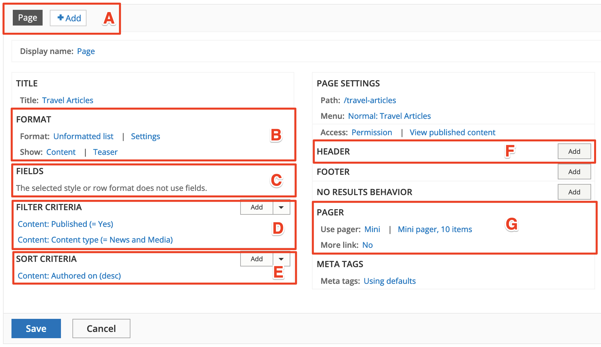

# Content listing with Views

In this unit we’ll focus on Views, a popular core module in GovCMS and Drupal.

Using the Views module, we can fetch content from the database of our site and present it to the user as lists, posts, galleries, tables, maps, graphs, menu items, blocks, reports, forum posts, etc. Different content types including nodes, users, and other bundles can be displayed.

Views UI, a submodule within Views, provides a graphical interface underneath which lies a powerful SQL query builder that can access virtually any information in your database and display it in any format.

.png>)

Different displays can present the query results as pages with fixed URLs on your site (or URLs accepting arguments), blocks, feeds, or panel panes.

You can also use Views to present related content or implement contextual filters. An example of presenting related content is when you want to display a list of users along with links to the content they have created.

## Introduction to Views

As an introduction to Views, your instructor will go through some of its features. Views allows you to create filters using dynamic input and also connect content to other content pieces.

It’s important to remember that you’re _limiting_ a data set by using filters and selecting the appropriate (and only the necessary) fields. If you’ve got a very large website and try to display full nodes on one page, you will destroy the site. Keep this in mind to avoid any issues.

Recommended reading:

[Documentation for the Drupal 8/9 core Views module](https://www.drupal.org/docs/8/core/modules/views)

Basic interface to create a view:

1. **Choose what to query**. Select content, users, taxonomy, files or any other type of data.
2. Limit your selection by filtering by content type, taxonomy term, etc.
3. **Specify how to display,** lists, tables, grid etc.
4. **Set a display,** such as a page, block, RSS feed, etc.

.png>)

## Create lists of content using Views

In a previous unit we created the new content type of Job Posting for our Government Jobs website. However, we didn’t set up a way for the list content to be displayed anywhere on our site. In this exercise we’re going to create a list of job postings on one page and a list of News and Media articles on another page. This will help you learn more about the Views module. See the exercises under this unit.

## Views displays – multiple views in one

Views allows you to reuse existing configuration in a good way. If you create a page listing of your content and need to provide a block of page titles or add an RSS feed (even create more pages) – View Displays can be used rather than duplicating views.

.png>)

If you explore the existing GovCMS Block Article View – three Displays exist: Page, Feed and Block.

Views displays allows you to easily create a duplicate of any other display and add some customisations and overrides.

## Views caching

Views also allow you to speed up your site if you have two views that load similar fields. This is because with Views you can cache both the query and rendered output, which reduces the load on your database. You can learn more about Views caching in Unit 10.

## Views attachments

The Views module includes some pre-built templates, which can be activated and edited to suit your requirements.

 .png>)

## The Views editing interface – Format pane

In this section we’re going to look at the Views editing interface.

* **A. Displays**: Create multiple displays from the same view. This might mean multiple pages with different filters or blocks, RSS feeds, etc.
* **B. Format**: Output content into lists, tables, or show the full content (node) display.
* **C. Fields**: Specify fields such as title, date, taxonomy, etc.
* **D. Filter criteria**: This is the most important aspect, since you limit the selection this way.
* **E. Sort criteria:** Specify ordering of the list - by created date, by title or any other property.
* **F. Header**: Add arbitrary HTML to the top and bottom of your views.
* **G. Pager**: Specify how many items to display or whether or not to show a "previous/next" pager.

## Related content with Views (contextual filters)

In the Unit 6 exercises, we used filters in Views to limit the data displayed (e.g. to show certain content types or show content categorised with a specific taxonomy term. For our Jobs website, we want to show related content when we view a job listing for a specific state/territory, without having to build a new view for each new state. The solution is to use **context** to control the items displayed. We can set up GovCMS to check the taxonomy terms from the article, and dynamically include content that’s categorised with the same term.

We can configure a view so that it’s filtered dynamically, depending on the context. For example, we could use a contextual filter to add a block that contains related content or that presents a list of articles by the same author.
