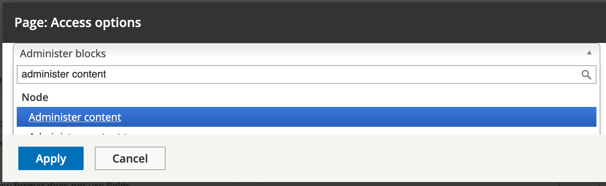
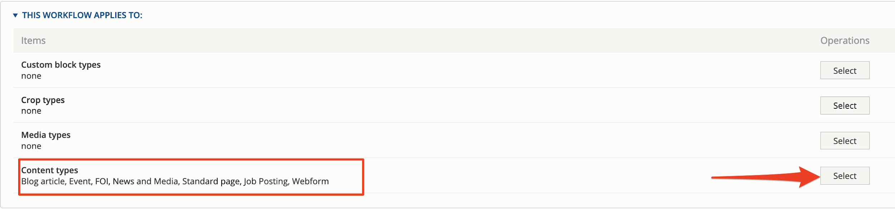
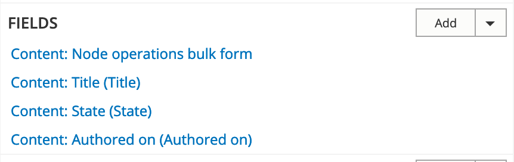

# Customize the content administration experience

Content editors and authors like to see common content management tasks easily and should also be able to quickly see a list of new content. There are several features you can setup to enable this.

#### Access-restricted view

You could create a custom view for administrators that lists all new content with quick “edit” links. You could also set up a default filter so administrators can also see unpublished content.

Below you can see the screenshots for setting up administration permissions.

.png>) 

#### Bulk operations: Content lists for administrators

GovCMS’s default content listing shows each page of content with easy access to operations such as delete and unpublish. In some cases, site administrators will need to manage content in a bulk way, rather than individually.

The module **Views bulk operations (VBO)** allows you to create custom content listings and perform bulk operations.

GovCMS has extended the Content administration page so more content actions can be performed.

.png>)

#### **Exercise 6.10:** Administration with View bulk operations

In this exercise, we'll create a way for content approvers to view all content waiting for approval, so they can quickly and easily review and publish new content.

1. **Prepare the site** In the current setup, content editors can create and publish job postings. We’re going to change this, so that new job postings must be reviewed by a Content Approver before being published. To do this, we’ll introduce a moderation workflow.
   1. Go to Configuration → Workflow → Workflows
   2. Edit the existing “Editorial” workflow. We’re going to reuse the existing workflow states and transitions as-is, to match the moderation workflow of the rest of the site.
   3. Scroll down to **This workflow applies to** section and press **Select** in the **Content types** row. _\*\*\*\*_
   4. Select the **Job Posting** checkbox, **Save** the changes .png>)
   5. Press the **Save** button in the Edit Editorial workflow page.

**Add the view**

*
  1. Create a new View with the following settings

| View name          | Admin: Submitted job postings |
| ------------------ | ----------------------------- |
| Show               | Content of type: Job Posting  |
| Page title         | Submitted jobs                |
| Page path          | admin/content/jobs            |
| Display format     | Table                         |
| Items to display   | 50                            |
| Use a pager        | Selected                      |
| Create a menu link | No                            |
| Create a block     | No                            |

*
  1. Click Save and edit.

**Add fields**

**Tip:** Select multiple fields at a time and configure them sequentially.

*
  1. Add these fields:
* Content: Node operations bulk form
* Content: Authored on
* Content: State
  1. Configure the Bulk operations:

Available actions:

* Delete content
* Save content
* Update URL alias

Note that we did not select the “Publish content” and “Unpublish content”. Since we have a moderation workflow in place, these actions won’t work on our site.

*
  1. Keep other defaults for the remaining fields.

**Rearrange fields**\

**Remove unnecessary filters**\
.png>)

**Add moderation workflow filter**\
To only see Job Postings that are pending approval, add the **Content: Moderation state** filter. Configure the following options:\
.png>)

**Configure the format settings**\
.png>)

*
  1. Edit the table settings. Ensure any column that can be sortable is. .png>)

**Add a "no results" message**\
\_\*\*\*\*\_Adding a “no results” message will clearly show that the view IS working properly if/when there isn’t any content waiting for approval.

*
  1. In the middle column, under **NO RESULTS BEHAVIOR**, click **Add**.
* Select Global: Text area
* Then set the message “There are no job postings currently waiting for review!” .png>)
* Apply the changes

**Change access settings for this view**\
Lastly, you want to change the access/permission settings for this new view, from "View published content" to "Administer content".\

**Save and review your changes**
