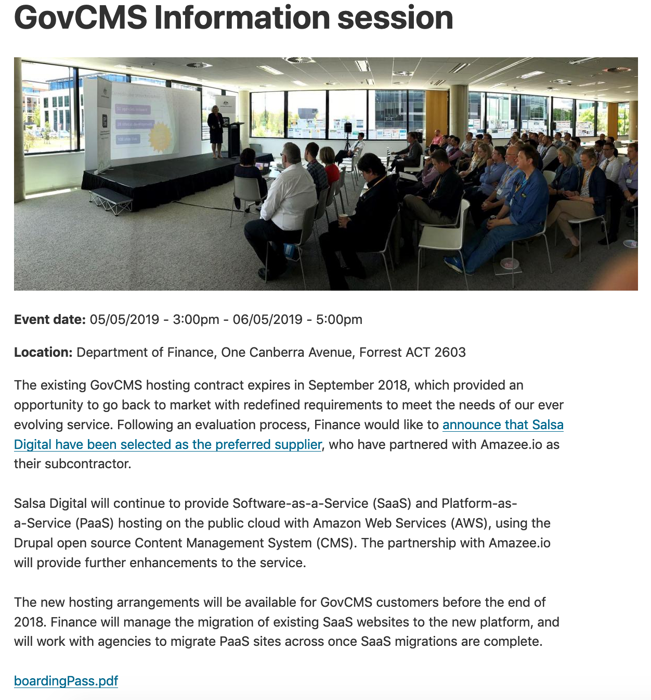

# Exercice 6.7: Configure data field and Event content type

For this exercise, we’ll provide hints - try to configure the event listing content type without looking back on the notes/previous instructions.

First, we’ll look at a simple view to filter out past events, then we’ll make a calendar entry using templates.

In this exercise we’re going to prepare the date settings and configure the event content type to get it ready for the next exercise.

1. **Review the Event content type**
2. Using experience from the earlier tutorials about content types and fields, go to the **Manage Fields** page of the **Event** content type. Review fields available in GovCMS.
3. Move to the **Manage form display** page and reorder the fields in the Event content type, moving all custom fields \(pattern field\_\[field-name\]\) except the Components field above the Body field. Leave the Components field below the Body.
4. Go to **Content** → **Add content** → **Event** and test the form, making further adjustments to the field position if required.
5. **Check permissions -** whenever you create a new content type, you always need to check the permissions. Allow Content Authors to create events. Ensure that site visitors can leave comments \(the **Comment** module must be activated and configured\). 

**Configure the date settings on your site**  
this once-off step is required to ensure the website date and time is set in the correct way

**Note:** You can also add custom data formats via the **Add format** button.

**Update the date field**  
Given events are in the future, we can’t use the date created date to list events. We need to add a date field. Follow instructions from earlier activities to create an event date field with these details:

| Label | Event date |
| :--- | :--- |
| Field name | field\_event\_date |
| Field type | Date range |
| Widget | Date and time range |

**Test and improve**

* 1. Test the form by creating a new event entry. Notice the date field is in the middle of the form, but would be better placed higher up.
  2. Change the order of fields, so the **Event date** is under the title. 

**Change the URL alias**

We’d like to set up the URLs so that all events are in a /events URL path, for example a URL path could be: /events/job-fair

**Hint:** The Event path pattern is preconfigured in GovCMS, but if you find it different to the required pattern, then follow instructions earlier for editing URL alias patterns. Use a pattern such as  
events/\[node:title\]

**Re-test**

To test your changes, create another new event. Now, the date should appear under the event title and when you publish content it will have a unique URL following the /event path.

#### Challenge Exercise 6.8

If you have extra time, challenge yourself to extend this content type by making one or more of the following changes:

* Change the content type so you can add external links to registration pages
* Set up the content type so you can add multiple images
* Add a related field that will show the _Agency_ that’s sponsoring the event

#### **Exercise 6.9:** Modify an event listing for future dates

There are a variety of ways you could list events. For this exercise, we’ll create a simple view that shows all upcoming events.

1. **Add sample content**
   1. Add in 5-10 new events \(either manually or using Devel generate\)
   2. Make sure all events are published
   3. Include events with both past dates and future dates in the Event Date field

**Modify the view**  
Go to **Structure** → **Views** and edit the _GovCMS Events Views_ view.

**Customise the display**

**Filter out old events**

### 

