# Exercise 6.10: Administration with View bulk operations

In this exercise, we'll create a way for content approvers to view all content waiting for approval, so they can quickly and easily review and publish new content.

## Prepare the site

In the current setup, content editors can create and publish job postings. We’re going to change this, so that new job postings must be reviewed by a Content Approver before being published. To do this, we’ll introduce a moderation workflow.

1. Go to _Configuration_ → _Workflow_ → **Workflows**.

    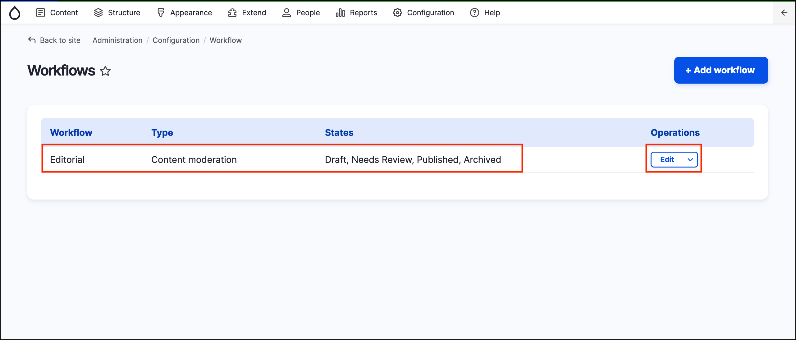
    
2. Edit the existing “Editorial” workflow. We’re going to reuse the existing workflow states and transitions as-is, to match the moderation workflow of the rest of the site.
3. Scroll down to **This workflow applies to** section and press **Select** in the **Content types** row.

    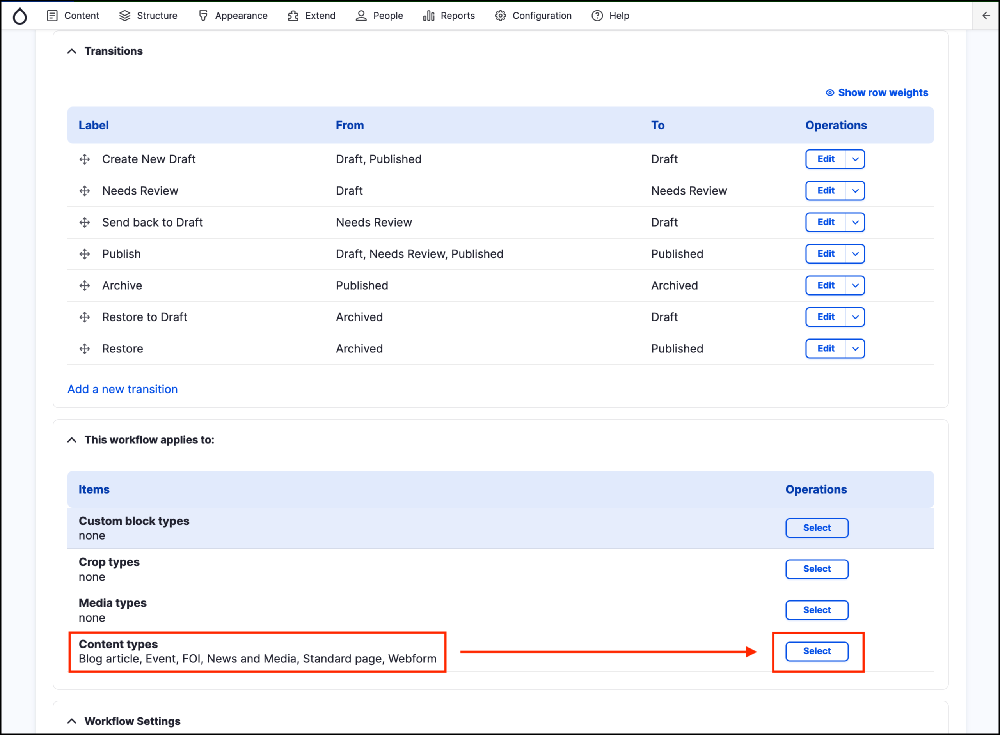
    
4. Select the **Job Posting** checkbox, **Save** the changes.

    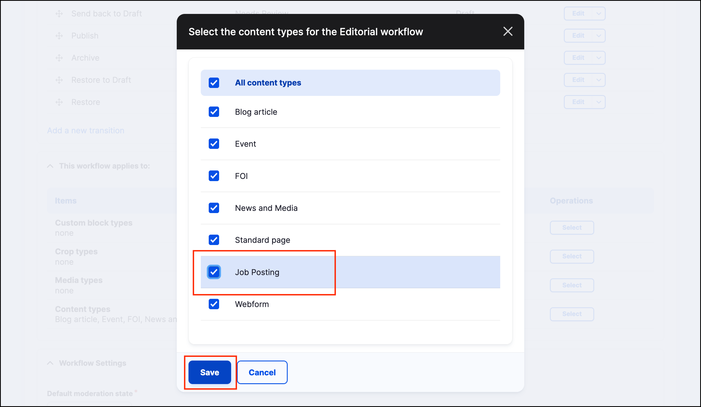
    
5. Press the **Save** button in the Edit Editorial workflow page. 

## Add the view

1. Create a new View with the following settings:

    | View name | Admin: Submitted job postings |
    | :--- | :--- |
    | Show | Content of type: Job Posting |
    | Page title | Submitted jobs |
    | Page path | admin/submitted-jobs |
    | Display format | Table |
    | Items to display | 50 |
    | Use a pager | Selected |
    | Create a menu link | No |
    | Create a block | No |
    
    > **Hint**: Go to _Structure_ → _Views_ → **Add View**.
    
    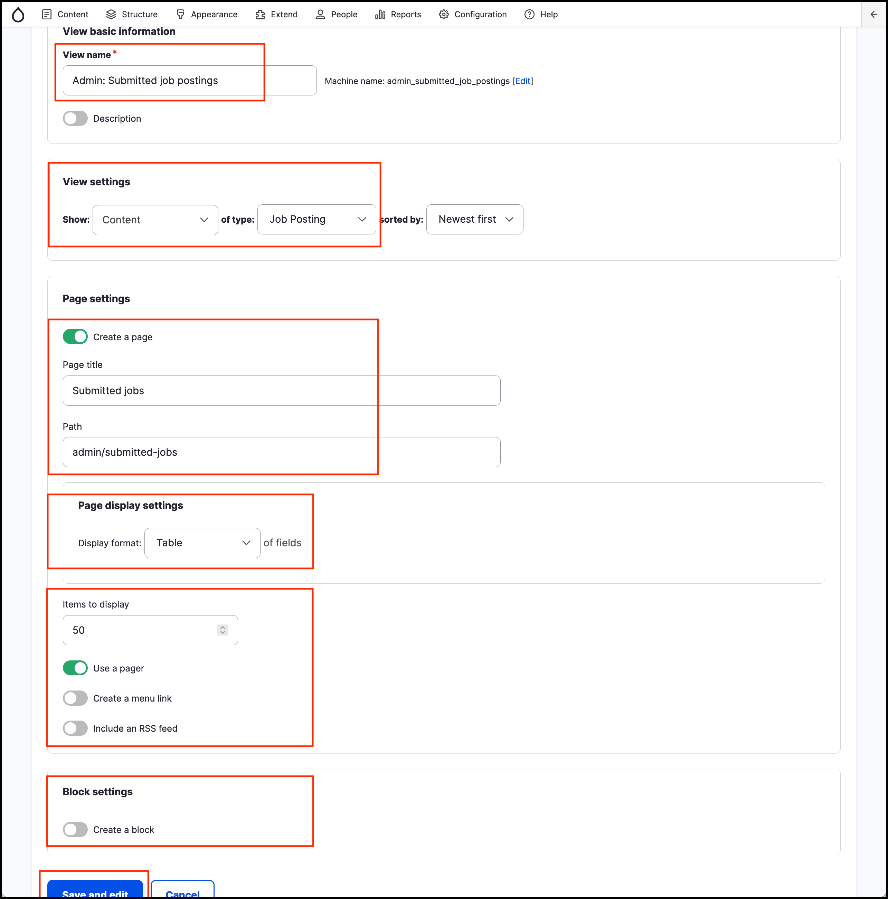

2. Click **Save and edit**.

## Add fields

> **Tip:** Select multiple fields at a time and configure them sequentially.

1. Add these fields:
   - Content: **Node operations bulk form**
   - Content: **Authored on**
   - Content: **State**

2. Configure the **Bulk operations**: Available actions:
   - Delete content
   - Save content
   - Update URL alias

    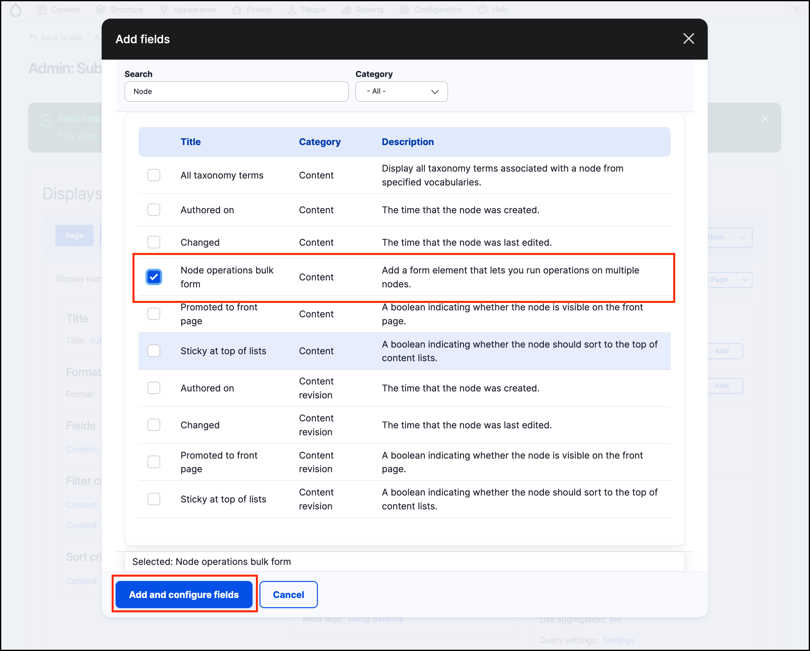
    
    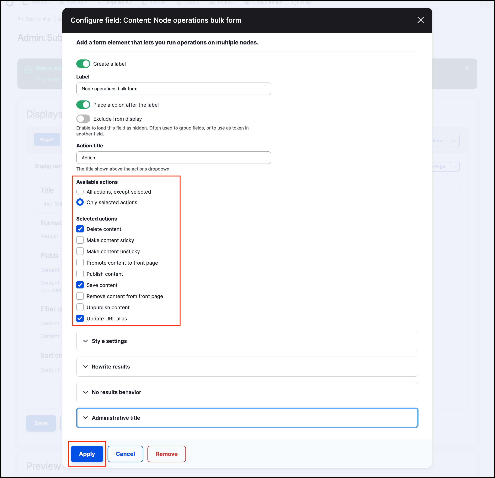

Note that we did not select the “Publish content” and “Unpublish content”. Since we have a moderation workflow in place, these actions won’t work on our site.

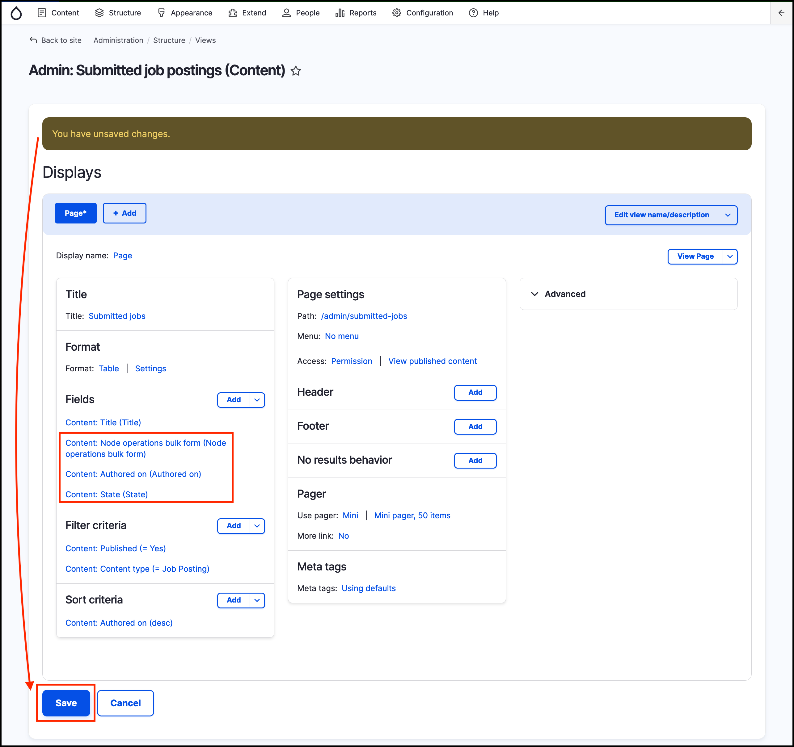

Keep other defaults for the remaining fields. Remember to **Save** your changes to the View.

## Rearrange fields

Click the dropdown next to the **Add** button in the _Fields pane_ and select **Rearrange**.

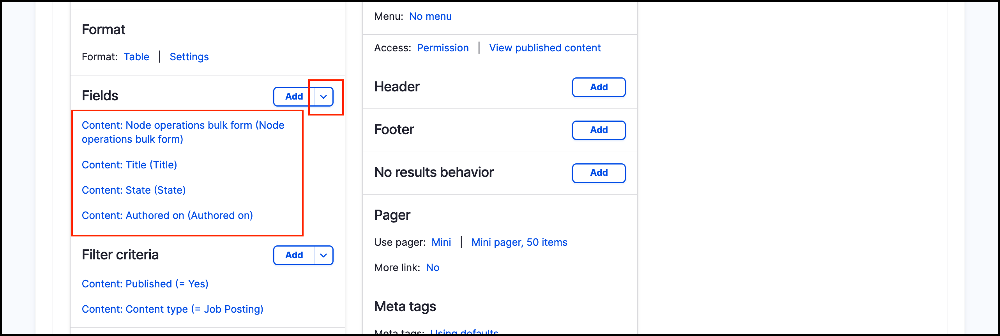

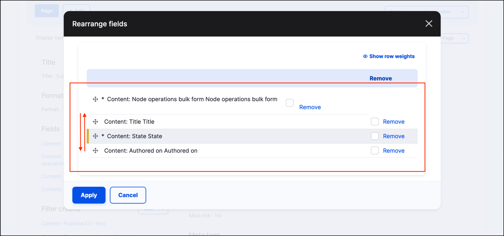

## Remove unnecessary filters

The filter **Content: Published (= Yes)** can be removed as we will be replacing it in the next section.

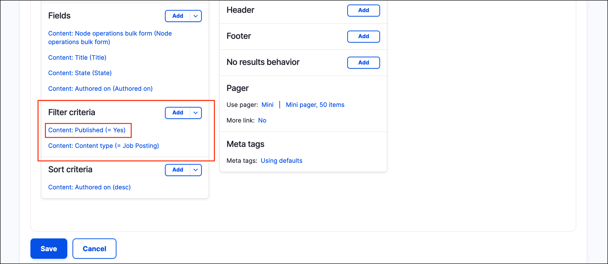

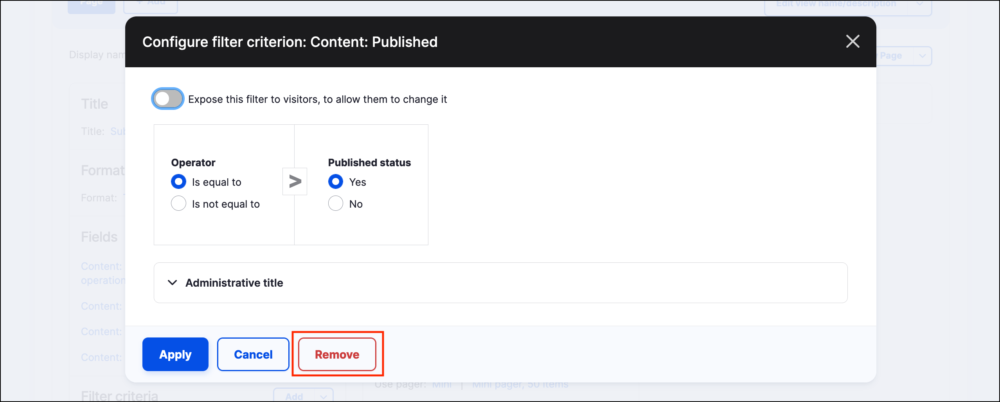

## Add moderation workflow filter

To only see Job Postings that are pending approval, add the **Content: Moderation state** filter. Configure the following options:

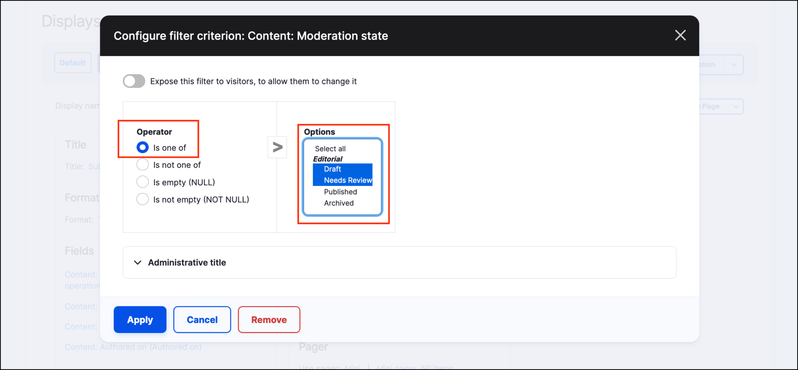

> **Tip:** Hold down the Command key \(Control for Windows\) to select multiple options.

## Configure the format settings

Edit the table settings. Ensure any column that can be sortable is selected. Set the default order for _Authored on_ to Descending.

## Add a "no results" message

Adding a “no results” message will clearly show that the view IS working properly if/when there isn’t any content waiting for approval.

1. In the middle column, under **NO RESULTS BEHAVIOR**, click **Add**.
2. Select Global: Text area

    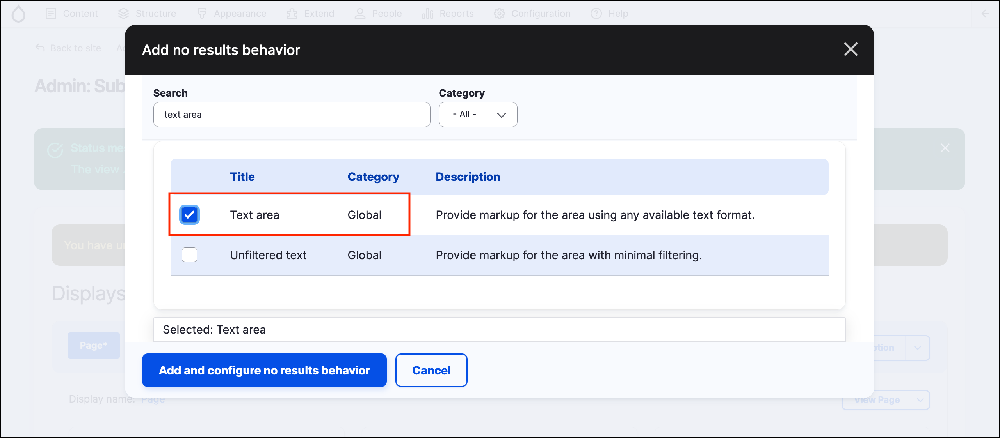

3. Then set the message “There are no job postings currently waiting for review!”.

    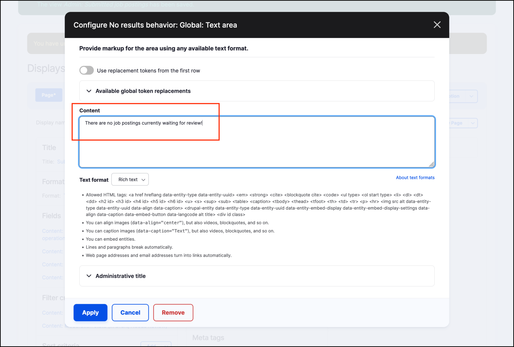
    
4. **Apply** the changes.

## Change access settings for this view

Lastly, we will change the access/permission settings for this new view, from **View published content** to **Administer content**.

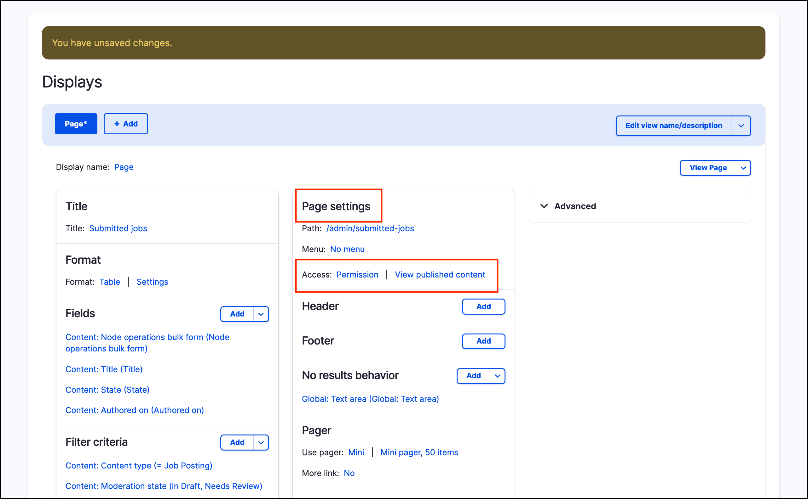

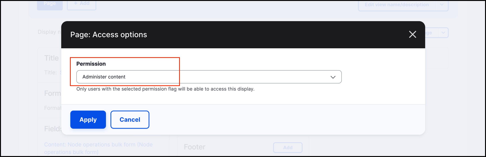

## Save and review

Save the view and review. Go to admin/submitted-jobs. If there are no Job Listings in Draft status you should see the screen below:

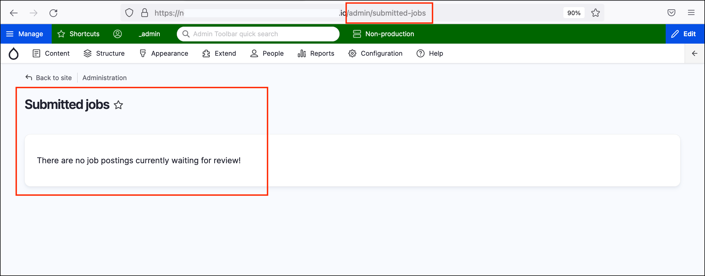

