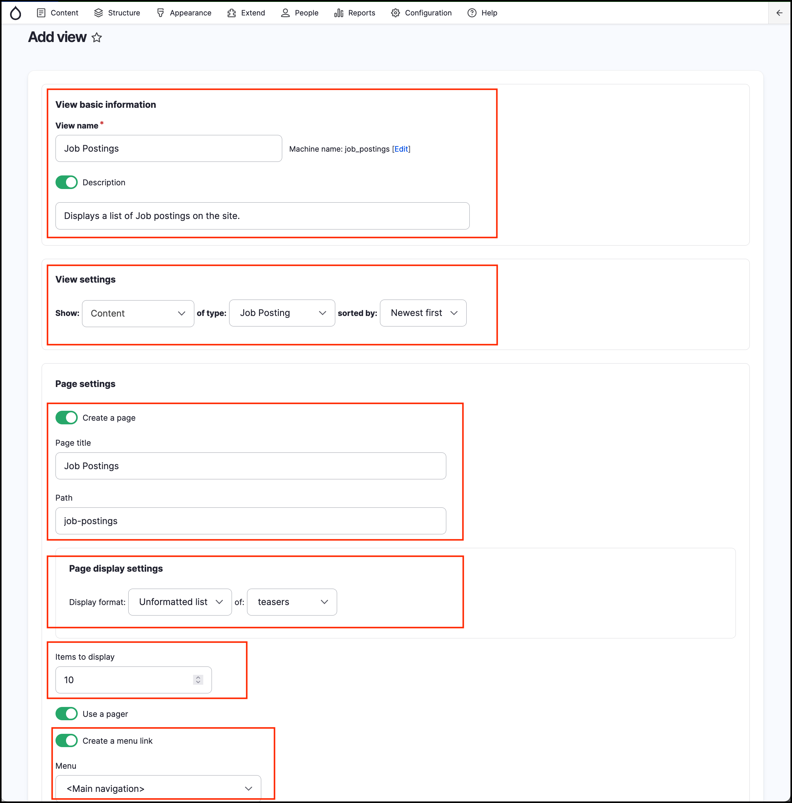

# Exercise 6.2: Create Job Posting View

Repeat the steps above to create the Job Posting view. You may need to create a few more job postings on your site to see how the list feature works.

Make the View name **Job Postings**, URL **/job-postings** and add a **Jobs** link to the _Main navigation_ menu.

You will extend this job listing in a later session.

