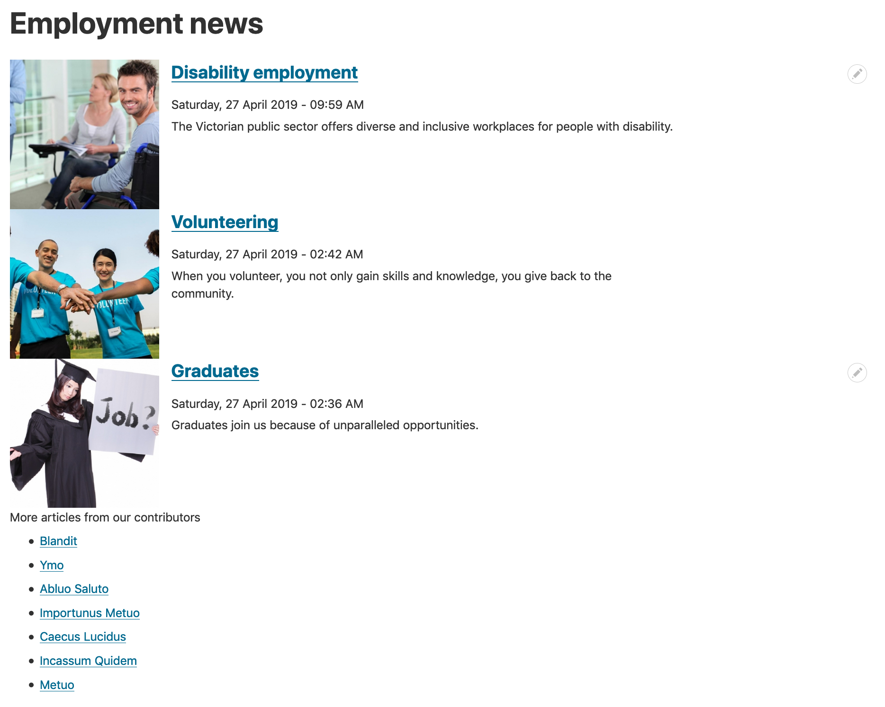
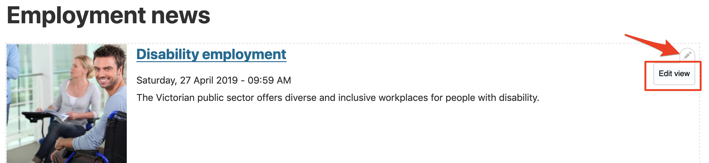
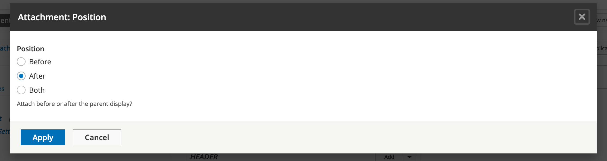

# Exercise 6.3: A customised News and Media page

In this exercise we’ll customise the _Employment news_ View page we created earlier, making it show three items of recent content, then a bulleted list of titles of seven recent News and Media articles. Below is what the layout of the page will look like.

There are seven stages in this process:

1. Locate the View and edit using contextual links
2. Change the number of items to display
3. Add a new display: an attached list
4. Add a header to the attachment
5. Change the offset to exclude the first three articles
6. Change the attachment setting
7. Review your changes

## 1. Locate the View and edit using contextual links

1.  Navigate to the _Employment news_ page we created earlier.

    
2. Locate and click the _Contextual links_ pencil and click **Edit view.**.

## 2. Change the number of items to display

1. Under Pager (G in screenshot above) click "mini" to change the settings.
2. Select "Display a specified number of items".
3. Click **Apply**.
4. Change Items per page: 3.
5. Click **Apply**.

Now check your preview to confirm three items are displayed.

## 3. Add a new display: an attached list

Next we'll add a list of seven more recent articles to the bottom of this view.

1. At the top (A in earlier diagram), click the **+Add** button and select "Attachment".
2.  You’ll now have more than one display available, with the one you’re editing highlighted. Make sure the correct one is always highlighted when you’re editing views.

    
3.  Next click **Unformatted list** under Format in the left column (B in the earlier screenshot). A new window will pop up, giving you the option to select the display you're changing.

    
4. Select "This attachment".
5. Select "HTML list".
6. Click the Apply (this display) button.
7.  The next screen is “Attachment: Style options”. Leave all settings as default and click the **Apply** button.

    
8.  Under **Format** → **Show,** click **Content** to change the settings.

    
9. Then click **Apply** on the final screen.
10. You'll see that Views added a _Title_ field for us. If we needed more fields to be displayed, we could have added them using the **Add** button. Let’s continue with only the Title field for now.

    
11. Check the Preview pane at the bottom of the page to confirm our display is correct:

.png>)

## 4.Add a header to the attachment

1. Under Header (F in the earlier diagram) click **Add**.
2. Make sure you’re editing "This attachment (override)".
3.  Search for and select "Text area". Apply changes.

    
4. Make sure the _Text format_ for the **Content** field is _Rich Text_. Then type in the **Content** field: \
More articles from our contributors\

5. Apply the changes.
6. Check that the preview shows text ‘More articles from our contributors’ above the list.

## 5. Change the offset to exclude the first three articles

Our Attachment view will be displayed below the first three News and Media articles, so we need to exclude those from our list to avoid displaying duplicate content:

1. Make sure you're still editing the **Attachment** display (A in earlier diagram). Under the Pager settings (G in earlier diagram) in the centre column, click "10 items" to change the setting.
2.  Change the “Items to display” to 7 and the "Offset" to 3. Apply the changes.

    

## 6. Change the attachment settings

1.  Under "Attachment settings" in the centre column click the option "Attach to: Not defined".

    
2.  Select "page". Apply the changes.

    
3. Click "Attachment position:Before".
4. Select "After". Apply the changes.

## 7. Review your changes

1. Click the **Save** button to save your changes.
2. Return to the _Employment news_ page and review the changes.
3. You may create more News and Media content to test it. Make sure you publish any new content before reviewing the _Employment news_ page.
