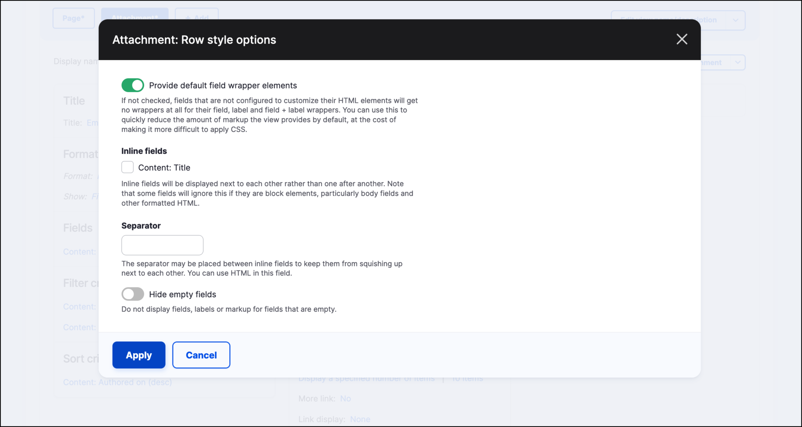
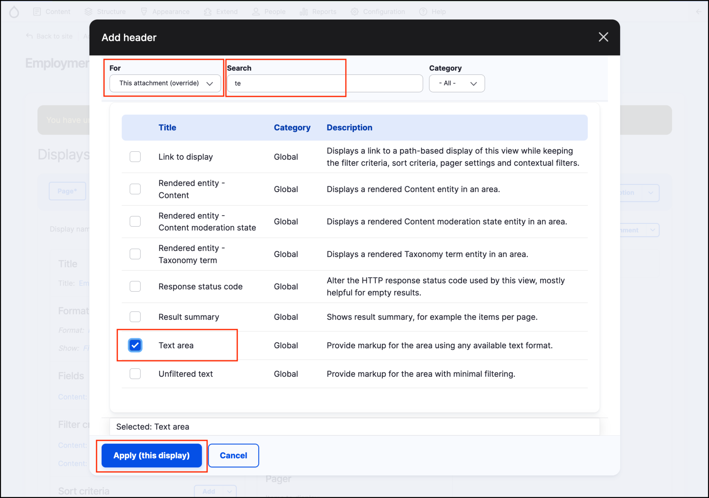
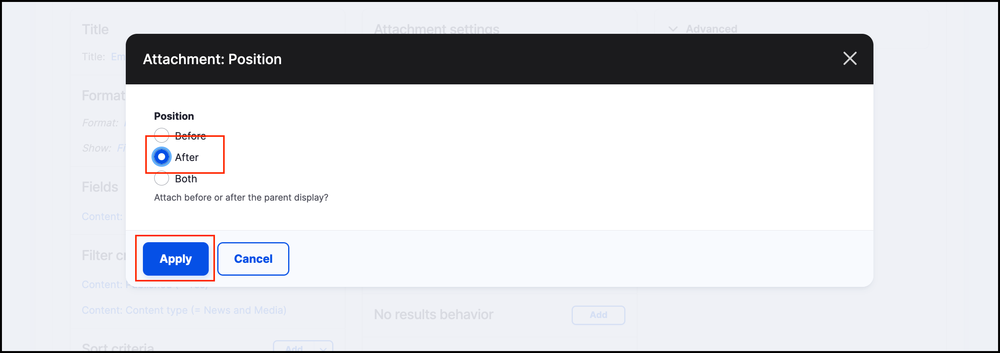

# Exercise 6.3: A customised News and Media page

In this exercise we’ll customise the _Employment news_ View page we created earlier, making it show three items of recent content, then a bulleted list of titles of seven more jobs. Below is what the layout of the page will look like.

<figure><figcaption>
Showing 3 jobs, the more jobs
</figcaption></figure>

There are seven stages in this process:

1. Locate the View
2. Change the number of items to display
3. Add a new display: an attached list
4. Add a header to the attachment
5. Change the offset to exclude the first three articles
6. Change the attachment setting
7. Review your changes

## 1. Locate the View

1.  Navigate to the _admin/structure/views_ and edit the Employment news view.\

    <figure><figcaption>
Showing the edit button in the Views listing page
</figcaption></figure>

## 2. Change the number of items to display

1. Under Pager click "mini" to change the settings.
2. Select "Display a specified number of items".
3. Click **Apply**.
4. Change Items per page: 3.
5. Click **Apply**.

Now check your preview to confirm three items are displayed. Scroll down to the Preview section to check only three items are displayed.\
\

<figure><figcaption>
Showing preview results
</figcaption></figure>

## 3. Add a new display: an attached list

Next we'll add a list of seven more recent jobs to the bottom of this view.

1. At the top, click the **+Add** button and select "Attachment".
2.  You’ll now have more than one display available, with the one you’re editing highlighted. Make sure the correct one is always highlighted when you’re editing views.

    <figure><figcaption>
Highlighting the Attachment display tab
</figcaption></figure>
3.  Next click **Unformatted list** under Format in the left column. A new window will pop up, giving you the option to select the display you're changing.\

    <figure><figcaption>
Field settings
</figcaption></figure>
4. Select "This attachment".
5. Select "HTML list".
6. Click the Apply (this display) button.
7.  The next screen is “Attachment: Style options”. Leave all settings as default and click the **Apply** button.

    <figure><figcaption>
Attachment style settings
</figcaption></figure>
8.  Under **Format** → **Show,** click **Content** to change the settings. Select the **Fields** radio button.

    <figure><figcaption>
Attachment row style settings
</figcaption></figure>
9.  Then click **Apply** on the final screen, leaving the settings as they are.

    <figure><figcaption></figcaption></figure>
10. You'll see that Views added a _Title_ field for us. If we needed more fields to be displayed, we could have added them using the **Add** button. Let’s continue with only the Title field for now.

    <figure><figcaption>
Title field in View
</figcaption></figure>
11. Check the Preview pane at the bottom of the page to confirm our display is correct.

## 4.Add a header to the attachment

1. Under the _Header_ section on the View page click **Add**.
2. Make sure you’re editing "This attachment (override)".
3.  Search for and select "Text area". Apply changes.

    <figure><figcaption></figcaption></figure>
4.  Make sure the _Text format_ for the **Content** field is _Rich Text_. Then type in the **Content** field: \
More Jobs\

    <figure><figcaption>
Adding content to global text area
</figcaption></figure>
5. Apply the changes.
6.  Check that the preview shows text ‘More Jobs’ above the list.\

    <figure><figcaption>
Preview of new header
</figcaption></figure>

## 5. Change the offset to exclude the first three Jobs

Our Attachment view will be displayed below the first three Jobs, so we need to exclude those from our list to avoid displaying duplicate content:

1. Make sure you're still editing the **Attachment** display. Under the **Pager settings** in the centre column, click "10 items" to change the setting.
2.  Change the “Items to display” to 7 and the "Offset" to 3. Apply the changes.\
    \

    <figure><figcaption>
Pager options settings
</figcaption></figure>

## 6. Change the attachment settings

1.  Under "Attachment settings" in the centre column click the option: "Attach to:" **Not defined**.

    <figure><figcaption>
Attach to "not defined" link
</figcaption></figure>
2.  Select "Page". Apply the changes.

    <figure><figcaption>
Select Page
</figcaption></figure>
3. Click "Attachment position:Before".
4. Select "After". Apply the changes.

## 7. Review your changes

1. Click the **Save** button to save your changes.
2. Return to the _Employment news_ page and review the changes.
3.  You may create more Jobs content to test it. Make sure you publish any new content before reviewing the _Employment news_ page.\
    \

    <figure><figcaption>
Final Views page
</figcaption></figure>
