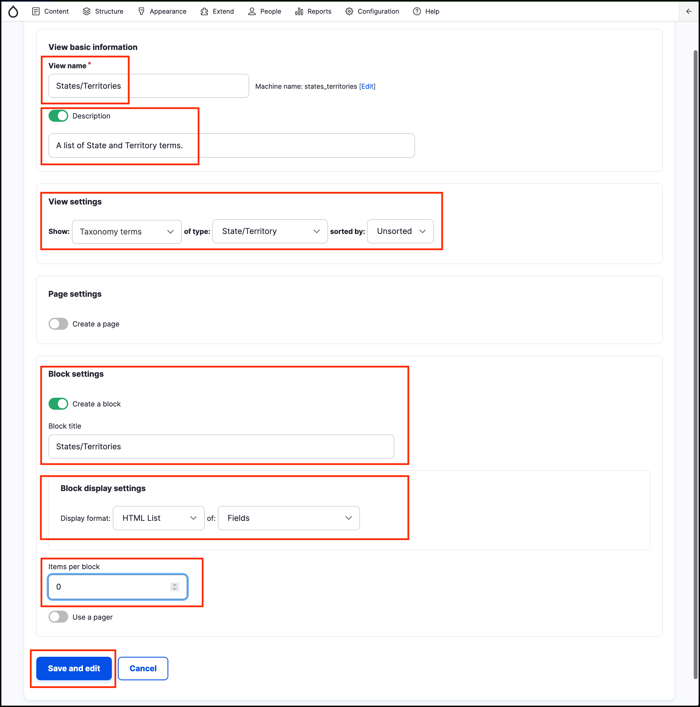
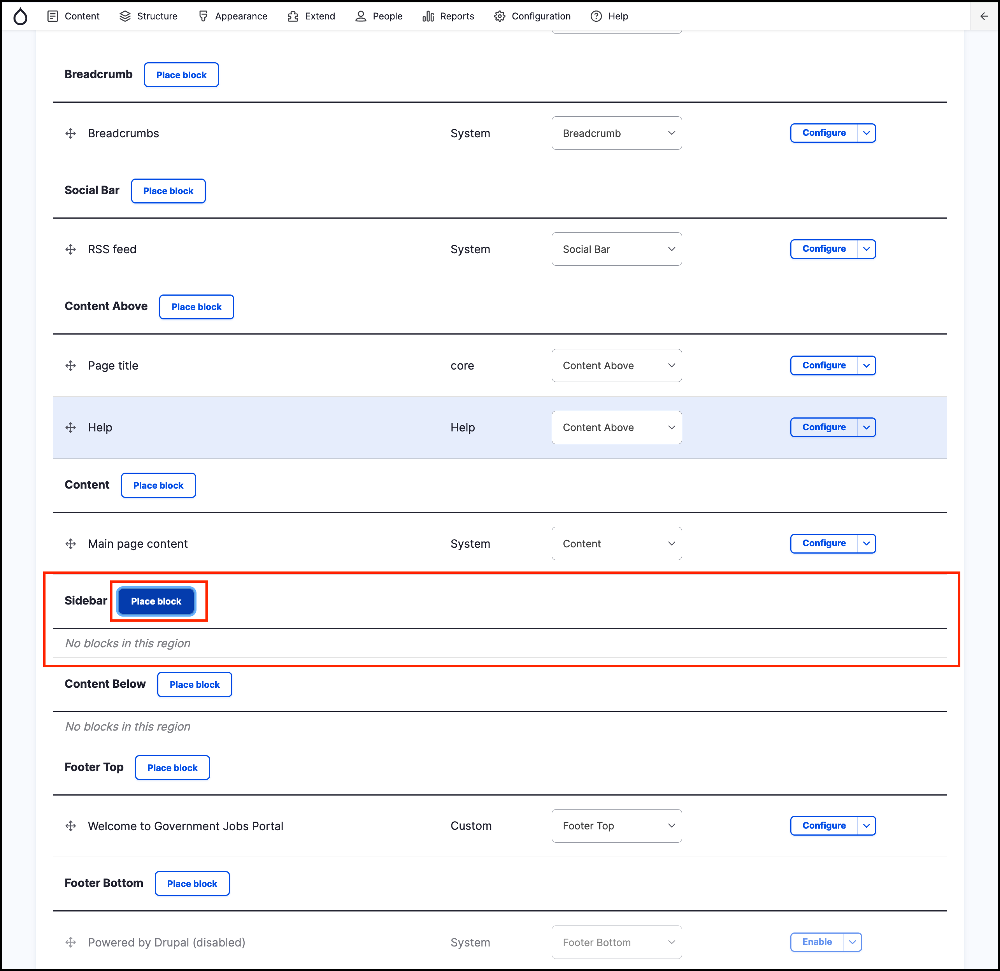
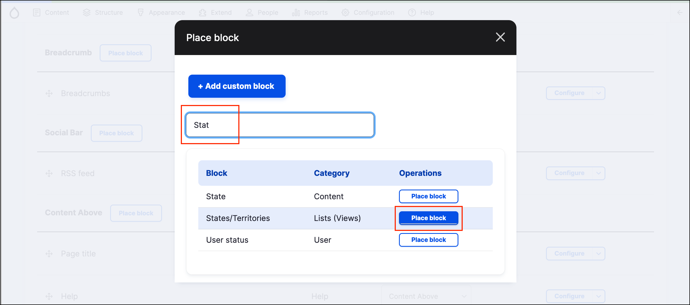
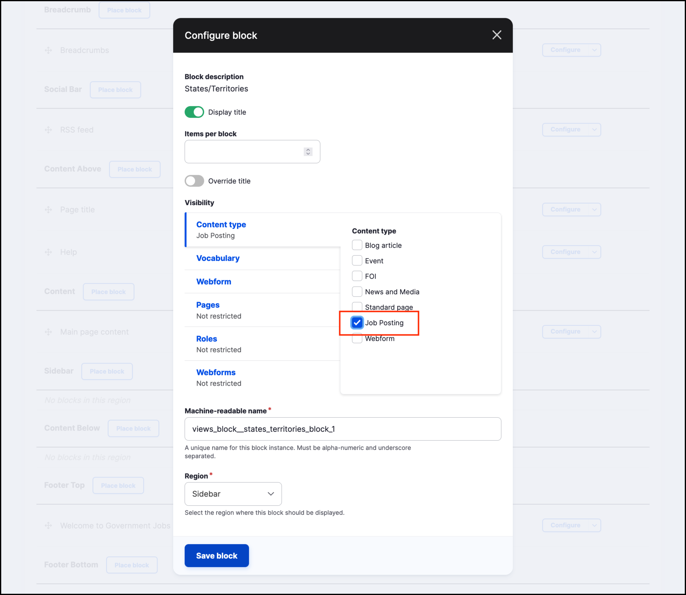

# Exercise 6.5: Make a list of States/Territories block

In this exercise we’ll add a list of the **States and Territories** in the sidebar, so the page looks like the screenshot below.\

<figure><figcaption>
States Block in sidebar
</figcaption></figure>

1.  Go to **Structure** → **Views**. Click **+ Add new View**. Add in these settings:

    * **View name:** States/Territories.
    * Select to enable **Description**: A list of State and Territory terms.
    * Show _Taxonomy_ terms of type _State/Territory_ sorted by _Unsorted_.
    * Select **Create a block**.
    * **Block title**: States/Territories.
    * **Display format**: _HTML list_ of _Fields_.
    * **Items per block**: 0.
    * **Use a pager**: Leave unselected.
    * Click **Save and edit**.

    <figure><figcaption></figcaption></figure>
2. Go to Structure → Block Layout.
3.  In the _Sidebar_ area click the **Place block** button.

    <figure><figcaption></figcaption></figure>
4.  Find **States/Territories** block in **Lists (Views)** category and click the **Place block** button.

    <figure><figcaption></figcaption></figure>
5.  Configure block visibility settings to only display it on the **Job Posting** _content type_.

    <figure><figcaption></figcaption></figure>
6. Click **Save block**.
7. Scroll down and click **Save Blocks** to complete.
8. Navigate to a _Job posting_ content page and locate your block.
