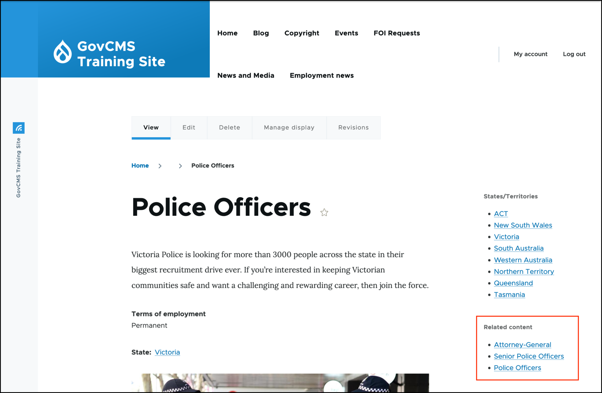
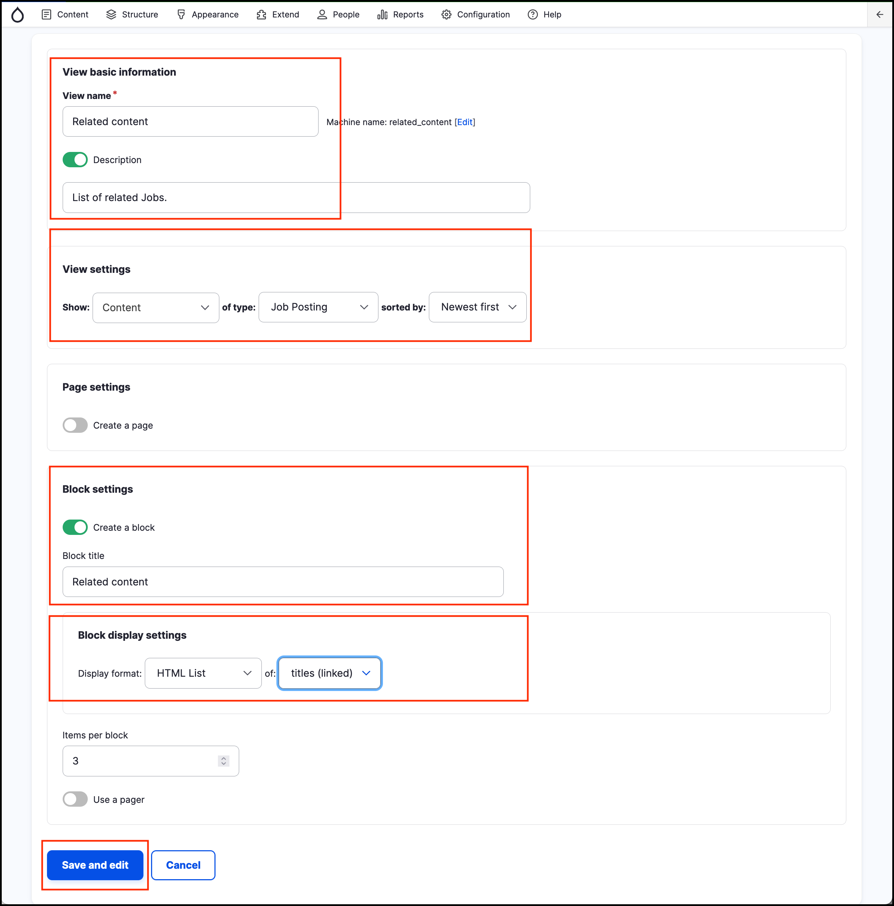
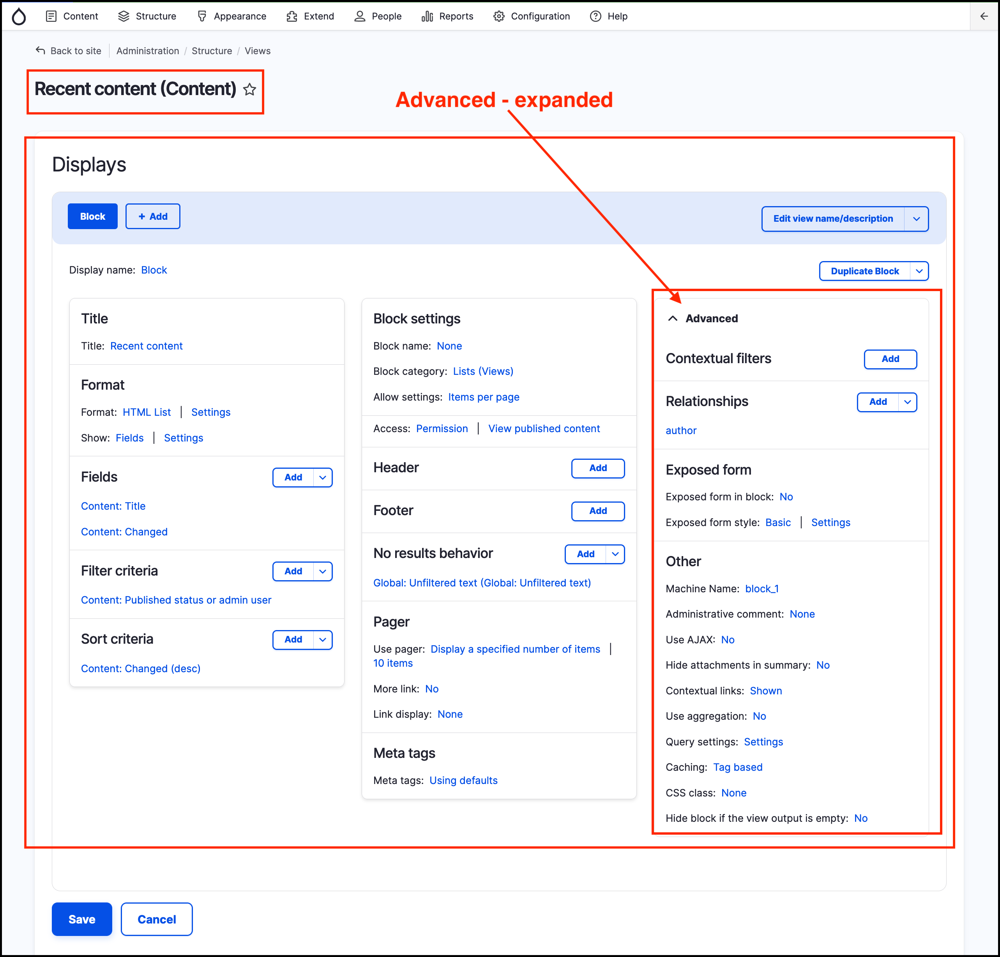
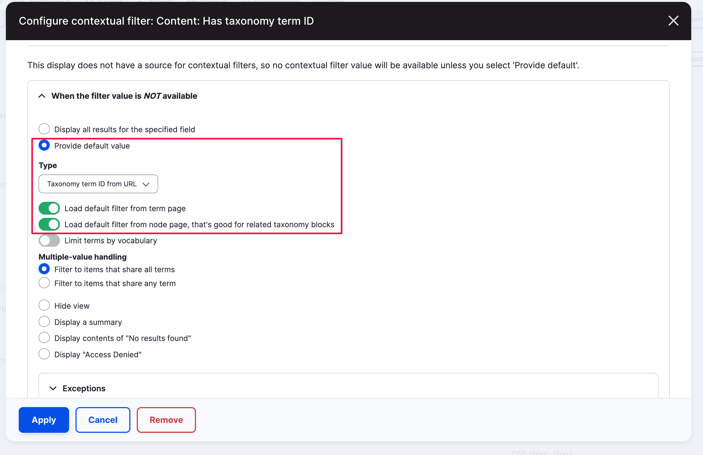
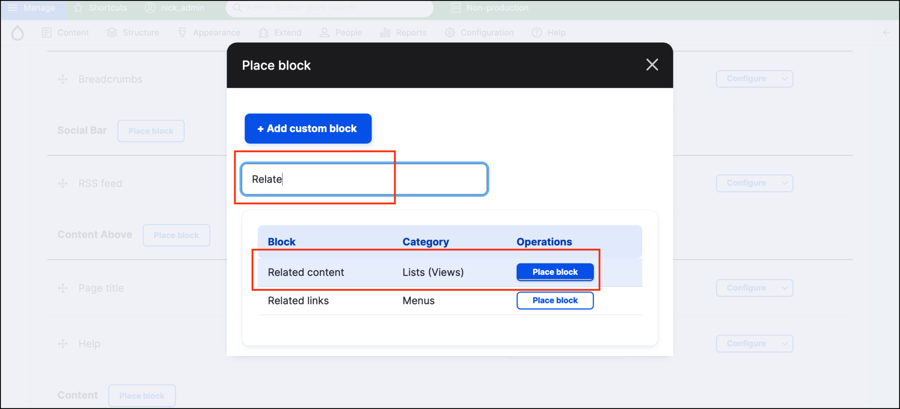
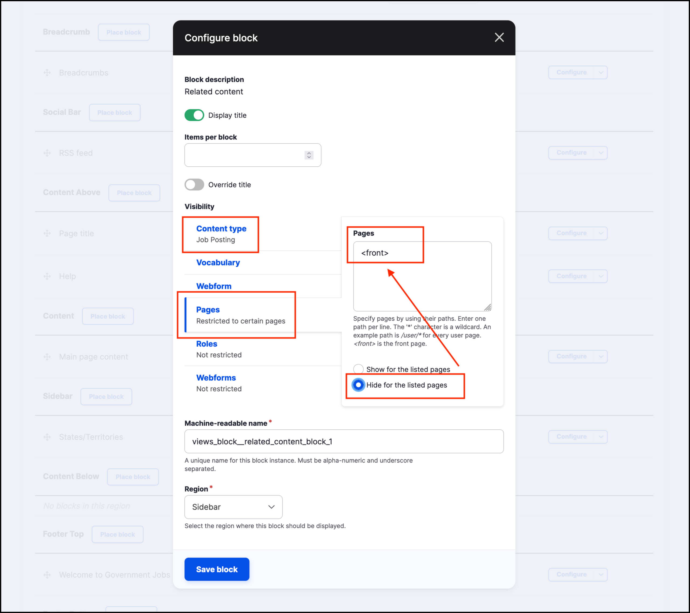
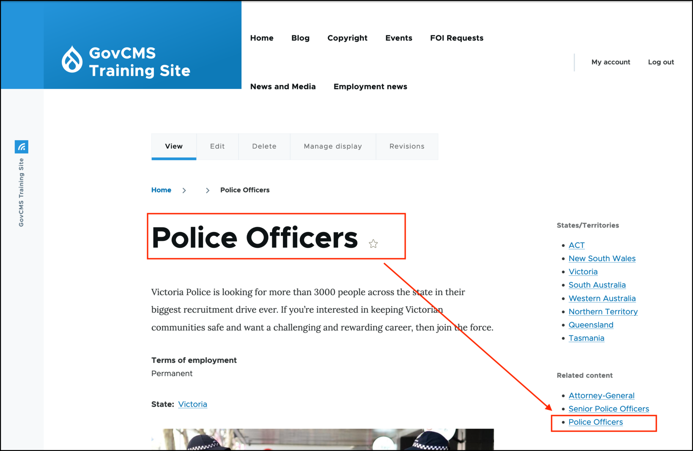
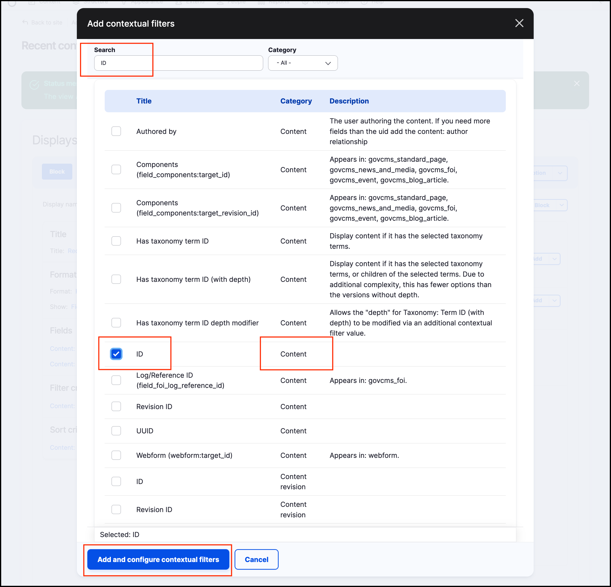
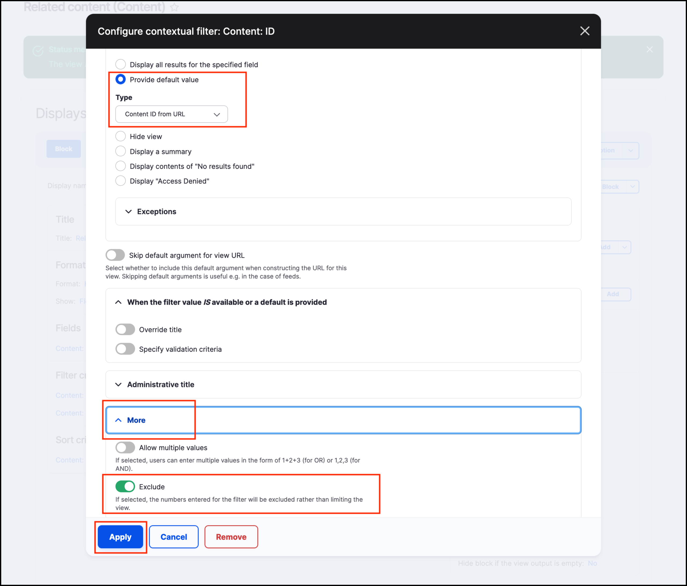
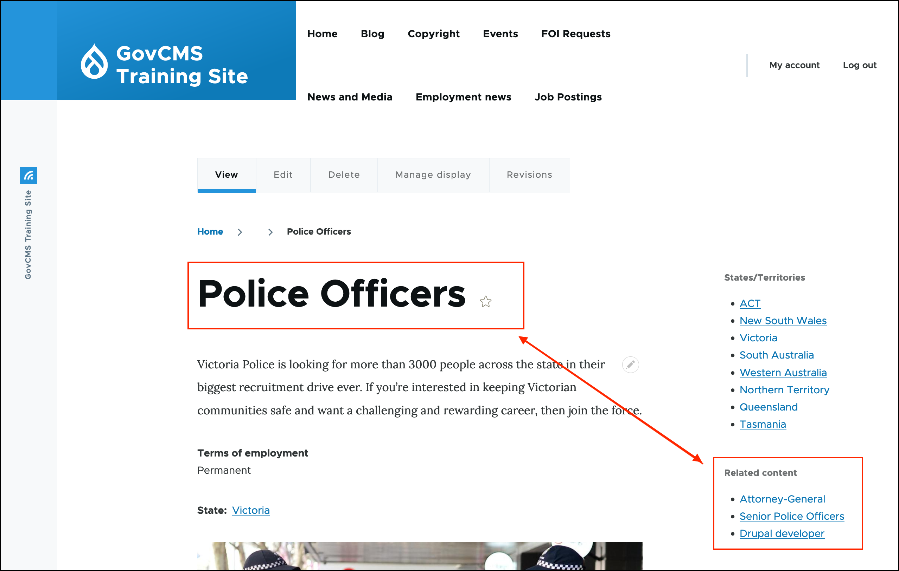

# Exercise 6.6: Build the related content block

Next we’ll add the related content block, as per the screenshot below.

## Check content tags

Make sure you have some _Job posting_ content tagged with the _State/Territory_ terms.

## Create the View

Follow the process outlines in [Exercise 6.5](exercise-6-5-make-a-list-of-states-territories-block.md) to create a new View called **Related content**.

Your view should look like the following screenshot on the edit View page. Note that the **Advanced** section has been expanded, as it is used in the next steps

## Add dynamic "contextual" filter

The contextual filter allows us to show a list of the content with the same tags as the current content.

1. Expand the **Advanced items** on the right hand side.
2. Click **Add** next to **Contextual filters**.
3. Search for "Has taxonomy term ID" then select the checkbox.
4.  Click **Add and configure contextual filters**.

    
5.  Under "When the filter value is NOT available" select the "**Provide a default value"** option.\
    For the Type, select "**Taxonomy term ID from URL**".\
    Also check "**Load default filter from term page**" and "**Load default filter from node page, that's good for related taxonomy blocks**"

    
6. Click **Apply**.
7. Click **Save** on the View page.

## Place the block

1. Go to **Structure** → **Block layout** and scroll down to the “Sidebar” area.
2. Click the **Place block** button.
3.  In the pop-up, filter by text “Related content” in the **Lists (Views)** category.

    
4. Click **Place block**.
5.  Under Visibility settings, configure block to display on all pages except the homepage. Remember to use the \<front> token as the homepage identified. You may also use “/”. In addition, filter the block to only show on the **Job Posting** content type.

    
6. Click **Save block**.

## Review and test

Go to the frontend of your site and check that the Related content block has been added, as in the below screenshot.

Check that you have some content in certain states/territories, so you can see how the block works.

* When you click on a state (tag) on a specific article you should see a list of related content, listed by the taxonomy term. You should not see the block.
* You should see the Related Content block when you view a **Job posting**.

## Filter out currently displayed page

While testing the Related content block, did you notice anything unusual?

The **Related content** block displays the article title of the currently displayed page:

Let’s remove it by adding one more _Contextual Filter_.

1. Return to editing the **Related Content** view.
2. Expand the _Advanced_ pane and you should see the _Contextual Filter_ **Content: Has taxonomy term ID** that we created earlier.
3. Add another contextual filter.
4.  Search for ID (in Category _Content_).

    
5.  Select _Provide default value_ in the **When the filter value is NOT available** pane → **Content ID from URL**.

    
6. Under the **More** pane, select **Exclude**.
7. **Apply** the changes.
8. **Save** the View.
9. Test your block from the previous example. Now it should not display the current page in the block.

