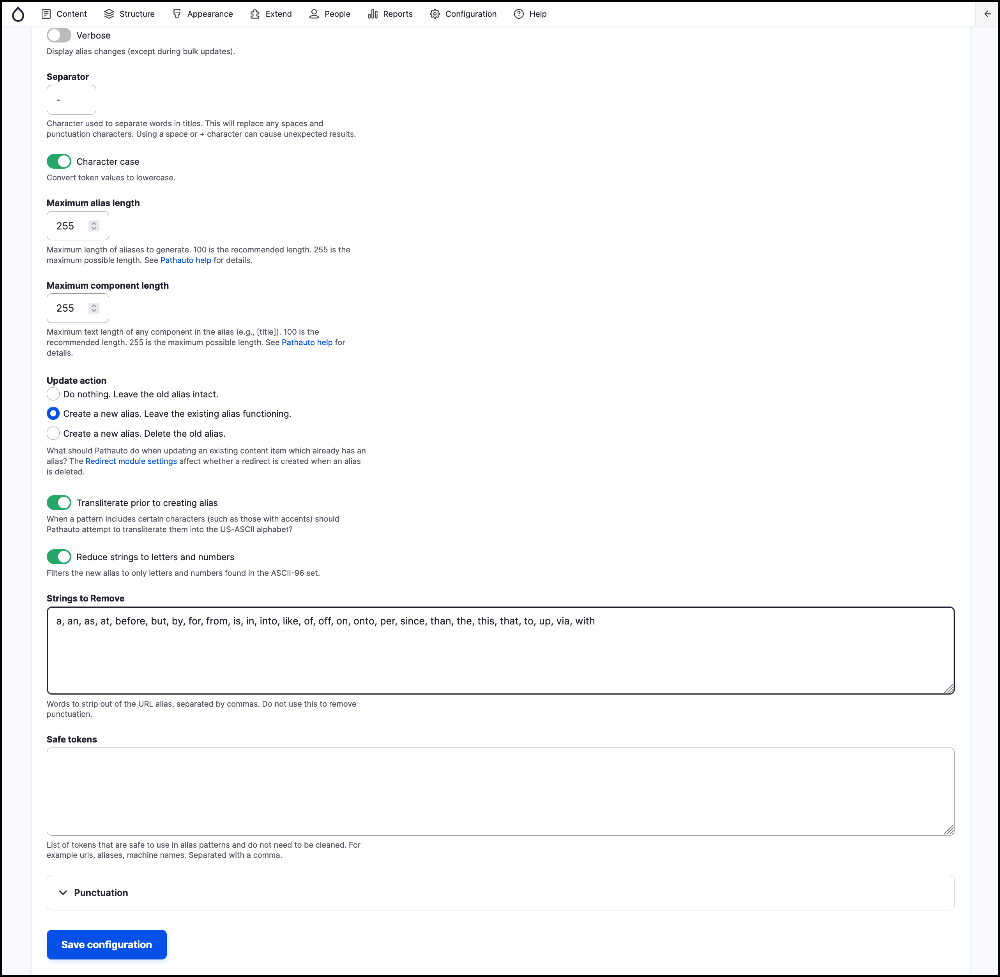

# Exercise 7.2: Configure redirects

In this exercise we will configure automated content redirection when content alias changes.

1. Navigate to the _Configuration_ → _Search and metadata_ → **URL Aliases** → **Settings**.
2. Scroll down to the **Update action** section.
3. Select the option **Create a new alias. Leave the existing alias functioning**.
4. **Save configuration**.

    

5. Test it out. Navigate to a Standard page of your choice – go to **Content**.
6. Note the page URL alias – you’ll need it in the next step.
7. Change the page title and publish the page. This should change the URL alias of the page.
8. Confirm that the URL alias of your page changed.
9. Manually enter the previous URL alias – from step 6
10. Confirm the page redirected to the latest URL alias – as noted in the step 8.
