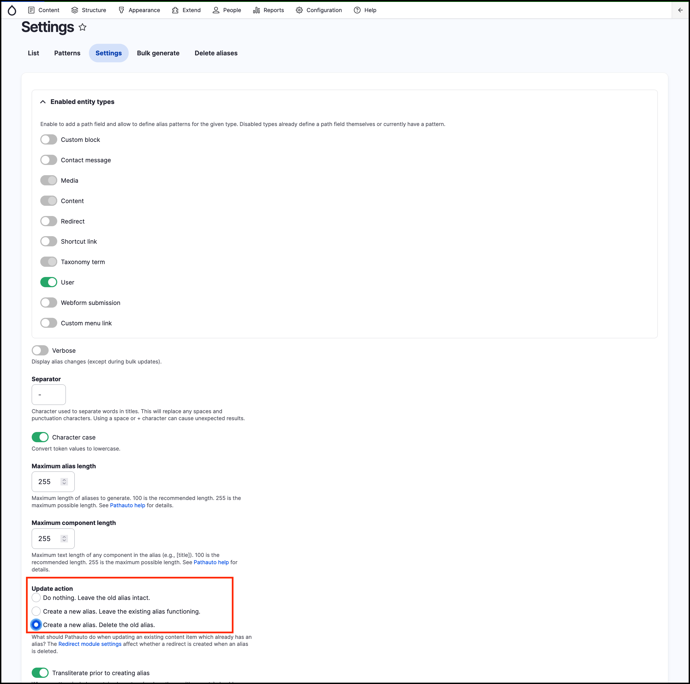

# URL Redirects

URL Aliases are generally the best URL for site visitors to use. However, sometimes site visitors may need an alternative URL. This may be because an incorrect URL was published in print or on another website or because you want to create a shorter URL for a marketing campaign.

Redirects are also created by GovCMS to make sure only one (usually the latest) URL alias is functional and to ensure previously created URL aliases do not return “404 Not Found” response.

 (1) (1).png>)

_Illustration of how Redirects are forwarding all traffic to the latest Alias_


**Tip:** Redirects are generally a better option because extra URL aliases can mean you end up with duplicate content issues, which has a negative impact on SEO.


Out-of-the-box, GovCMS sites may not handle redirects the way your client would expect. Navigate to the _Configuration_ → _Search and metadata_ → **URL Aliases** then go to the **Settings** tab and explore how the update action of URL aliases is handled.

In this default configuration the old alias will be deleted. This may not be the best way to handle changes of URL aliases in content.

A better way to handle URL aliases is to create a redirect automatically when an URL alias is getting updated. This will ensure that links to content stay valid whenever the URL alias of a content page is changed.
