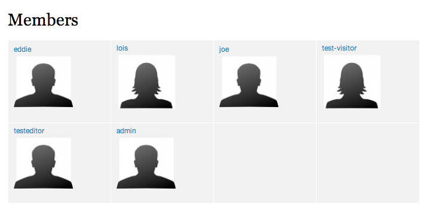
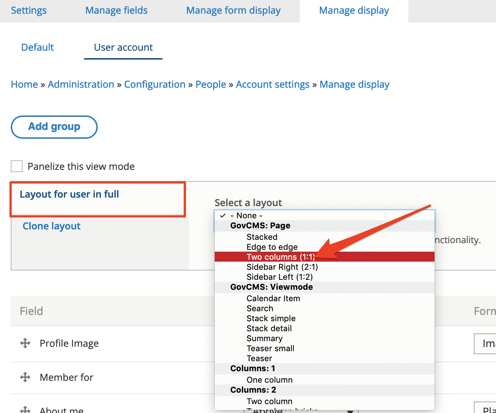

# Employee list and custom profiles

Site visitors would like to see who else is a member on the site. This also promotes a sense of community. This list should show profile images displayed in a grid and username, and link to the user’s account page.

As you work, consider how you can use a similar process to make an image gallery on a site.

#### **Exercise 8.6:** Set up profile fields

Previously, you added fields to content types. You can also add fields to user profiles. This means you can let users share information about themselves and then you can display it. You can also control permissions so only trusted users can see profiles. Below you can see the profiles will have a text field for description and also a list of interests and a profile picture.

1. Add a text field for a biography
   1. Go to Configuration People → Account settings → Manage fields
   2. This interface is similar to the one for adding fields to content, now you can Add a new field with the following settings:
      1. **Type:** Text -&gt; Text \(plain, long\)
      2. **Label:** About me
      3. Machine Name: field\_about\_me
      4. **Widget:** Select _Text area \(multiple rows\)_ \(configurable later from the _Manage form display_ tab\).
   3. Review the User settings. We will keep all the default settings, however, review the options before you save.
   4. Click Save settings

Add a taxonomy field for interests  
We need to create a new “Interests” vocabulary we can use in this case.

* 1. Go to Structure → Taxonomy → Add vocabulary
     1. Name: Interests
     2. Save the vocabulary
     3. At this stage we may not add any terms to the vocabulary and rely on users adding them via profile
  2. If you moved away after the step 1, go to Configuration → People → Account settings → Manage fields
  3. Add Field: Reference -&gt; Taxonomy term.
* **Label**: Interests
*  Allowed number of values: Unlimited
* Create referenced entities if they don't already exist: Yes
* **Vocabulary**: Interests
* **Widget:** Select _Autocomplete \(Tags style\)._ This could be configured after you add the field, from the _Manage form display_ tab.
* **Save** settings.

Test by editing your account  
Return to the front page.

* 1. Click **Your username** in the top administration menu, then _View profile_, then the **Edit** tab. 
  2. At the bottom of the form you can see the options available.
  3. Fill in some text for **About me** and type in tags \(comma-separated for multiple tags\) for **Interests**, such as _Brazil, sailing, dancing._
  4. Under **Picture**, upload an image if you haven't already.
  5. Save.

Click the **View** tab and now you can view the admin profile. Try looking at it in another browser \(if available\) to see it without the administrative options.

You can also manage the display of the fields, for example hiding the label. As your Drupal skills improve, you can make changes to the site design through _Theming_ to alter the way this information looks; or change what displays through _Manage display_ configuration pages.

#### 

#### **Exercise 8.7:** Create the list of users

In this exercise, you’ll make a grid display of user profile pictures like this:

1. Go to Structure → Views and click + Add new view.
2. Configure your view with the following settings.

* View name: Members
* Show Users sorted by Newest first.
* Under _Create a page_, ensure the _Display format_ is Unformatted list of _Fields_.

1. Keep the remaining defaults and click **Save and edit**.
2. You are now in the advanced settings. At the bottom, you can see a preview of your new view. What do you see? We will change to show usernames and user pictures.
3. Under Format - Click to “Unformatted list”. This opens a dialog window. **Format** to _Grid._

* Select _Grid_. Set **Number of columns** to 2. Click **Apply**.

1. Next, we’ll add the user picture.

* Under the **Fields** settings, click to **Add.**
* Search for “profile” and select _Profile Image_. Click **Add and configure field.**
* Select **Medium \(220x220\)** _Image style_.
* Set the image to **Link to** _Content_
* Click Apply

1. Finally, we’ll add a link to the main navigation. Under _Page settings_ → _Menu_ click the **“No menu”** options to change them.

* **Type:** Select Normal menu entry.
* Add a _menu link title_ **Members**.
* Scroll down to **Menu** to select _&lt;Main navigation&gt;._
* Click **Apply.**

1. Scroll down to the Views preview and review if the results are as expected. Click **Save**.
2. Test your new view. In the main navigation, you should have a menu link to “Members”, and a page available at [http://example.com/members](http://example.com/members)

#### **Exercise 8.8:** Edit the existing view to filter out roles

As you can see in the above screenshot, the view we built shows the site administrator user. If we had multiple users in the Site Administrator role, all administrators would be listed here, in our view. In this exercise we hide those administrator users, by adding a role filter to our view.

1. Go to **Structure** → **Views** and locate our _Members_ view. Click the **Edit** button.
2. Click the **Add** button next to the _Filter Criteria_ section.
3. Search for “roles” and select **Roles** filter. Apply the changes.
4. In the next screen, select **Is none of** _operator_ and select the **Site Administrator** in the **Options** list.
5. Apply your changes and preview the result below.
6. Save the view and review the Members page, you shouldn’t see the **Site Administrator** users.

#### **Exercise 8.9:** Create a custom layout

User profiles currently list all content in one column. In this exercise we’ll re-arrange the profile information into two columns. We’ll change the layout of user profiles using **Display suite**.

1. Review the current layout. Click on a member profile.  
2. Go to Administration → Configuration → People → Account settings and click Manage display tab.

You’ll notice this brought you to the Manage display tab for the Account settings.

You’ll see that the _secondary tabs_ are missing and we cannot select a custom _view mode_. Let’s separate our display into a custom view mode **User account**. This separation could allow us to reuse the new _View mode_ later on, if we needed to.

* 1. Click the **Custom display settings** vertical tab and select to enable the **User account** view mode: 
     * After saving your changes, you’ll notice the _secondary tabs_ appear, allowing you to switch to customise the **User account** view mode:

       
  2. Click the **User account** tab.
  3. Change the layout to Two columns:

     

  4. After saving your changes, review the Field column, you’ll see that it now shows many additional regions, such as:
* Header \(all existing fields were moved into this region by GovCMS\)
* Content top
* Content
* Sidebar
* Content bottom
* Footer
* Disabled \(this special area shows any fields excluded from display\)
  1. The **Current layout** thumbnail shows the layout of current view mode

1. When the manage display page reloads, you can reorder the fields to match the screenshot:

* Move any fields not shown in the screenshot into the disabled region.
* Adjust label display as displayed in the screenshot above.
* Save your changes and review the outcome by reviewing your own profile page 

#### Challenge Exercise 8.10: An image gallery

With the member list you created a grid-based view of members’ profiles. Now, create a gallery of images from the **News and Media** published on your site.

* If you don’t have **News and Media** articles with images, use the Devel Generate tool to create them.
* Alter the display of the Thumbnails to show up as square images.
* Make a view to display the images in a grid to create a simple gallery.

