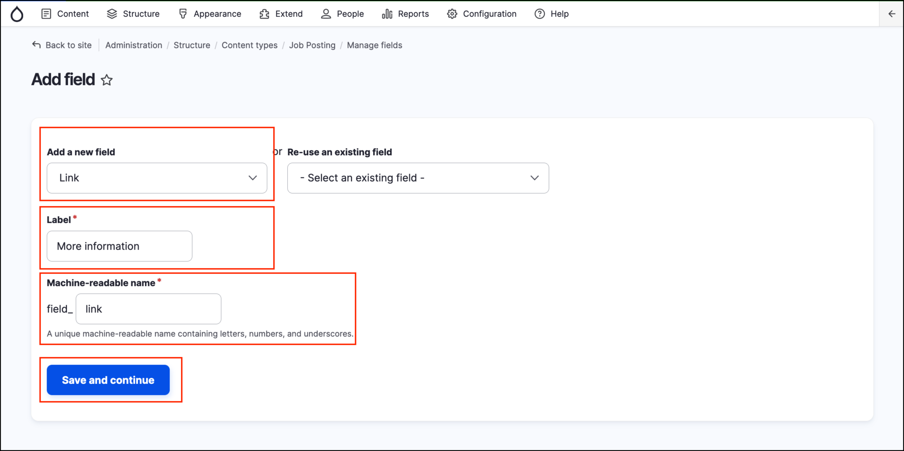
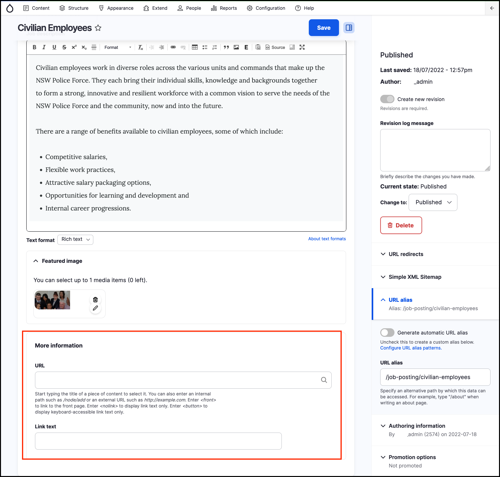
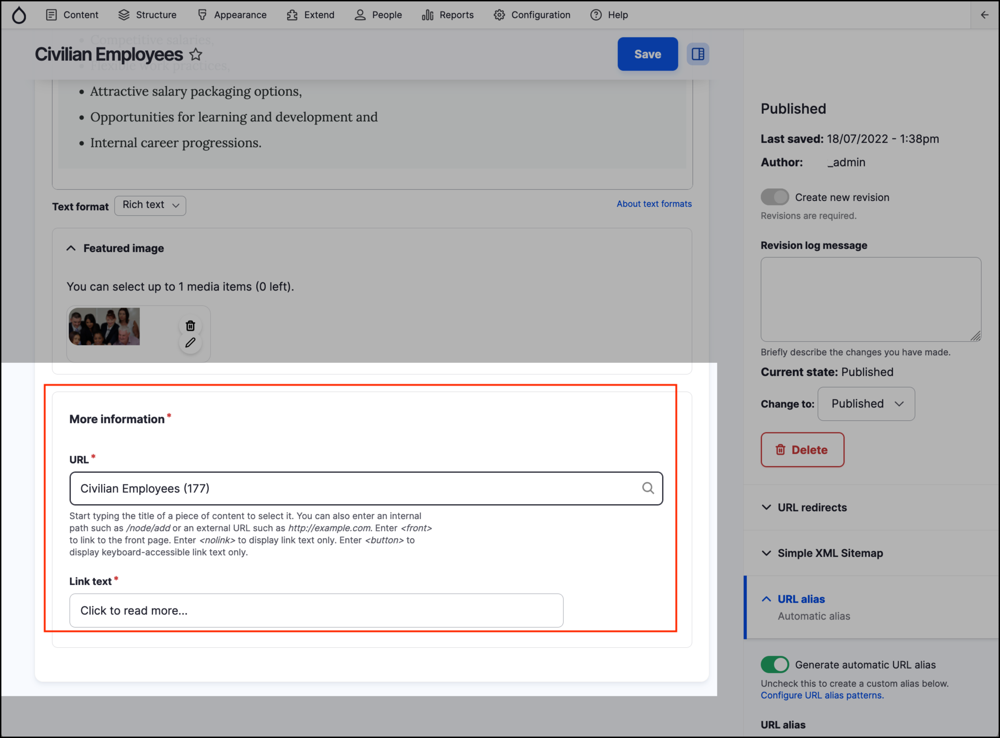

# Exercise 8.1: Add an external link field

In this exercise we’ll add a new link field to the _Job Posting_ content type. The link will go to “More information” on another website.

## Add the link field

1. Go to _Structure_ → _Content types_ → **Job Posting** and click on the **Manage fields** tab.
2. Add a new field and use the following settings: 

    
    
3. Click **Save and continue.** This will take you to the Field settings page. 
4. There are no changes so just click **Save settings**. 
5. This takes you to the settings for this field on the _Job posting_ content type.

## Test it

Go to a Job posting and search for the 'More information' section and **Link** field.

## Change the field settings to make link title required field

You can also make the link title field a required field. Follow the instructions below:

1. Go back to the **Manage Fields** page of the **Job Posting** content type.
2. Edit the Link field.
3. Change the Allow link text to “Required”.
4. Save settings.

## Re-test it

1. Update your Job posting content page from the previous example and enter the link title.
2. Compare the look of the content page.

The **More information** fields should now be required fields.

