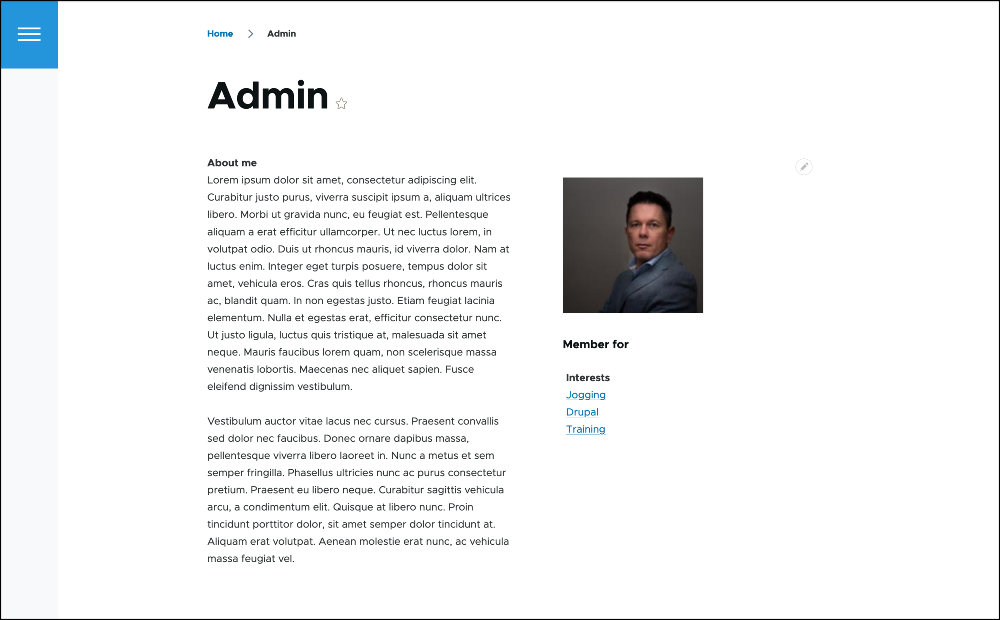
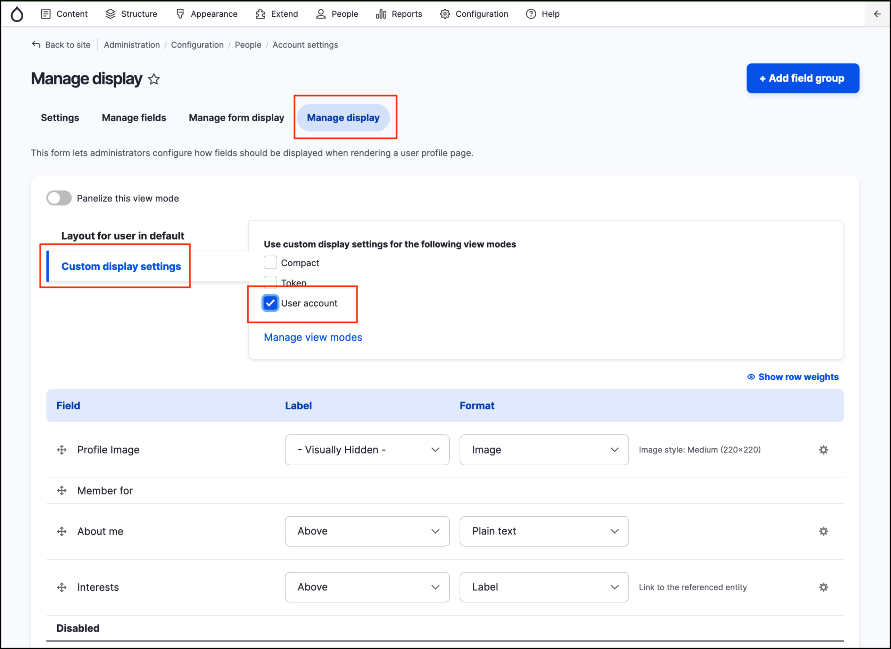
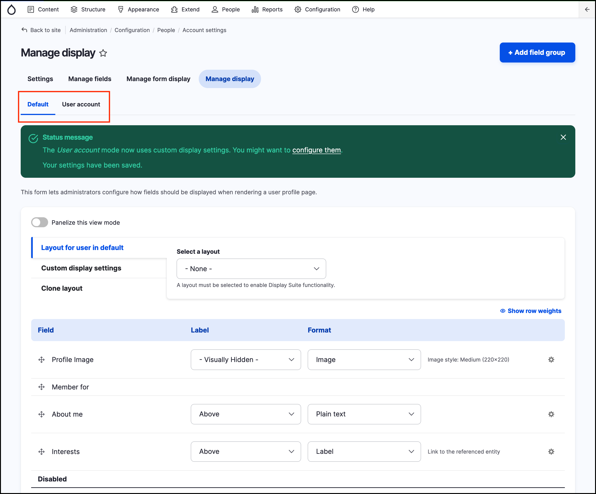
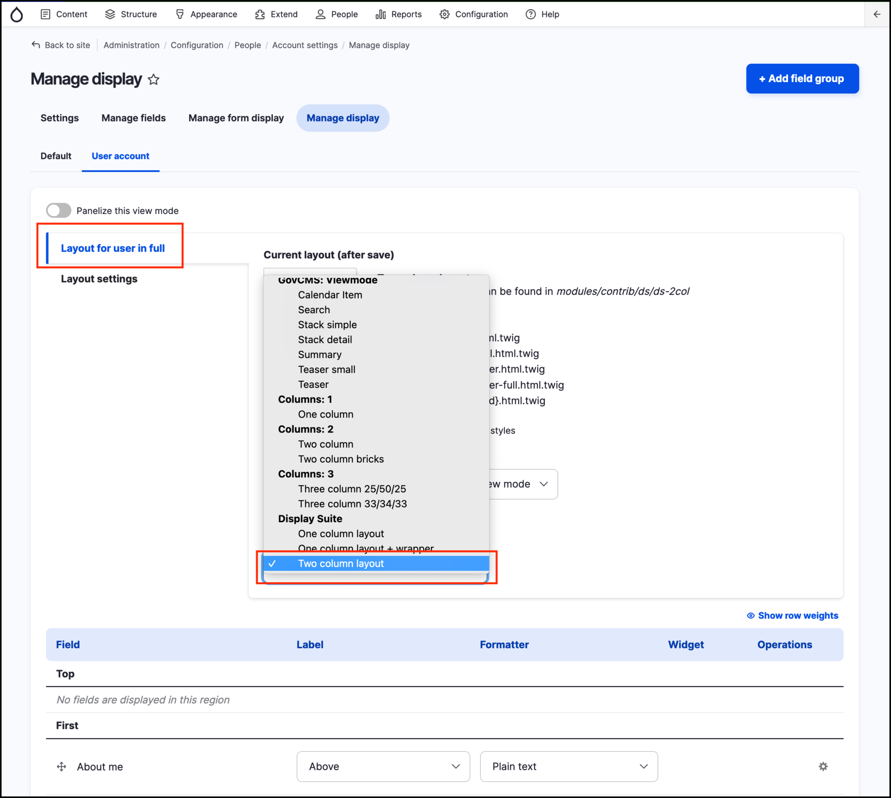
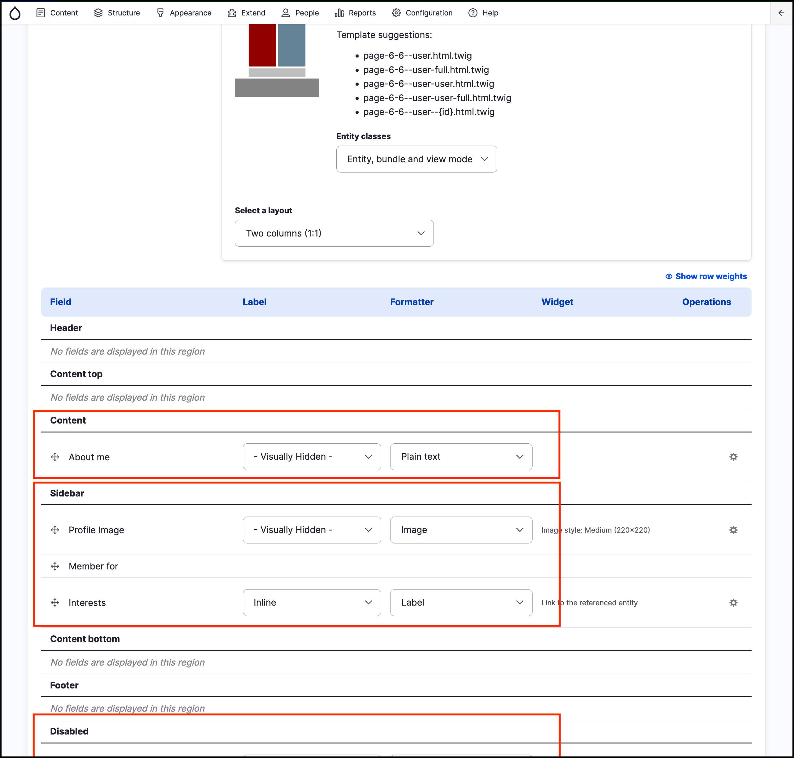

# Exercise 8.10: Create a custom layout

User profiles currently list all content in one column. In this exercise we’ll re-arrange the profile information into two columns. We’ll change the layout of user profiles using **Display suite**.

1. Review the current layout. Click on a member profile. 

    
    
2. Go to _Administration_ → _Configuration_ → _People_ → **Account settings** and click **Manage display** tab.

    You’ll see that the _secondary tabs_ are missing and we cannot select a custom _view mode_. Let’s separate our display into a custom view mode **User account**. This separation could allow us to reuse the new _View mode_ later on, if we needed to.

3. Click the **Custom display settings** vertical tab and select to enable the **User account** view mode: 

    

4. Scroll down and click **Save**. After saving your changes, you’ll notice the _secondary tabs_ appear, allowing you to switch to customise the **User account** view mode:

    
       
5. Click the **User account** tab.
6. Change the layout to Two columns \(Display suite\):

     

7. After saving your changes, review the **Field** section, you’ll see that it now shows additional regions, such as:
   - Left
   - Right
   - Disabled \(this special area shows any fields excluded from display\)

    

    The **Current layout** thumbnail shows the layout of current view mode

    

8. When the manage display page reloads, you can reorder the fields to match the screenshot:

    
    
9. Move any fields not shown in the screenshot into the disabled region.
10. Adjust label display as displayed in the screenshot above.
11. Save your changes and review the outcome by reviewing your own profile page

