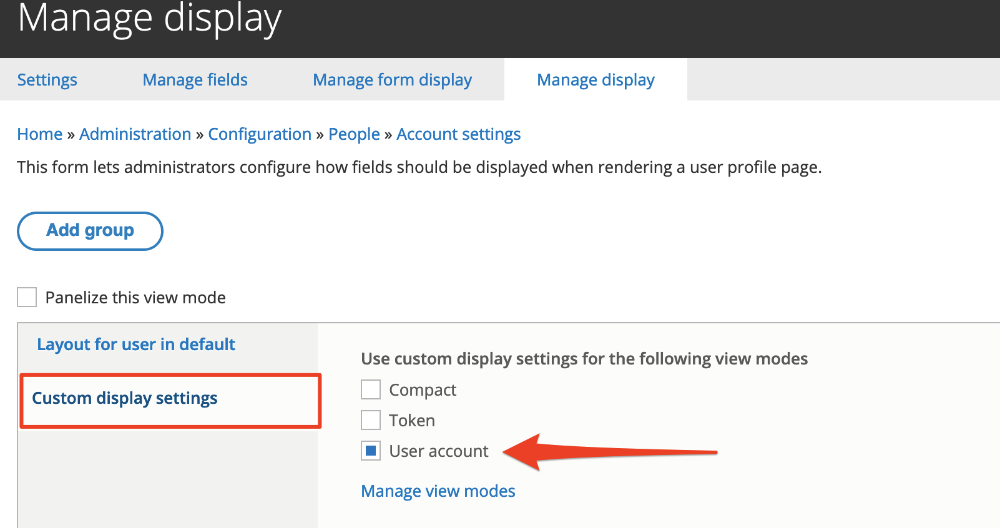
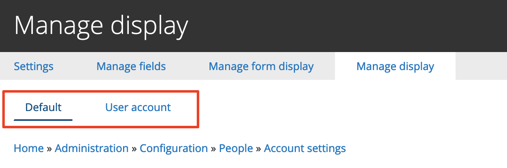
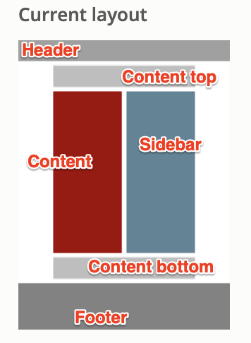
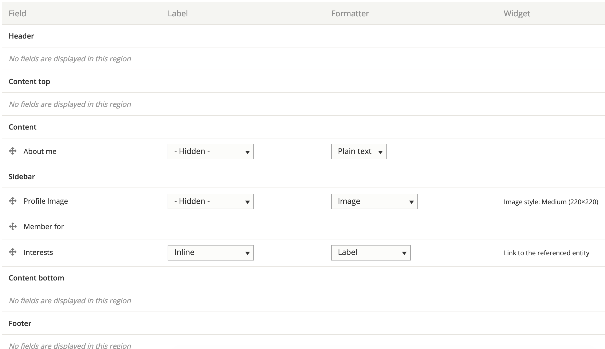

# Exercise 8.10: Create a custom layout

User profiles currently list all content in one column. In this exercise we’ll re-arrange the profile information into two columns. We’ll change the layout of user profiles using **Display suite**.

1.  Review the current layout. Click on a member profile.

    
2. Go to Administration → Configuration → People → Account settings and click Manage display tab.

You’ll notice this brought you to the Manage display tab for the Account settings.

You’ll see that the _secondary tabs_ are missing and we cannot select a custom _view mode_. Let’s separate our display into a custom view mode **User account**. This separation could allow us to reuse the new _View mode_ later on, if we needed to.

1.  Click the **Custom display settings** vertical tab and select to enable the **User account** view mode:

    

    After saving your changes, you’ll notice the _secondary tabs_ appear, allowing you to switch to customise the **User account** view mode:

    
2. Click the **User account** tab.
3.  Change the layout to Two columns:

    
4. After saving your changes, review the Field column, you’ll see that it now shows many additional regions, such as:

* Header (all existing fields were moved into this region by GovCMS)
* Content top
* Content
* Sidebar
* Content bottom
* Footer
* Disabled (this special area shows any fields excluded from display)

The **Current layout** thumbnail shows the layout of current view mode

When the manage display page reloads, you can reorder the fields to match the screenshot:

* Move any fields not shown in the screenshot into the disabled region.
* Adjust label display as displayed in the screenshot above.
* Save your changes and review the outcome by reviewing your own profile page

