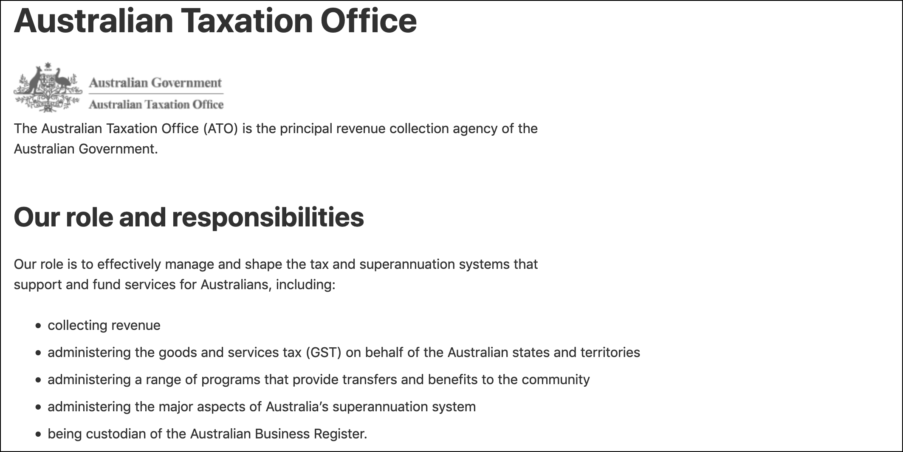
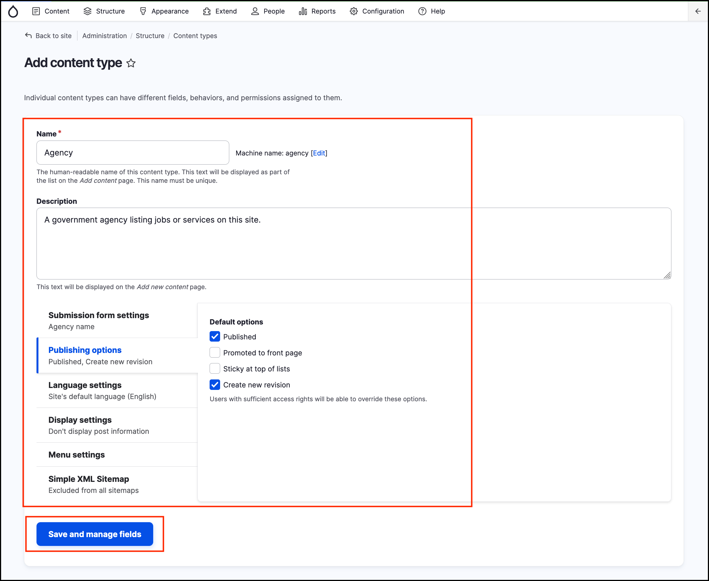
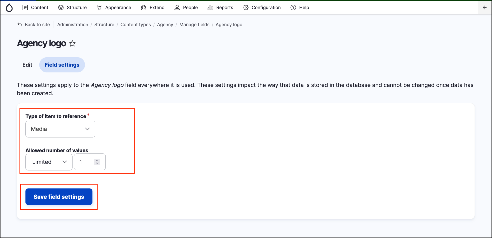
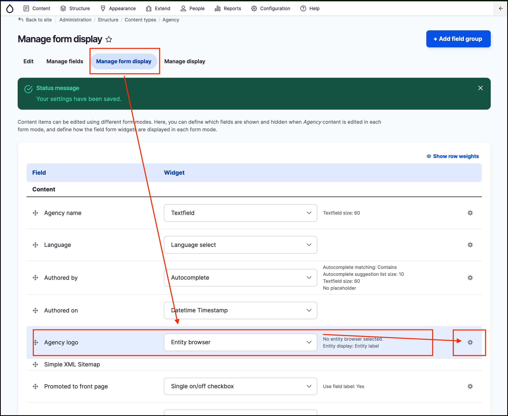
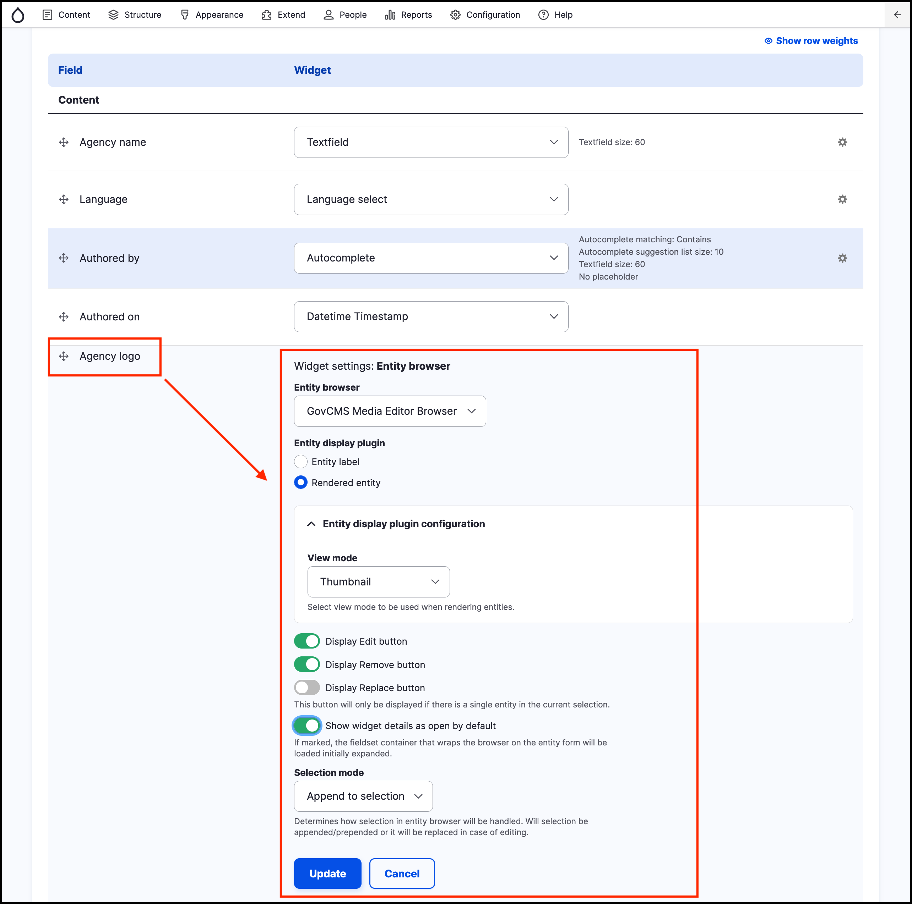
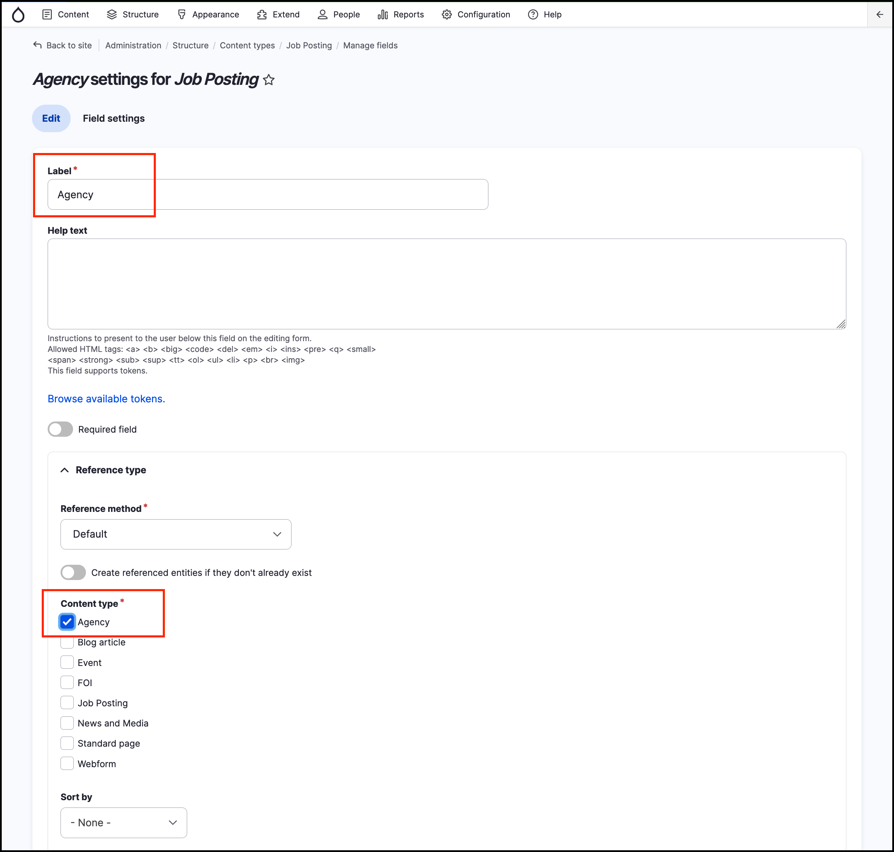
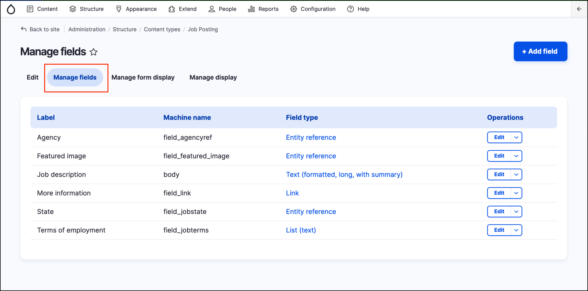
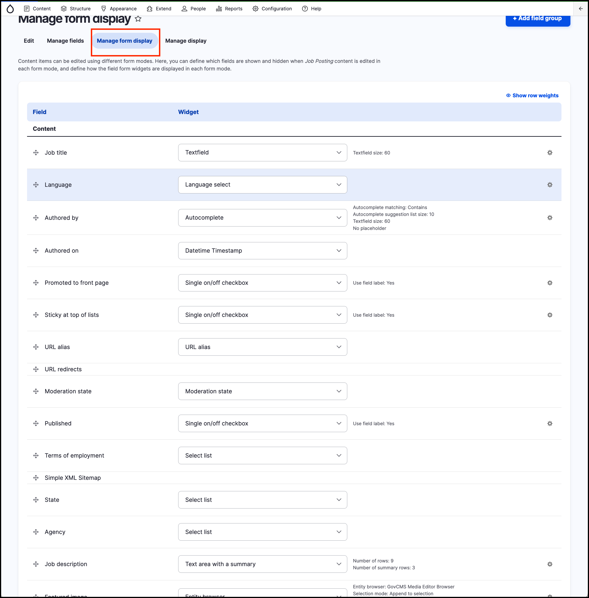
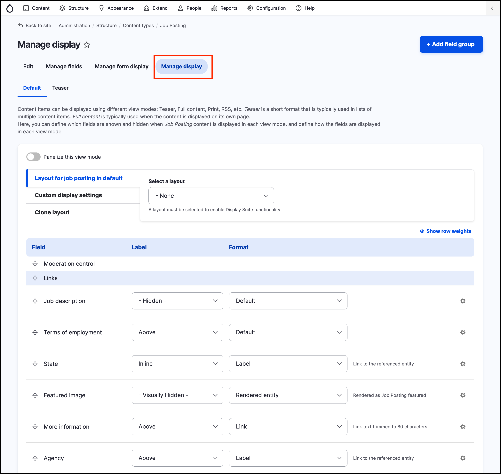

# Exercise 8.2: Create Agency References

Content Reference is a useful tool in GovCMS. It helps you create new relationships between content. There are many ways to leverage this connection with Views. For example, when you’re viewing an **agency** page, you could show which jobs “back reference” to that agency.

## Create the Agency content type

Using what we’ve covered so far on content types, create a new content type using these settings:

| Name |  Agency |
| :--- | :--- |
| Description |  A government agency listing jobs or services on this site. |
| Title field label |  Agency name |
| Publishing options |  NOT Promoted to front page |
| Display settings |  Don’t Display author and date information. |
| Menu settings |  No menu |

  
Click **Save and manage fields**.

> **Note:** Make sure you check permissions, allowing Content Authors to create agencies.

## Add agency logo image field

We’re now going to add the **Image field** to the agency content type. When adding the field, make sure you also configure the **form display** and the **display** of the field. Use the following settings:

   - **Label:** Agency Logo
   - **Field name:** field\_agency\_logo
   - **Field type:** Media Reference
   - **Number of values:** 1
   - **Required:** Leave unselected
   - **Help text:** “If available, please upload a logo for this agency.”
   - **Media type:** Image

## Manage Form display settings

Click on the _Manage form display_ tab. Select **Entity browser** from the Widget dropdown, then click the cog icon next to the **Agency logo** field.

Adjust the settings as shown in the screenshot below:

 
    
When finished, click the **Update** button and then **Save** the _Manage form display_ page.

## Add references field to job posting

Finally, we’re going to add a references field for job postings.

1. Go to _Structure_ → _Content types_ → **Job posting** and click the **Manage fields** link.
2. Add a new field using these settings:
   - **Type:** Reference → Content
   - **Label**: Agency
   - **Field name**: agencyref \(click to edit the machine name\)
   - **Content type:** Agency
   - **Sort by**: - None -

    

3. Click **Save settings**.
4. You’ll also need to configure the form display. Use the **Select list** _widget_ for the **Agency** field. Note: You can also move the **Agency** field on the form so it’s above the **Job description** field.
5. You’ll also need to configure the display. Set the _Agency_ field to display as a link.
6. Your job posting fields will now look something like the screenshot below. 

    

7. You may rearrange any new fields we’ve added and bring them above the Job description field.

  
   

## Try it out

Now that you’ve added the new fields, it’s time to try them out.

