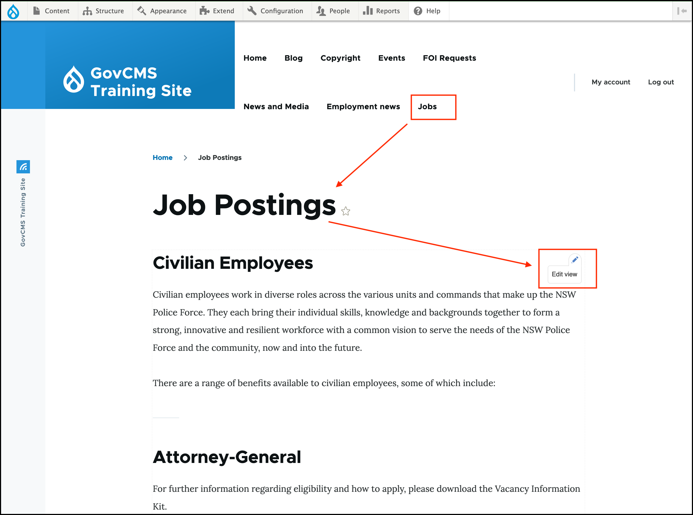
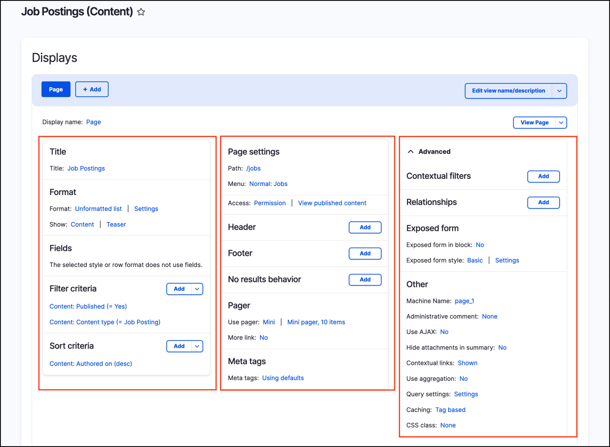
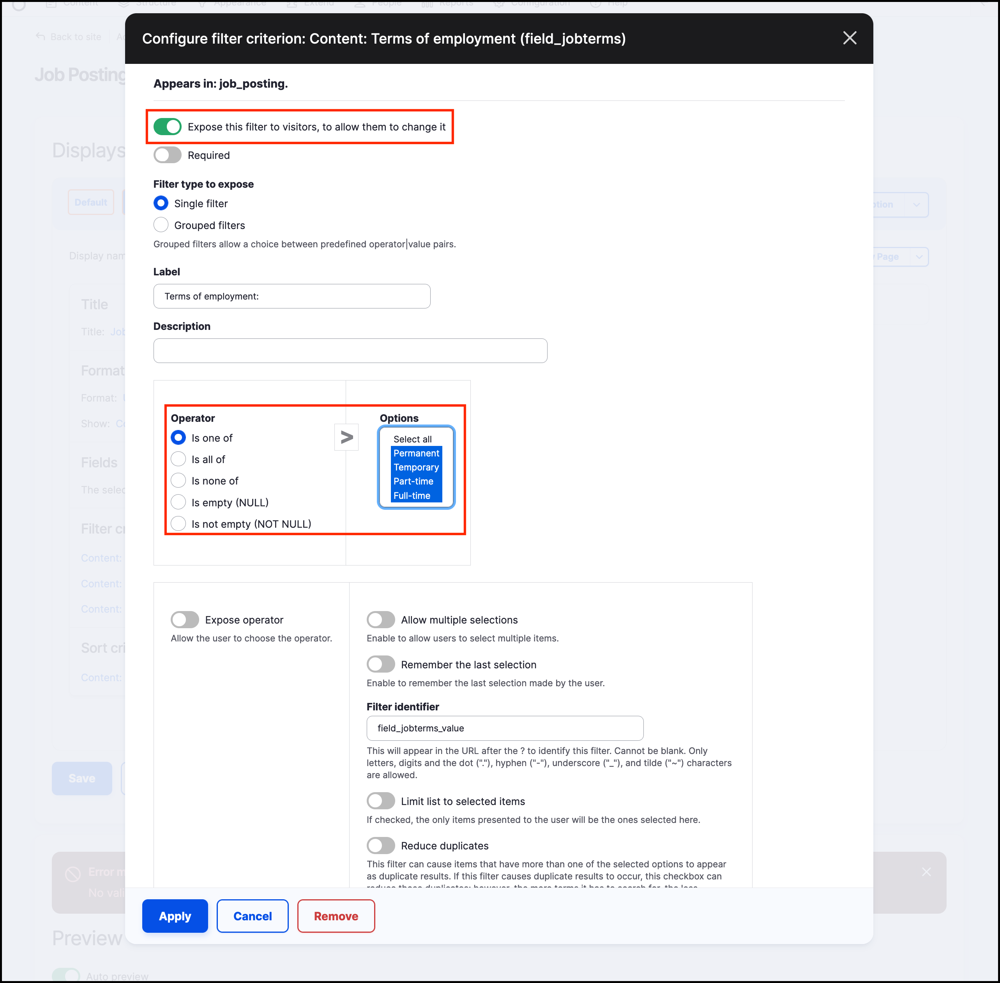
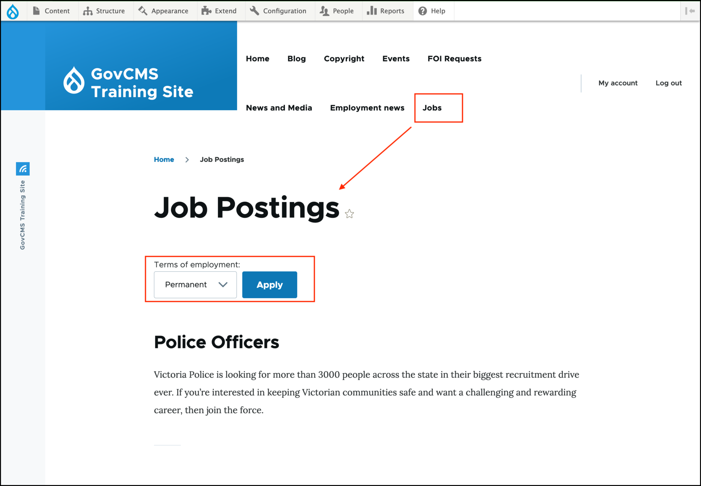
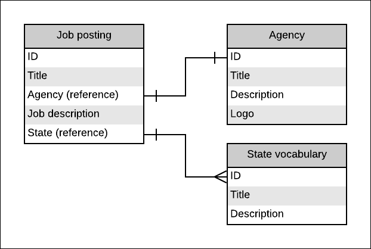

# Exercise 8.3: Configure the job listing

In this exercise we’ll configure the job listing so it filters by terms of employment.

## Edit the job listing \(or create it if you haven’t already\)

If you’ve already created the Job list view, skip to the step

## Configure the view

If you don’t have the job listing view, we’ll create it and set the filter criteria. 

     
1. Go to **Structure** → **Views** → **Add new view**. Configure with these settings:
   - **View name:** Job listing
   - Show **“Content”** of type **“job posting”** sorted by **“Newest first”**
   - Select the **Create a page** checkbox
   - Keep the defaults for the page setting
   - Select **Create a menu link**
   - **Menu**: Select **Main navigation** Link text: **Jobs**

2. Click **Save and edit**

## Configure the view

Based to knowledge acquired from previous units in this manual, add a filter by terms of employment, and expose to the site visitors. Use the preview section located below the view configuration form to accomplish this task. Once you are happy with how it has been configured, save the view.

> Hint. Use the screenshot below if you need some guidance.

## Review your changes

Review your changes by checking your homepage. “Jobs” will be part of the main navigation \(because you added it to the menu\) and you’ll now see a dropdown menu that filters the job postings.

## Job list with agency logos \(Views relationships\)

Content types often share information such as taxonomy terms, authors, and so on. We may also want to add in a relationship between content types so that we can share data \(fields\) from one content type with another. When you first set up a view, you select your “base table”. By adding in View relationships, you can share information from tables of other content types.

